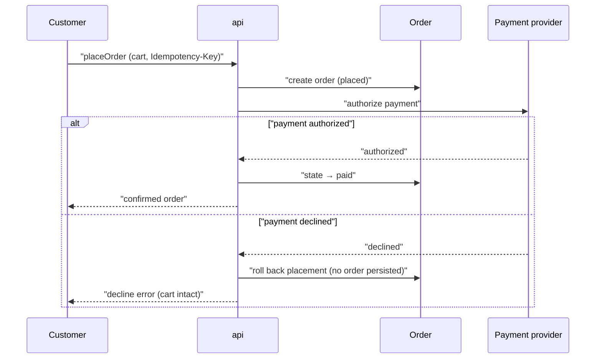

# Flow: Place order

<!-- Conformance example (blueprint-format 22). The PLATFORM-AGNOSTIC contract:
     no screens — they live in webapp.md beside this file. The goal-traceability
     spine runs product goal → this flow → entity/API/screen. Code-independent:
     names entities, the `api` service, and operationIds only. -->

## Purpose

A shopper reviews their cart and pays for it in a single checkout sitting,
receiving a confirmed order they can revisit later. This is the primary path by
which an Order comes into being, so it carries the "no lost orders" promise.

Serves: [Reliable ordering](../../../product.md#goal-reliable-ordering)

## Platforms

| Platform | File            | Notes                         |
| -------- | --------------- | ----------------------------- |
| webapp   | [webapp](./webapp.md) | The only surface for checkout |

## Trigger & Actors

| Actor    | May trigger              | Authorization     | Audit-recorded |
| -------- | ------------------------ | ----------------- | -------------- |
| Customer | Submitting cart checkout | Owner of the cart | no             |

## Steps

1. Customer submits their cart on the Checkout screen — creates an
   [Order](../../../entities/order/index.md) in `placed` via `placeOrder`.
2. System authorizes payment with the payment provider inside the same checkout
   transaction; on success the [Order](../../../entities/order/index.md) moves
   `placed → paid`.
3. Customer reviews the confirmed order and their past orders — reads
   [Order](../../../entities/order/index.md) via `getOrder`.

## Guarantees

| Step / group             | Consistency                                             | On failure                                                                                                       | Idempotency                                                        |
| ------------------------ | ------------------------------------------------------- | ---------------------------------------------------------------------------------------------------------------- | ------------------------------------------------------------------ |
| 1-3 placement + payment  | atomic — the order commits only once payment authorizes | Declined or provider timeout → placement rolls back, no `placed` order is retained, cart left intact for a retry | `placeOrder` `Idempotency-Key`; a retry returns the original order |
| 4-5 fulfilment + notices | eventual                                                | Retried by the owning job; the order stays `placed`                                                              | per-job, keyed on the order id                                     |

## Diagram

## Acceptance

- Given a signed-in customer with a non-empty cart, when they check out and
  payment authorizes, then exactly one order is created reading `paid` and it
  appears in their order history.
- Given a customer at checkout whose payment is declined, when they submit, then
  no order is persisted, their cart is unchanged, and the decline is shown
  inline.

## References

- [api API contract](../../../apis/api.openapi.yaml) — for `placeOrder` /
  `getOrder`
- [auth](../../../conventions.md#auth), [errors](../../../conventions.md#errors)
- [design-system](../../../design-system.md) — this flow has platform files

## Open Questions

- [ ] Saved payment methods for repeat customers — deferred. (2026-07-01)
