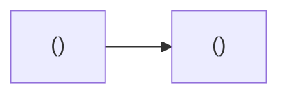

# <System Name> — Architecture

> **The human-readable system shape.** Lives at
> `docs/blueprint/architecture.md`. The machine-readable **Project Registry** is
> its own file — `docs/blueprint/registry.yaml` — which is what `blueprint`,
> `plan`, and `execute` parse; they never read this doc. Every registry project
> appears here as prose and as a diagram node, and nothing appears here that the
> registry does not have.
>
> Budget ~100 lines: this doc explains shape to a person. Anything a tool needs
> belongs in the registry.

## System Overview

<!-- What the system is and its high-level shape. State the deployment split:
which projects are cloud-hosted and share the common packages, and which run on
the client device and ship through the app stores. State the shared-package
strategy in one or two sentences. -->

<!-- Required: the system shape as a mermaid flowchart — one node per registry
project, edges for the interconnects (who calls whom / depends_on). A view of
the registry, kept in sync with it: every registry project appears as a node,
and no node exists without a registry entry. Follow the documentation-standards
diagram conventions (type-by-purpose, quoted labels, GitHub/GitLab-renderable,
no init directives). -->

## Projects

<!-- One short subsection per project. Describe responsibility and boundaries —
not implementation detail. -->

### <Project Name> (`<type>`)

<!-- What it does, its boundaries, and any notable architectural choice. -->

## How Projects Interconnect

<!-- Who calls whom. The auth flow (where identity is established and how it
propagates). The data flow (where the system of record lives and how reads/writes
move between projects). A simple text diagram is welcome. -->

## Hosting & Deployment

<!-- Where each project runs and how it ships. For cloud projects: the platform
and region. For the mobile app: the stores and release channel. -->

## Registry

The machine-readable system description lives in
[registry.yaml](./registry.yaml) — projects, capabilities, dependencies, and the
cross-cutting selections. It is authoritative; this doc is its prose view.

<!-- Do NOT restate the registry here. A cross-cutting decisions table, a
project/stack table, or a capability list duplicated into this doc is a format-16
gap: it was the one thing in the old single-file architecture doc guaranteed to
drift, since nothing could check the two copies against each other. -->
