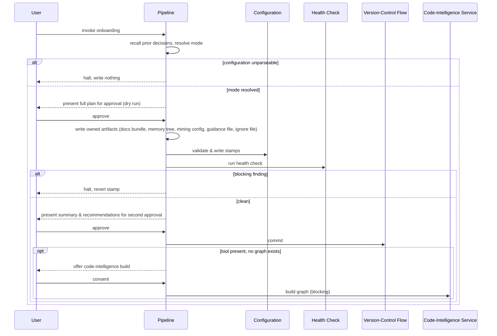

# Flow: vwf Setup

## Purpose

Bring any repo — new, existing, or on an older format — into the shape the
workflow reads. The phase-0 bootstrapper and the only onboarding extension
point.

Serves:
[A working codebase adopts it without a rewrite](../../../product.md#goal-adopt-without-rewrite),
[Getting started is one command](../../../product.md#goal-one-command-start)

## Host & extension point

Claude Code, registered as a **skill** — not a **hook** or a **subagent**, both
also on offer.

## Invocation surface

**User-only** — withheld from the model so nothing else can start it.
Model-and-user invocable risks another flow starting an onboard unasked;
model-only auto-applying could never be started deliberately.

## What the host supplies

Guaranteed: the repository working tree, and the user conversation. Conditional,
supplied by the host's execution environment: the ability to run external
commands (used to run the health check, to commit through the version-control
flow, and to detect whether the code-intelligence tool is present), and the
presence or absence of the code-intelligence tool and of an existing graph —
both read as facts, either may be absent. Also conditional, each meaningfully
absent rather than an error: an existing configuration file, an existing
documentation bundle, a prior memory of settled decisions.

## Trigger & Actors

| Actor    | May trigger                                  | Authorization               | Audit-recorded |
| -------- | -------------------------------------------- | --------------------------- | -------------- |
| the user | the onboarding extension point, by name only | none — local, no role model | no             |

## Steps

1. This flow first recalls any prior memory of settled decisions, so a re-run
   builds on what was already settled rather than re-asking — proceeding
   silently, as an optimisation rather than a gate, when the memory store is
   unavailable. It then resolves the mode once: no config & no legacy file →
   `onboard` (fork below); a stamp behind or legacy-only → `migrate`; both
   current → `current` (report both stamps to the user, print the chain, re-walk
   nothing); unparseable → halt.
2. On `onboard`, this flow forks on evidence. Blank (no manifest, source or
   docs): asks the user only the product's name and memory wing, each proposed
   from the directory name. Code (anything else, incl. a legacy bundle for
   `migrate`): detects the topology, each project's role and platforms, and the
   stack pins for each axis, and has the user confirm each — detection proposes,
   the user confirms. Both rejoin the shared spine, which presents the full plan
   — every create, move and update — as a dry run and waits for the user's
   approval; nothing lands before this.
3. Once approved, the resolved mode's pipeline gathers its facts and writes the
   artifacts it owns: the documentation bundle's reconciliation, the memory
   tree, its mining configuration, the workflow section merged into the repo's
   own guidance file (preserving what is already there), and the
   code-intelligence ignore file. Neither fork validates, stamps, commits or
   prints the chain — the shared spine alone does those, in the steps below.
4. This flow validates the bundle (frontmatter, resolving links, parsing
   artifacts, the required foundations, no secret values in the environment
   catalogue), then writes the configuration file: both stamps plus exactly what
   was elicited.
5. This flow runs the [health check](../110-vwf-doctor/index.md) and records
   what it reports.
6. This flow summarises what was actually created and updated, together with its
   recommendations, waits for the user's second approval, then commits through
   the [version-control flow](../120-vwf-git-workflow/index.md).
7. This flow offers the user the code-intelligence build, consent-gated, against
   the primary checkout, only when the tool is present and no graph exists —
   synchronous, blocking the run until it finishes.
8. This flow prints the chain forward — [product](../020-vwf-product/index.md),
   [architecture](../030-vwf-architecture/index.md),
   [design-system](../040-vwf-design-system/index.md),
   [blueprint](../050-vwf-blueprint/index.md) — and stops; it also names but
   never runs [readme](../160-vwf-readme/index.md).

## Guarantees

| Step / group                                          | Consistency                                                                    | On failure                                                                  | Idempotency                                        | Load & latency                        |
| ----------------------------------------------------- | ------------------------------------------------------------------------------ | --------------------------------------------------------------------------- | -------------------------------------------------- | ------------------------------------- |
| Mode resolution → artifact write → health check (1–5) | eventual — recall, resolve, write owned artifacts, then validate, stamp, check | halt reverts the stamp (delete if this run created it, else restore)        | full — no progress key; re-run resolves mode fresh | default — per conventions#reliability |
| Approval, commit & optional graph build (6–8)         | n/a — local only, never pushed                                                 | none — consent stands until approved; a decline is honoured, never re-asked | n/a — one-shot per invocation                      | default — per conventions#reliability |

## Diagram

## Gates & halts

- **Unparseable configuration → halt.** Report the parse error with its line and
  two remedies: fix it, or delete it and re-run. Never onboard over it — it
  still records decisions nothing else does.
- **A blocking health-check finding → halt and revert the stamp** (delete the
  configuration if this run created it, else restore it). A stack token no
  installed extension declares reaches this.
- **Two exceptions that do not halt**, each reported every run as a degradation:
  a declined code-intelligence build, and a declined infrastructure-repo
  extraction recorded as an explicit decline.

## Artifacts written

Committed: the runtime configuration file; the documentation bundle's
reconciliation; the memory tree and its mining configuration; the workflow
section merged into the repo's own guidance file; the code-intelligence ignore
file. Ignored by version control: the code-intelligence graph. Never written
here: the README — a separate flow owns it.

## Acceptance

- Given a blank repo, when onboarding runs, then it resolves to `onboard` and
  ends with a configuration carrying both current stamps.
- Given a repo with code, when onboarding runs, then it resolves to `onboard` on
  the code sub-path, and no source file moves.
- Given stamps behind, when onboarding runs, then it resolves to `migrate` and
  reconciles only what drifted.
- Given a conforming repo, when onboarding runs, then it resolves to `current`,
  reports both stamps, and writes nothing.
- Given an unparseable configuration, when onboarding runs, then it halts with
  the parse error and both remedies, file untouched.
- Given a blocking health-check finding, when onboarding runs, then it halts and
  leaves no configuration file this run created.
- Given a prior run was interrupted, when onboarding runs again, then it
  produces a smaller plan, never a duplicate.
- Given the code-intelligence build was previously declined, when the flow runs
  again, then it does not re-ask and reports the decline as a degradation.
- Given an infrastructure-repo extraction was declined on record, when the flow
  runs, then it completes without halting and reports the finding as a warning.

**Abuse case:** `n/a` — the only actor is the developer running the flow on
their own machine, authorized by owning it
([conventions#auth](../../../conventions.md#auth)). There is no external or
unauthenticated trigger to attempt what its authorization does not allow, and
the flow mutates no payment or entitlement.

**Counter:** `vwf-setup.completed` on a run that commits within the
documentation tree, the configuration directory and the agent instructions file;
`vwf-setup.failed` on a run that touches anything outside them. Serves
[#goal-adopt-without-rewrite](../../../product.md#goal-adopt-without-rewrite).

## References

- [runtime settings](../../../conventions.md#runtime-settings)
- [engineering baseline](../../../conventions.md#baseline)
