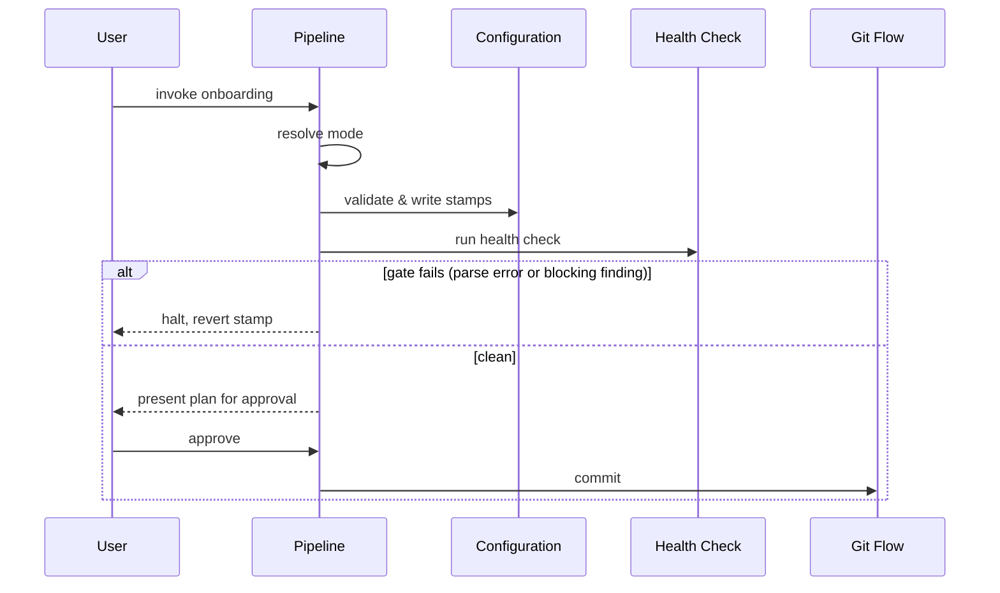

# Flow: vwf Setup

## Purpose

Bring any repo — new, existing, or on an older documentation format — into the
shape the rest of the workflow reads. The phase-0 bootstrapper, and the only
extension point that onboards; it recognizes an existing codebase's own
conventions rather than replacing them.

Serves:
[A working codebase adopts it without a rewrite](../../../product.md#goal-adopt-without-rewrite),
[Getting started is one command](../../../product.md#goal-one-command-start)

## Host & extension point

The agent host, via a user-invoked extension point registered by name.

## Invocation surface

User-only, deliberately: the extension point is withheld from the model's own
invocation, so no other extension can delegate to it — the user owns the timing
of onboarding. Model-invocable, another extension could start an onboard mid-run
unasked; model-only, a user could not start one at all.

## What the host supplies

Guaranteed: the repository working tree, and the user conversation. Conditional,
each meaningfully absent rather than an error: an existing configuration file,
an existing documentation bundle, a prior memory of settled decisions.

## Trigger & Actors

| Actor    | May trigger                                  | Authorization               | Audit-recorded |
| -------- | -------------------------------------------- | --------------------------- | -------------- |
| the user | the onboarding extension point, by name only | none — local, no role model | no             |

## Steps

1. Resolve the mode once: no config & no legacy file → `onboard`; a stamp behind
   or legacy-only → `migrate`; both stamps current → `current`; unparseable →
   halt.
2. On `onboard`, evidence forks the path: no manifest/source/docs → blank
   sub-path; anything else (incl. a found legacy bundle, handed to `migrate`) →
   code sub-path.
3. On `current`, name both stamps, report the repo current, print the chain;
   re-walk nothing.
4. Validate the bundle: frontmatter, resolving links, parsing artifacts, the
   required foundations, no secret values in the environment catalogue.
5. Write the configuration file: both stamps plus exactly what was elicited.
6. Run the health check over the repo and record what it reports.
7. Summarise every create, move and update plus recommendations, wait for
   approval, commit through the git flow.
8. Offer the code-intelligence build, consent-gated, against the main checkout,
   only when the tool is present and no graph exists.
9. Print the chain forward and stop; run none of the commands it names.

## Guarantees

| Step / group                                  | Consistency                                 | On failure                                                                  | Idempotency                                        |
| --------------------------------------------- | ------------------------------------------- | --------------------------------------------------------------------------- | -------------------------------------------------- |
| Mode resolution → health check (1–6)          | eventual — validate, then stamp, then check | halt reverts the stamp (delete if this run created it, else restore)        | full — no progress key; re-run resolves mode fresh |
| Approval, commit & optional graph build (7–9) | n/a — local only, never pushed              | none — consent stands until approved; a decline is honoured, never re-asked | n/a — one-shot per invocation                      |

## Diagram

## Gates & halts

- **Unparseable configuration → halt.** Report the parse error with its line and
  two remedies: fix it, or delete it and re-run. Never onboard over it — it
  still records decisions nothing else does.
- **A blocking health-check finding → halt and revert the stamp** (delete the
  configuration if this run created it, else restore it). A stack token no
  installed extension declares reaches this: the menu is closed to what is
  installed, never an invented entry.
- **Two exceptions that do not halt**, each reported every run as a degradation:
  a declined code-intelligence build, and a declined infrastructure-repo
  extraction recorded under the enforcement key.

## Artifacts written

Committed: the runtime configuration file; the documentation bundle's
reconciliation; the memory tree and its mining configuration; the workflow
section merged into the repo's own guidance file; the code-intelligence ignore
file. Gitignored: the code-intelligence graph. Never written by hand here: the
README — a separate flow owns it.

## Acceptance

- Given a blank repo, when onboarding runs, then it resolves to `onboard` and
  ends with a configuration carrying both current stamps.
- Given a repo with code, when onboarding runs, then it resolves to `onboard` on
  the code sub-path, and no source file moves.
- Given a repo whose stamps are behind, when onboarding runs, then it resolves
  to `migrate` and reconciles only what drifted.
- Given a conforming repo, when onboarding runs, then it resolves to `current`,
  reports both stamps, and writes nothing.
- Given an unparseable configuration, when onboarding runs, then it halts with
  the parse error and both remedies, file untouched.
- Given a blocking health-check finding, when onboarding runs, then it halts and
  leaves no configuration file that this run created.
- Given a prior run was interrupted, when onboarding runs again, then it
  produces a smaller plan, never a duplicate one.

## References

- [runtime settings](../../../conventions.md#runtime-settings)
- [engineering baseline](../../../conventions.md#baseline)
