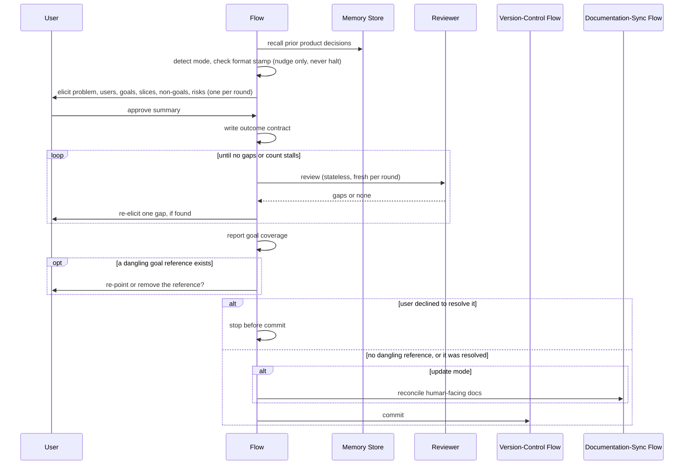

# Flow: vwf Product

## Purpose

Establish the outcome contract the whole blueprint serves — the problem, who has
it, the measurable goals, and what to build first. The phase −1 foundation; the
blueprint sweep halts without it.

Serves:
[Work traces to a stated outcome](../../../product.md#goal-traceable-work),
[The blueprint stays authoritative](../../../product.md#goal-authoritative-blueprint)

## Host & extension point

Claude Code, registered as a **skill**.

## Invocation surface

**Both user- and model-invocable** — the opposite choice from
[the setup flow](../010-vwf-setup/index.md): other flows delegate to it by name
(the bootstrapper prints it as the next step;
[the production-feedback flow](../090-vwf-feedback/index.md) routes a metric
reading), and user-only would hide it from them, failing the delegation
**silently**.

## What the host supplies

Guaranteed: the repository working tree; the user conversation; the ability to
dispatch a fresh stateless reviewer per round, each seeing only the written
document and no conversation history — which is what makes each round's
judgement independent. Conditional (each may be absent, meaningfully): an
existing outcome contract (its presence selects update mode); a prior memory of
settled decisions and parked ideas; recorded metric readings from
[the production-feedback flow](../090-vwf-feedback/index.md); the ability to run
external commands, used to search flow docs for goal references and commit
through [the version-control flow](../120-vwf-git-workflow/index.md).

## Trigger & Actors

| Actor                                                        | May trigger                                                     | Authorization               | Audit-recorded |
| ------------------------------------------------------------ | --------------------------------------------------------------- | --------------------------- | -------------- |
| the user                                                     | the product extension point, by name or from the setup chain    | none — local, no role model | no             |
| [the production-feedback flow](../090-vwf-feedback/index.md) | the product extension point, by name, to route a metric reading | none — local, no role model | no             |

## Steps

1. This flow recalls prior product decisions and parked product-level ideas
   before eliciting, so a re-run builds on what was settled rather than
   re-asking. Proceeds silently if the memory store is unavailable.
2. This flow detects the mode: an existing contract selects **update**, its
   absence **create**. In update mode it reads the recorded metric readings
   first — a metric missing its target is raised before anything else is asked,
   because it is the strongest re-ranking evidence available.
3. This flow compares the repo's format stamp against the shipped one and, on
   drift, **nudges** [the bootstrapper](../010-vwf-setup/index.md) and
   **proceeds anyway** — it runs after the bootstrapper rather than inside it,
   so halting here would strand a repo that is merely behind.
4. The user, guided by this flow, settles six things in order, one decision per
   round: the problem (past solution-shaped answers, to the outcome beneath);
   the target users and each one's core need; the goals, each with a metric,
   target, horizon and where it is read; the slice priority, each slice naming
   the goal it serves; the non-goals, at least one or an explicit none-yet; and
   the risks, riskiest first, each with what validates it. **Unmeasurable
   phrasing is refused** — a proxy metric is proposed instead.
5. The user approves a summary of what will be created or changed before
   anything is written. Nothing lands before this.
6. This flow writes the outcome contract, every goal under a stable anchor so
   other docs can link to it.
7. A stateless reviewer, dispatched fresh per round, returns either no gaps or a
   numbered list; gaps are re-elicited one at a time and the doc rewritten until
   clean. The loop pauses for the user if the gap count stops strictly
   decreasing.
8. This flow reports goal coverage — which goals no flow serves yet, and which
   flow purposes link a goal that no longer exists. The first is information.
   The second **must be reconciled before the commit**.
9. In update mode this flow first reconciles the human-facing docs through
   [the documentation-sync flow](../130-vwf-docs-sync/index.md), then commits
   through [the version-control flow](../120-vwf-git-workflow/index.md).

## Guarantees

| Step / group                                                      | Consistency                                                               | On failure                                                                                                                                                                                                                                                                                                                                                                                                                                                                                                                                                                                                 | Idempotency                                        | Load & latency                        |
| ----------------------------------------------------------------- | ------------------------------------------------------------------------- | ---------------------------------------------------------------------------------------------------------------------------------------------------------------------------------------------------------------------------------------------------------------------------------------------------------------------------------------------------------------------------------------------------------------------------------------------------------------------------------------------------------------------------------------------------------------------------------------------------------- | -------------------------------------------------- | ------------------------------------- |
| Recall → mode detection → drift check → elicitation → write (1–6) | eventual — recall, resolve mode, elicit, approve, then write              | if the memory store is unavailable, the recall is skipped silently and the run proceeds; if the format stamp is behind the shipped one, the bootstrapper is nudged and the run proceeds anyway; a refusal (an unmeasurable goal) is honoured in-conversation, and nothing lands before approval                                                                                                                                                                                                                                                                                                            | full — no progress key; re-run resolves mode fresh | default — per conventions#reliability |
| Review loop → goal coverage → commit (7–9)                        | eventual — review, reconcile retired-goal references, report, then commit | the review loop pauses for the user once the gap count stops strictly decreasing; if the commit fails, the written contract stays on disk, uncommitted, and the run reports it rather than retrying silently — nothing is rolled back, because the contract is worth keeping; if the update-mode documentation reconciliation fails, the commit still proceeds and the doc drift is reported as an open item rather than blocking a contract that is already correct; if the user declines to re-point a dangling goal reference, the run stops before committing — the one case in this group that blocks | n/a — one-shot per invocation                      | default — per conventions#reliability |

Every step in this flow runs synchronously within the invocation that triggers
it; nothing is queued or completed after the run returns.

## Diagram

## Gates & halts

**This flow never halts.** Two gates run inside it instead:

- **Dangling goal reference** — the user is asked to re-point or remove it.
- **Unmeasurable goal** — the user is told a proxy metric is proposed instead.

## Artifacts written

Committed: the outcome contract, with one stable anchor per goal. Never written
here: the human-facing docs reconciled in update mode — those belong to
[the documentation-sync flow](../130-vwf-docs-sync/index.md).

## Acceptance

- Given no contract exists, when this flow runs, then it creates one with a
  stable anchor per goal.
- Given a contract exists, when this flow runs, then it asks only about genuine
  deltas, leaving confirmed content untouched.
- Given a metric reading is missing its target, when update mode runs, then that
  metric is raised before any other question.
- Given the format stamp is behind the shipped one, when this flow runs, then it
  nudges the bootstrapper and proceeds rather than halting.
- Given a proposed goal has no measurable metric, when elicited, then it is
  refused and a proxy metric proposed instead.
- Given a goal is retired, when this flow commits, then every referencing flow
  purpose has been re-pointed or removed first.
- Given the summary is unapproved, when the write step is reached, then nothing
  has been written yet.
- Given the reviewer's gap count stops strictly decreasing, when the loop runs,
  then it pauses for the user instead of looping unattended.

**Abuse case:** `n/a` — the only actor is the developer running the flow on
their own machine, authorized by owning it
([conventions#auth](../../../conventions.md#auth)). There is no external or
unauthenticated trigger to attempt what its authorization does not allow, and
the flow mutates no payment or entitlement.

## References

- [engineering baseline](../../../conventions.md#baseline)
- [the architecture flow](../030-vwf-architecture/index.md), which consumes this
  contract
