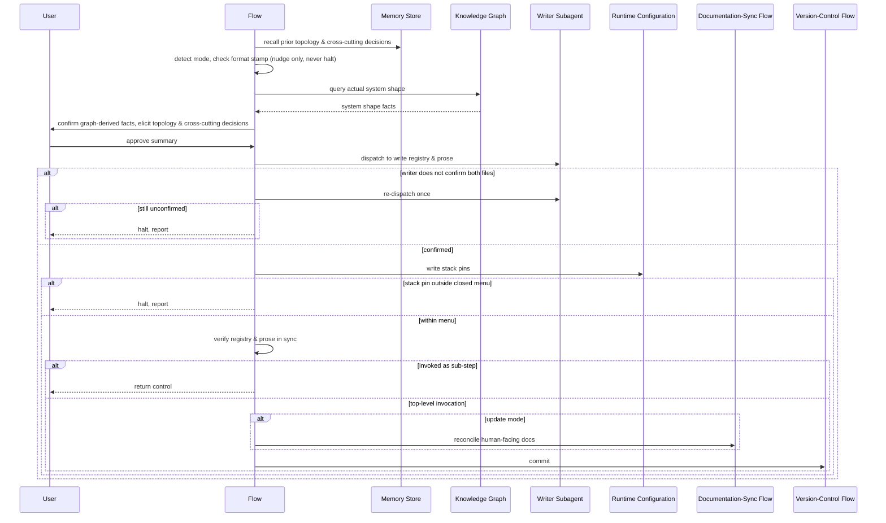

# Flow: vwf Architecture

## Purpose

Establish the system's *shape* — which projects exist, what each is, and how
they interconnect — as a machine-readable registry plus its prose view.

Serves:
[Dependencies precede dependents](../../../product.md#goal-ordered-dependencies),
[The workflow imposes no stack](../../../product.md#goal-stack-agnostic-workflow),
[A working codebase adopts it without a rewrite](../../../product.md#goal-adopt-without-rewrite)

## Host & extension point

Claude Code, registered as a **skill**.

## Invocation surface

**Both user- and model-invocable.**
[The blueprint flow](../050-vwf-blueprint/index.md) and
[the execute flow](../070-vwf-execute/index.md) delegate to it by name to
reconcile the registry as a sub-step, and the bootstrapper prints it in the
chain it prints; user-only would make those delegations fail silently.

## What the host supplies

Guaranteed: the repository working tree; the user conversation; the ability to
dispatch a fresh stateless writer subagent; the ability to run external commands
(to commit through the version-control flow); the closed set of stack options
the installed plugins define, per axis — the menu each project's pin is chosen
from. Conditional, each meaningful when absent: an existing registry (its
presence selects update mode); an existing prose view carrying an embedded
registry (which means the repo predates the split and routes to the
bootstrapper); the outcome contract (its presence selects **derivation** mode);
a knowledge graph of the actual system shape; a prior memory of settled topology
and cross-cutting decisions; the repo's recorded format stamp, present only
where the runtime configuration exists (its absence is what the bootstrapper's
mode detection keys on); the runtime configuration, read for existing pins and
written with the new ones.

## Trigger & Actors

| Actor                                                                                                  | May trigger                                                                        | Authorization               | Audit-recorded |
| ------------------------------------------------------------------------------------------------------ | ---------------------------------------------------------------------------------- | --------------------------- | -------------- |
| the user                                                                                               | the architecture extension point, by name or from the setup chain                  | none — local, no role model | no             |
| [the blueprint flow](../050-vwf-blueprint/index.md) or [the execute flow](../070-vwf-execute/index.md) | the architecture extension point, by name, to reconcile the registry as a sub-step | none — local, no role model | no             |

## Steps

1. This flow recalls prior topology, stack and cross-cutting decisions, plus
   parked system-shape items, before eliciting. Proceeds silently when the
   memory store is unavailable.
2. This flow detects the mode, four ways: an existing registry selects
   **update** (ask only about genuine deltas); an existing prose view carrying
   an embedded registry means the repo predates the split, so it nudges
   [the bootstrapper](../010-vwf-setup/index.md) and then proceeds in update
   mode against the extracted file; no registry but an existing
   [outcome contract](../020-vwf-product/index.md) selects **derivation**;
   neither present recommends the outcome contract be written first.
3. This flow compares the repo's format stamp against the shipped one and, on
   drift, nudges the bootstrapper and proceeds.
4. This flow queries the knowledge graph, where one exists, for the actual
   system shape before eliciting. Every graph-derived fact is confirmed with the
   user before it is recorded; nothing is written on graph output alone. Silent
   skip when no graph is reachable.
5. In derivation mode, this flow proposes the whole registry from the outcome
   contract — projects, roles, platforms, topology, placement — each value
   carrying the evidence it came from, and the user corrects it by choice rather
   than by cold interview. Whatever the contract underdetermines falls back to
   elicitation.
6. The user, guided by this flow, settles the system prose (what the system is,
   the hosted-versus-device split and shared-code strategy, who calls whom),
   then each project in turn (name, role, platforms from that role's closed
   list, path, capabilities, dependencies, documentation unit, and its stack
   pins per axis, picked from the closed menu the installed plugins define —
   there is no free-text entry), then the cross-cutting concerns and the product
   foundations. One decision per round, each naming the project it is about.
7. The user approves a summary of what will be created or changed. Nothing is
   written before this.
8. A fresh stateless writer subagent writes both the registry and its prose
   view, and returns a contract block naming both files. This flow never passes
   either file's contents back through the conversation.
9. This flow writes the stack pins into the runtime configuration itself, never
   through the writer — the writer never sees a stack.
10. This flow verifies the result inline: every project appears in both files,
    the prose carries a system-shape diagram whose nodes are exactly the
    registry's projects, the prose restates nothing machine-readable, no
    placeholder survives, every dependency names a real project, the dependency
    edges form no cycle, every registry project holds a stack pin per axis, and
    every pin resolves within the closed menu.
11. This flow commits through
    [the version-control flow](../120-vwf-git-workflow/index.md), and in update
    mode first reconciles the human-facing docs through
    [the documentation-sync flow](../130-vwf-docs-sync/index.md). When invoked
    as a sub-step by another flow, it returns control instead and does not
    commit — the calling pipeline owns that.

## Guarantees

| Step / group                                                                              | Consistency                                                                                                                                                                                                                                                | On failure                                                                                                                                                                                                             | Idempotency                                                                                                                                                                    |
| ----------------------------------------------------------------------------------------- | ---------------------------------------------------------------------------------------------------------------------------------------------------------------------------------------------------------------------------------------------------------- | ---------------------------------------------------------------------------------------------------------------------------------------------------------------------------------------------------------------------- | ------------------------------------------------------------------------------------------------------------------------------------------------------------------------------ |
| Recall, mode detection, drift check, graph query, derivation, elicitation, approval (1–7) | eventual — recall, detect mode, query the graph, elicit, then approve                                                                                                                                                                                      | a memory store or graph that is unavailable degrades silently and the run proceeds; a format-stamp drift nudges the bootstrapper and the run proceeds anyway                                                           | full — no progress key; re-run resolves mode fresh                                                                                                                             |
| Write registry & prose, stack pins, verification, commit (8–11)                           | atomic — registry, prose and stack pins are verified in sync before the commit; on a halt the writer's files stay on disk — nothing rolls back, and only the runtime configuration's stamp is reverted, only where the bootstrapper's own rule requires it | a writer that never confirms both files halts after one re-dispatch; a stack pin outside the closed menu halts before anything is stamped; a verification gap surviving two re-dispatches stops with the item reported | update mode — a second run resolves to update mode, preserves confirmed content, and rewrites only what changed; registry, prose and stack pins converge rather than duplicate |

Every step runs synchronously — nothing is queued.

## Diagram

## Gates & halts

- **The writer's return does not confirm both files** → re-dispatch once with
  the same inputs; if it still does not confirm both, halt and report. Never
  read a file that was never written.
- **A stack pin or language token outside what the installed plugins define** →
  halt before anything is stamped. The menu is closed.
- **A verification gap** → re-dispatch the writer with the delta, or edit
  directly when the fix is mechanical, then re-read and re-check; the same gap
  surviving two re-dispatches stops with the item reported.
- **No registry and no outcome contract** → not a halt: recommend the contract
  be written first, and offer the full interview as the fallback.

## Artifacts written

Committed: the machine-readable registry (authoritative) and its prose view,
both written by the writer subagent; the per-project stack pins in the runtime
configuration, written by this flow. Nothing is ignored by version control.

## Acceptance

- Given the outcome contract exists and no registry, when this flow runs, then
  it proposes the whole registry with each value's evidence, and the user
  corrects it by choice rather than by cold interview.
- Given a registry already exists, when this flow runs, then it asks only about
  genuine deltas, leaving confirmed content untouched.
- Given an existing prose view carrying an embedded registry, when this flow
  runs, then it nudges the bootstrapper and proceeds in update mode against the
  extracted file.
- Given the repo's format stamp is behind the shipped one, when this flow runs,
  then it nudges the bootstrapper and proceeds rather than halting.
- Given no registry and no outcome contract exist, when this flow runs, then it
  recommends the contract be written first rather than halting.
- Given the knowledge graph reports a fact about the system shape, when this
  flow elicits, then that fact is confirmed with the user before it is recorded.
- Given the writer subagent's return does not confirm both files, when this flow
  re-dispatches once and the return still does not confirm both, then it halts
  and reports rather than reading either file.
- Given a verification gap survives two re-dispatches, when this flow re-checks
  again, then it stops and reports the unresolved item rather than looping.
- Given a stack pin or language token outside what the installed plugins define,
  when this flow reaches the stack-pin step, then it halts before anything is
  stamped.
- Given the registry and prose disagree on which projects exist, when
  verification runs, then it reports the mismatch rather than committing.
- Given the summary is unapproved, when the write step is reached, then nothing
  has been written yet.
- Given this flow is invoked as a sub-step by another flow, when it completes,
  then it returns control without committing.

## References

- [engineering baseline](../../../conventions.md#baseline)
- [the design-system flow](../040-vwf-design-system/index.md) and
  [the blueprint flow](../050-vwf-blueprint/index.md), which consume the
  registry
