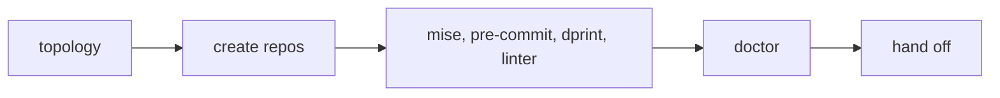

# Language plugins and product templates

Draft for review. Nothing here is built yet.

> **Path/terminology pass applied 2026-08-17**, after the Claude-first cutover:
> paths point at `plugins/`, and frontmatter uses Claude's native spellings.
> Nothing about the *design* was re-decided. Note also that this draft overlaps
> the [stackgen plan](../plans/2026-08-17-stackgen.md), which proposes
> generating language skills rather than authoring a plugin per language — read
> that first, and treat this as the narrower alternative it competes with.

Two asks that turned out to share a spine: a skill that authors a **language
plugin**, and a setup flow where the user **picks a template and starts**
instead of answering a long interview. They meet at the stack template — the
artifact a language plugin ships and the setup flow consumes.

## What exists today

Grounded facts, because several of the decisions below only make sense against
them.

**Twenty stack templates, and only nine belong to a language plugin.**

| Axis              | Count | Owned by                          |
| ----------------- | ----- | --------------------------------- |
| `project`, `repo` | 9     | language plugins                  |
| `backing`         | 7     | capability and cloud plugins      |
| `deploy`          | 5     | cloud, devtools, language plugins |

The eleven `backing` and `deploy` templates name no language at all. This is why
a language plugin is not a subset of stack templates, and stack templates are
not a superset of language plugins: they overlap on one axis and each has a
large half the other never touches.

**`frameworks:` already exists and is unvalidated.** Every stack template
declares it in frontmatter — the union today is `astro`, `react`, `effect`,
`hono`, `refine`, `temporal`, `pulumi`, `flutter` — but no zod schema covers
stack-template frontmatter, so nothing checks it.

**`registry.yaml` already carries `capabilities:` per project**, drawn from
`assets/capability-vocabulary.md`. A capability-shaped template therefore needs
no new vocabulary.

**Roles collapsed to four** in blueprint format 22 — `backend`, `frontend`,
`data`, `system` — each with a closed platform list. vwf reads the platform,
never the role.

**`setup` resolves one of three entry paths and is idempotent by construction.**
Step 0 reads `.config/vwf.yaml` and picks `onboard`, `migrate` or `current`;
there is no progress key, because re-running re-resolves the mode from disk and
a conforming repo lands on `current`. The shared spine after the pipeline
validates the bundle, writes the config, runs `doctor` (halting and reverting
the stamp on a blocking finding), commits, and then **prints** the chain
`product` → `architecture` → `design-system` → `blueprint` without running any
of it.

**`architecture` writes docs only.** It owns `registry.yaml` and the stack pins
in `.config/vwf.yaml`, but the `architecture-writer` agent has no `Bash` tool
and, by its own contract, never sees or records a stack.

## Part 1 — the language-plugin mandate

### The skill

One project-level skill, `.claude/skills/language-plugin/`, doing two jobs:

- **Scaffolder** — slash-invocable. Interviews for the language's facts and
  writes `plugins/<lang>/`.
- **Doctrine** — `user-invocable: false`, `paths: plugins/**`. Read
  automatically while editing a language plugin.

Per-property depth lives in `references/`, following `plugin-authoring` and
`installer-cli`.

### The properties

Enforced by `plugins:check` against any plugin whose project templates declare
`languages:` in their frontmatter. (The manifest key of the same name is gone —
nothing read it, and it folded into `keywords`.)

| Group         | Properties                                                                          |
| ------------- | ----------------------------------------------------------------------------------- |
| Toolchain     | LSP · type checking · linters · formatter · toolchain and version pinning           |
| Verification  | test runner · coverage · benchmarking · profilers                                   |
| Operations    | package manager and manifest · build and run · codegen rules · repository structure |
| Doctrine      | idioms and anti-patterns · docstring convention · frameworks                        |
| Lifecycle     | version migration · dependency-vulnerability pointer to `devtools`                  |
| **Mandatory** | the vwf stack-adapter contract                                                      |

Eighteen waivable, one not.

Three deliberate exclusions:

- **DAP.** Claude Code does not support it. Dropped entirely rather than shipped
  as config nothing reads. Revisit if that changes.
- **Tracing.** The `observability` plugin already mandates that the product
  emits OTLP and never a vendor SDK. Restating that in every language plugin
  would eventually contradict it. Profiling stays; tracing points at
  `observability`.
- **A closed framework list decided by vwf.** See below — the list is derived,
  not authored.

### Waivers

A `waivers:` map in the plugin manifest, property slug to a required reason
string, mirroring vwf's `enforcement.rules`. Build-time only; rendered to no
target.

`plugins:check` fails on an unaddressed property and passes on a waived one.
**Waivers print in the per-target coverage report** — a silent waiver is
indistinguishable from a property nobody thought about, which is the failure
this mechanism exists to prevent.

### Frameworks become a closed vocabulary

`frameworks:` is promoted from unvalidated frontmatter to a checked manifest
field, **derived** as the union of the plugin's own stack templates. One source,
no drift — the pattern the marketplace already uses.

Closed means a project declaring a framework no installed plugin claims is
`unknown = blocking`, exactly as `config_format` 14 did for languages.

This reverses a standing decision. `assets/stack-vocabulary.md` currently says
frameworks stay open, and that passage has to be rewritten rather than quietly
contradicted.

Consequence worth stating: doctrine can only exist for a framework some stack
template names. `flutter` ships GetX and Firebase doctrine while
`dart-flutter.md` declares `frameworks: [ flutter ]`, so that template must
declare them — which it arguably should have all along.

### The retrofit this forces

| Plugin       | Owes                                                                             |
| ------------ | -------------------------------------------------------------------------------- |
| `typescript` | doctrine or waivers for `astro`, `react`, `hono`, `refine`, `temporal`, `pulumi` |
| `flutter`    | `getx` and `firebase` declared on `dart-flutter.md`                              |
| both         | every unaddressed property from the table above, waived or written               |

Nineteen properties is a high bar, and adding a language stops being an
afternoon. The waiver mechanism is what keeps that honest instead of encouraging
thin stubs — provided waivers stay visible.

## Part 2 — green-field setup and product templates

### The split

`setup` gains two paths.

**Green-field** — no config, no manifests, no source. Common bootstrap only:



No project set, no stack. The user then runs `product`, and only after that does
the template pick decide projects and stacks. Goals come before structure.

**Brown-field** — today's `onboard` code sub-path, unchanged.

The shared spine — bundle validation, config write, doctor, approval gate — must
stay genuinely shared. Two divergent paths in one skill is the maintenance risk
here, and duplicated steps are how it goes wrong. vwf 18 already forks `onboard`
on blank-vs-code evidence, so this split is a re-cut of that fork rather than a
new one.

### Where the template pick lives

In `/vwf:architecture`, which takes on all three jobs: the template pick, the
registry and stack pins it already owns, and the scaffolding.

Three consequences:

- **The `architecture-writer` agent can stay as it is.** If the orchestrator
  does the scaffolding and still delegates doc-writing, the agent's "never
  records a stack" contract survives intact.
- **Repo creation is git work.** Every skill delegates git to `git-workflow`,
  which does not do `git init` or submodule-add today. It needs extending.
- **Nothing calls `architecture` for you.** Since vwf 18 setup prints the chain
  and runs none of it, so the template pick is reached only when the user runs
  `architecture` — and the scaffold step still needs a guard, or running it in
  an existing repo will scaffold over it.

### Capability-shaped product templates

A product template names roles, platforms and capability tokens. It never names
a technology, so vwf can own it without breaking its own neutrality rule.

```yaml
---
axis: product
name: SaaS — web app and API
slug: saas-web-api
topologies: [ monorepo, multi-repo ]
projects:
  - role: frontend
    platforms: [ webapp ]
  - role: backend
    platforms: [ service ]
    capabilities: [ relational-datastore, third-party-auth, distributed-tracing ]
  - role: system
    platforms: [ iac ]
---
```

`/vwf:architecture` resolves each capability against the installed plugins'
menus and asks only where two candidates compete — `relational-datastore`
resolves to `postgres` alone if only `datastore` is installed, and becomes one
question if `gcp` is installed too.

This is what collapses roughly ten per-axis picks into one pick plus a few
disambiguations, without merging the axes. They are still independent; they are
just resolved in one pass.

The shape maps onto `registry.yaml` directly, since it already carries `role`,
`platforms` and `capabilities` per project.

### What architecture becomes

Less of a blank-page interview. It arrives with a proposed project set and
resolves what the template left open, rather than eliciting every project from
nothing.

## Part 3 — the stack-template authoring skill

A **sibling** of the language-plugin skill, not a parent — the nine-versus-
eleven split above is why. It covers all four axes plus the new product axis,
across every plugin kind.

Deferred deliberately. The hard part of authoring `typescript-effect-hono.md` is
not the language: it cites `product-foundations` concerns,
`baseline/write-versioning`, `rules/integrations-via-common`, and the
`local_stack` harness capability supplied by a *different* axis. A skill for
that should be written once the product axis exists, not twice.

## Order of work

| # | Workstream                                                                                                                      | Depends on |
| - | ------------------------------------------------------------------------------------------------------------------------------- | ---------- |
| 1 | Language-plugin skill, the mandate, `frameworks` and `waivers` in `schema/src/manifest.ts`, a stack-template frontmatter schema | —          |
| 2 | Closed frameworks: `config_format` bump, `doctor` check, rewrite `stack-vocabulary.md`                                          | 1          |
| 3 | Retrofit `typescript` and `flutter`                                                                                             | 1, 2       |
| 4 | Green/brown-field `setup` split                                                                                                 | —          |
| 5 | Product templates, architecture rework, `git-workflow` extension                                                                | 4          |
| 6 | Stack-template authoring skill                                                                                                  | 5          |

1 to 3 and 4 to 5 are independent of each other and can run in either order.

## Open questions

- **Does topology constrain the product-template menu?** A three-repo template
  is simply not offered to someone who picked single-repo — or may a template
  propose a topology change instead?
- **Which language drives workstream 1?** A concrete first plugin would test
  whether nineteen properties is the right bar before `typescript` and `flutter`
  are retrofitted against it.
- **What ends green-field setup?** A menu of next steps risks offering
  `architecture` before `product`, which the ordering forbids. A single "run
  `product` next" hand-off is safer.
- **How many product templates ship initially, and which?** The menu's value
  depends on it covering the common shapes without becoming its own interview.

## Risks

- **Two setup paths drift.** The likeliest failure. Mitigation: share the common
  steps structurally, do not copy them.
- **Closed frameworks blocks real projects.** Anything niche now needs a plugin
  declaring it. The `unknown = blocking` behaviour is correct but will be felt.
- **The mandate discourages new languages.** Nineteen properties is a real cost.
  Watch whether waivers become the normal path rather than the exception.
- **`architecture` grows too large.** It would own the template pick,
  scaffolding, the registry, stack pins and capability resolution. If it gets
  unwieldy, splitting the scaffolding back out is the escape hatch.
