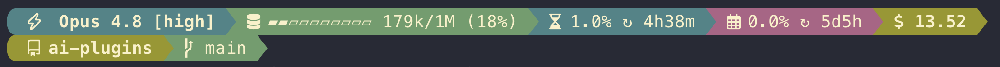

# Statusline

A powerline-style
[Claude Code statusline](https://docs.claude.com/en/docs/claude-code/statusline)
installed by the `@askviraj/ai-plugins` CLI. One script drives **two surfaces**
— the main two-line status bar and the subagent panel — and everything it draws
is data-driven from JSON, so you can restyle it per repo without touching code.

- Script: [`tools/statusline/statusline`](../tools/statusline/statusline)
- Defaults:
  [`tools/statusline/statusline.json`](../tools/statusline/statusline.json)
- Schema: [`schemas/statusline.schema.json`](../schemas/statusline.schema.json)

> **Requires a [Nerd Font](https://www.nerdfonts.com/).** The separators and
> most symbols are private-use glyphs; without a patched font they render as
> boxes.

## What it looks like



## Wiring it up

Run the installer with `npx` (or `pnpm dlx`) — no global install needed:

```sh
# install both surfaces
npx @askviraj/ai-plugins --statusline --subagentstatusline

# or just one
npx @askviraj/ai-plugins --statusline
npx @askviraj/ai-plugins --subagentstatusline
```

The CLI:

- copies the statusline script into `~/.claude/scripts/` (made executable),
- seeds `~/.config/statusline.json` with the bundled defaults — or, if it
  already exists, deep-merges any missing settings into it (your edits are
  preserved), and
- writes the requested key(s) into `~/.claude/settings.json`, leaving any other
  settings untouched.

If a target key already exists, the CLI prints the current value and asks before
overwriting. Pass `--yes` (`-y`) to overwrite without prompting.

The blocks it writes:

```json
{
  "statusLine": {
    "type": "command",
    "command": "${HOME}/.claude/scripts/statusline",
    "padding": 0,
    "refreshInterval": 4
  },
  "subagentStatusLine": {
    "type": "command",
    "command": "${HOME}/.claude/scripts/statusline"
  }
}
```

The script reads the Claude Code payload on stdin and detects the surface: a
payload with a `tasks` array renders the subagent panel, anything else renders
the main bar. Errors go to stderr so they never corrupt the line.

## Configuration

Configuration is layered. Two files are deep-merged at render time, in
increasing precedence (a higher layer overrides the same key in a lower one):

1. **Per-user** (lowest) — `~/.config/statusline.json`. The installer seeds this
   with the **full** default config (palette, symbols, per-segment styling, line
   layout, subagent panel, …) and, on re-run, deep-merges any settings you're
   missing while preserving your edits. This is your global, editable config and
   the source of all defaults.
2. **Per-repo overrides** (highest) — `<repo-root>/.config/statusline.json`.

Either layer may be absent. Merge semantics: **objects merge key-by-key, arrays
replace wholesale.** So a repo (or user) can set just `projectName` and inherit
everything else, override a single nested value (one segment's `bg`, one symbol,
the gauge width, a status colour), or replace `lines` entirely.

Add the published schema for editor autocompletion and validation (already
present in the defaults):

```json
"$schema": "https://raw.githubusercontent.com/virajp/ai-plugins/main/schemas/statusline.schema.json"
```

### Colours

Anywhere a colour is expected you can use one of three forms:

| Form         | Example               |
| ------------ | --------------------- |
| Palette name | `"blue"`              |
| Hex string   | `"#458588"`, `"#abc"` |
| RGB triple   | `[69, 133, 136]`      |

Palette names resolve against the `palette` map, so define a name once and reuse
it everywhere.

### Top-level keys

| Key               | Type            | Purpose                                                                                                        |
| ----------------- | --------------- | -------------------------------------------------------------------------------------------------------------- |
| `projectName`     | string          | Project display name for the `project` segment (glyph from `symbols.project`). Unset → the segment is omitted. |
| `palette`         | map<name,RGB>   | Named colours as `[r,g,b]` triples.                                                                            |
| `powerline`       | object          | Divider glyphs: `sep`, `sepThin`, `cap`, and `thinFg` (colour of the thin divider).                            |
| `defaultFg`       | colour          | Foreground for segments that don't set their own `fg`.                                                         |
| `gauge`           | object          | The `context` meter: `width`, `filled` glyph, `empty` glyph.                                                   |
| `worktreePattern` | regex string    | Path component that marks a git worktree; the subpath after it feeds the `worktree` segment.                   |
| `symbols`         | map<key,glyph>  | Glyph per data type (see below).                                                                               |
| `typeSymbols`     | map<type,glyph> | Subagent `type` → glyph; `_default` is the fallback.                                                           |
| `segments`        | map<id,style>   | Default styling (`bg`/`fg`/`bold`) per main-bar segment.                                                       |
| `lines`           | array of rows   | The layout (see below).                                                                                        |
| `subagent`        | object          | The subagent panel config (see below).                                                                         |

`symbols` keys consumed by the script: `model`, `context`, `win5h`, `win7d`,
`reset`, `session`, `cost`, `duration`, `project`, `worktree`, `folder`,
`branch`, `ahead`, `dirtyAdd`, `dirtyDel`, `dirtyMix`, `agent`, `tokens`.

The `branch` segment appends markers after the branch name: `ahead` (default
`↑`) when the branch is ahead of its upstream — i.e. there are local commits not
yet pushed — followed by the dirty marker (`dirtyAdd`/`dirtyDel`/`dirtyMix`).
Each is shown only when it applies; `ahead` is omitted when the branch is in
sync or has no upstream.

### Lines and segments

`lines` is a list of rows; each row is a list of segment entries. An entry is
either a **segment id string** or an **object** `{ name, bg?, fg?, bold? }` that
overrides that segment's styling inline. Both resolve their default styling from
the `segments` map. A row that resolves to no visible segments is dropped.

Available segment ids: `model`, `context`, `rl5h`, `rl7d`, `session`, `cost`,
`duration`, `project`, `worktree`, `branch`. Several render conditionally and
disappear when their data is absent (e.g. `session` with no session name,
`project` with no `projectName`, `worktree`/`branch` outside a repo).

```json
"lines": [
  ["model", "context", "rl5h", "rl7d", "session", "cost"],
  ["project", "worktree", "branch"]
]
```

### Subagent panel

The `subagent` block configures the panel surface:

| Key                  | Purpose                                                                                                                                         |
| -------------------- | ----------------------------------------------------------------------------------------------------------------------------------------------- |
| `descBudgetFraction` | Fraction of terminal width given to the description before it's truncated (default `0.45`).                                                     |
| `statuses`           | Status buckets, tried in order. First whose `match` regex hits wins; empty `match` = fallback.                                                  |
| `segments`           | Styling per row segment: `head` (status + type glyph), `name` (subagent name, falling back to its type), `model`, `desc`, `tokens`, `duration`. |

Each `statuses` entry is `{ match, symbol, bg }` — `match` is a case-insensitive
regex against the lower-cased task status, `symbol` is the status glyph, and
`bg` colours the head segment. The head segment's background always comes from
the matched status; the subagent `name` renders as its own segment (styled via
`subagent.segments.name`) when the task has a name.

## Examples

**Just rename the project (and change its glyph), keep everything else:**

```json
{
  "$schema": "https://raw.githubusercontent.com/virajp/ai-plugins/main/schemas/statusline.schema.json",
  "projectName": "my-project",
  "symbols": { "project": "" }
}
```

**Override one segment's colour and the gauge width:**

```json
{
  "segments": { "model": { "bg": "#d65d0e" } },
  "gauge": { "width": 16 }
}
```

**Replace the layout (arrays replace wholesale):**

```json
{
  "lines": [["model", "context", "cost"], ["branch"]]
}
```

**Recolour a subagent status:**

```json
{
  "subagent": {
    "statuses": { "running": { "bg": "purple" } },
    "segments": { "desc": { "bg": "grey" } }
  }
}
```

## Testing locally

```sh
# main bar
echo '{"model":{"display_name":"Opus 4.8"},"effort":{"level":"high"},"cost":{"total_cost_usd":46.51,"total_duration_ms":33540000},"context_window":{"used_percentage":26,"context_window_size":1000000,"total_input_tokens":259000},"rate_limits":{"five_hour":{"used_percentage":7,"resets_at":1774200000},"seven_day":{"used_percentage":1.0,"resets_at":1774600000}}}' | node tools/statusline/statusline

# subagent panel
echo '{"columns":120,"tasks":[{"id":"t1","name":"reviewer","type":"review","status":"running","description":"Auditing auth flow","tokenCount":18234,"startTime":1774200000000}]}' | node tools/statusline/statusline
```
