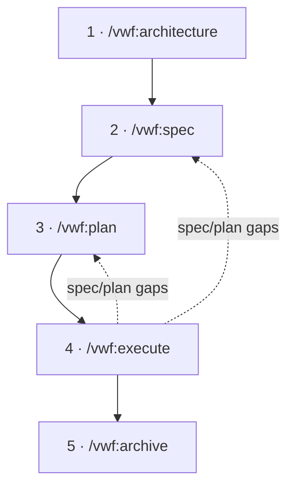
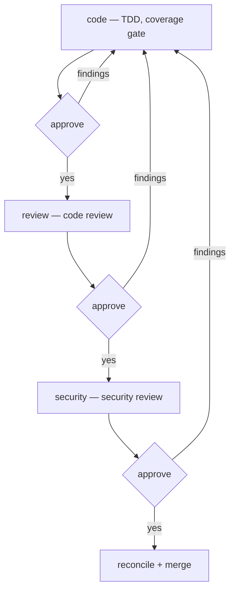

# vwf — Spec → Plan → Execute

`vwf` is an opinionated workflow plugin for Claude Code. It turns a vague
feature request into shipped, reviewed code through three disciplined phases:

1. **Spec** — keep an always-current blueprint of the *whole product*.
2. **Plan** — diff the spec against the real code for one slice, and write the
   delta to apply.
3. **Execute** — implement the plan under strict TDD, then run code review and
   security review behind approval gates.

You drive it with slash commands. Claude does the work, asks one question at a
time, and never writes until you approve.

## Prerequisites

`vwf` shells out to a few external tools. Install them first — the installer
checks for each and prints the exact command for anything missing.

| Tool            | Why                                      | Install                               |
| --------------- | ---------------------------------------- | ------------------------------------- |
| Claude Code CLI | hosts the commands                       | `mise use -g claude-code@latest`      |
| mise            | resolves the toolchain                   | `brew install mise`                   |
| node + pnpm     | `context7` MCP server; the npm→pnpm hook | `mise use -g node@latest pnpm@latest` |
| rtk             | the `rtk hook claude` Bash hook          | `brew install --formulae rtk`         |
| graphify        | knowledge graph the commands rely on     | `mise use -g pipx:graphifyy@latest`   |

`vwf` also depends on three plugins — `context7`, `markdown`, and `mempalace` —
all resolved from the same `virajp-plugins` marketplace. Claude Code
**auto-installs and auto-enables** them when you enable `vwf` (requires Claude
Code ≥ 2.1.143).

## Install

```sh
# Installs vwf + its plugin dependencies, and wires up graphify
pnpx @askviraj/ai-plugins --plugin vwf
```

Installing outside a git repo? Add `--skip-graphify` to bypass graphify's
repo-scoped setup:

```sh
pnpx @askviraj/ai-plugins --plugin vwf --skip-graphify
```

Restart Claude Code afterward so the commands, hooks, and dependencies load.

## The mental model

The three phases map to three questions:

- **Spec** answers *what should the whole product be?* — permanent,
  product-wide, organized by entity.
- **Plan** answers *what changes for this one slice, and in what order?* — a
  diff, not a re-spec, scoped to a single entity or section.
- **Execute** answers *is it built, correct, and safe?* — TDD, then review.



`architecture` runs once to bootstrap; then you loop
`spec → plan → execute →
archive` per slice. When execution exposes a hole in
the spec or plan, `vwf` captures it and loops back to fix the source — never
silently working around it.

## The documents it maintains

`vwf` keeps everything in version-controlled Markdown under `docs/`. The spec is
the desired state; the plans are the changes you apply to reach it.

```text
docs/
├── specs/                       # the always-current blueprint (desired state)
│   ├── architecture.md          # system shape + machine-readable Project Registry
│   ├── conventions.md           # cross-cutting decisions (auth, errors, …)
│   └── <entity>.md              # one doc per entity (or an <entity>/ folder)
└── plans/                       # per-cycle plans (the diff to apply)
    ├── <date>-<time>-<slice>.md
    └── archived/                # retired, completed plans
```

Each entity doc holds the full-stack picture for that entity — stable product
intent at the top, volatile engineering detail (data model, API, jobs, screens)
below a marker. The **Project Registry** in `architecture.md` is a yaml block
that `spec` and `plan` parse to map an entity's sections to the right project by
`type` — so the workflow stays stack-agnostic.

## Commands

| Command               | Model  | What it does                                              |
| --------------------- | ------ | --------------------------------------------------------- |
| `/vwf:architecture`   | opus   | Bootstrap or update the system shape + Project Registry   |
| `/vwf:spec [entity]`  | opus   | Maintain the full-product blueprint, one doc per entity   |
| `/vwf:plan [slice]`   | opus   | Write a reviewable cycle plan — a diff of spec vs code    |
| `/vwf:execute [mode]` | opus   | Implement the plan under TDD, then code + security review |
| `/vwf:archive [plan]` | sonnet | Retire a completed plan into `docs/plans/archived/`       |
| `/vwf:handoff <name>` | opus   | Capture the session so work resumes in a fresh one        |
| `/vwf:recall <name>`  | sonnet | Resume from a handoff in a fresh session                  |
| `/vwf:git-workflow`   | —      | Internal — worktree isolation, commits, merges            |

### /vwf:architecture

Run this **first**. It elicits your system's shape — projects, their types and
stacks, how they interconnect, where they deploy — and writes
`docs/specs/architecture.md`, including the machine-readable Project Registry
the other commands depend on. Re-run it any time the topology changes; it asks
only about genuine deltas, never re-eliciting what's confirmed.

This is the one doc that *does* name technologies and infrastructure — the spec
deliberately doesn't.

### /vwf:spec

Maintain the desired end state of the **whole product**, one entity at a time:

```text
/vwf:spec order
```

`spec` reads the registry, works out which engineering surfaces apply to the
entity (data model, API, jobs, screens), and elicits the gaps with you. It then
writes `docs/specs/order.md` and updates `conventions.md` for any cross-cutting
decision raised.

A fresh **reviewer subagent** then checks the doc against a completeness
checklist and returns `NO GAPS` or a numbered list. Gaps loop back to you for
the specific open decisions, then re-review — until the doc passes. The spec is
permanent and product-wide; it is never feature-scoped.

### /vwf:plan

Produce a reviewable plan for one slice of the spec:

```text
/vwf:plan order
/vwf:plan order/api      # just one section of the entity
```

A plan is a **diff**. `plan` reads the desired state (the spec slice +
conventions + registry) and the actual state (the real code the registry maps
the slice to), then writes only the delta — what exists, what's missing, what
changes, and the order to do it in — to `docs/plans/<date>-<time>-<slice>.md`.
Steps are ordered for TDD: each names the failing test that defines "done". If
the spec implies a surface the code lacks, `plan` flags it as drift rather than
quietly resolving it. You approve the plan before any code is written.

### /vwf:execute

Implement an approved plan. Execution is mechanical from the plan, but strict:

```text
/vwf:execute            # full pipeline from the start
/vwf:execute review     # jump to a stage (the prior stage must be complete)
```

It runs three stages, each in a fresh purpose-built subagent, each behind a
**mandatory approval gate**:

| Stage    | Model  | What happens                                                                |
| -------- | ------ | --------------------------------------------------------------------------- |
| code     | sonnet | Implements the plan under TDD (RED → GREEN → REFACTOR) to the coverage gate |
| review   | opus   | Adversarial code review against the plan, spec, conventions, and stack      |
| security | opus   | Threat-models the change against the project's declared capabilities        |



`vwf` never chains stages automatically — it pauses for your approval at every
gate. Review and security findings loop back to `code` to fix, then re-review.
When a stage exposes a **gap** (a hole in the spec or plan, not a code bug),
it's recorded — to the plan doc and to memory — and reconciled at the end of the
cycle, where `vwf` offers to fix the spec (`/vwf:spec`) or re-derive the plan
(`/vwf:plan`). It then reconciles the architecture registry and offers to
archive the plan.

### /vwf:archive

Move a finished plan out of the active set into `docs/plans/archived/`. It never
deletes. Run it manually, or accept the offer at the end of `execute`.

```text
/vwf:archive
```

### /vwf:handoff and /vwf:recall

Long sessions lose fidelity. When the context window grows **beyond ~60%**,
capture the session so a fresh one can continue:

```text
/vwf:handoff auth-refactor      # write a handoff, file it to memory
```

`handoff` writes a structured handoff document — goal, current state, key
decisions, open next steps, and (when there's a clear next action) a
ready-to-paste **next prompt** — and stores it in mempalace under your project.
In a new session:

```text
/vwf:recall auth-refactor       # rebuild context, then optionally run the next prompt
```

`recall` retrieves the handoff, reads the files it points to, summarizes where
you left off, and offers to run the captured next prompt. If mempalace is
unavailable, `handoff` falls back to `docs/handoffs/<name>.md` and `recall`
reads it from there.

### /vwf:git-workflow

Internal — you rarely invoke it directly. The other commands route **all** git
actions through it: it isolates work in a git worktree (never the main
checkout), commits with conventional messages, and merges. It never pushes
without your explicit request.

## How it asks questions

`vwf` is deliberately conversational. `architecture`, `spec`, and `plan` share
one **elicitation protocol**:

- **Explore first** — read the docs, code, and recent commits before asking
  anything; never ask what the registry or code already answers.
- **One decision per round** — multiple-choice with an "Other" escape hatch;
  each answer shapes the next question.
- **Only real decisions** — if exactly one idiomatic answer exists, it proceeds
  without asking. It never guesses an open decision — it records it instead.
- **Propose 2–3 approaches** — with trade-offs and a recommendation, before
  settling a direction.
- **Hard gate** — it presents the shape and waits for your approval before
  writing anything, however small the change looks.

## Memory

`vwf` uses the `mempalace` plugin as cross-session memory so each cycle builds
on the last instead of re-deriving it. It recalls prior decisions and findings
before working, and persists durable outcomes after. Memory is keyed by your
project (the **wing**) and split into rooms:

| Room        | Holds                                                      |
| ----------- | ---------------------------------------------------------- |
| `decisions` | design/architecture decisions and the *why*                |
| `problems`  | review and security findings and how they were resolved    |
| `planning`  | plan rationale and deferred options                        |
| `gaps`      | spec/plan holes surfaced during execution, and their fixes |
| `handoff`   | session handoffs for `/vwf:handoff` and `/vwf:recall`      |

Memory is best-effort: if mempalace is unavailable, `vwf` skips every memory
step and proceeds. Gaps are also mirrored into the plan doc, so they survive a
memory outage.

## A worked walkthrough

A first slice, end to end. Assume a backend service with an `order` entity.

```text
# 1. Bootstrap the system shape and registry (once per workspace)
/vwf:architecture

# 2. Specify the order entity — answer the questions, approve the doc
/vwf:spec order
#    → writes docs/specs/order.md, gated by the completeness reviewer

# 3. Plan the first slice — review the diff, approve it
/vwf:plan order
#    → writes docs/plans/2026-06-24-1430-order.md (TDD-ordered steps)

# 4. Execute — approve at each gate
/vwf:execute
#    → code (TDD) → [approve] → review → [approve] → security → [approve]
#    → reconcile registry + any gaps → merge via git-workflow

# 5. Archive the completed plan
/vwf:archive
```

From here, loop steps 2–5 per slice. Update the spec when the product changes;
re-run `architecture` only when the system's *shape* changes.

## Skills it ships

Two skills back the workflow's quality. You don't invoke them directly — they
inform how Claude writes and reviews:

- **`karpathy-guidelines`** — behavioral rules that reduce common LLM coding
  mistakes: think before coding, keep changes surgical, surface assumptions,
  define verifiable success criteria.
- **`rest-api-design`** — technology-agnostic REST API principles (versioning,
  error formats, pagination, auth, OpenAPI), applied whenever the spec or plan
  touches an API surface.

## Tips

- **Run `architecture` first.** `spec` and `plan` halt without a registry.
- **Keep slices small.** One entity or one section per plan/execute cycle keeps
  reviews sharp and the diff reviewable.
- **Trust the gates.** Read what each stage reports before approving — the
  approval is the point, not a formality.
- **Hand off early.** A handoff written at 60% context is worth far more than
  one squeezed out at 95%.
