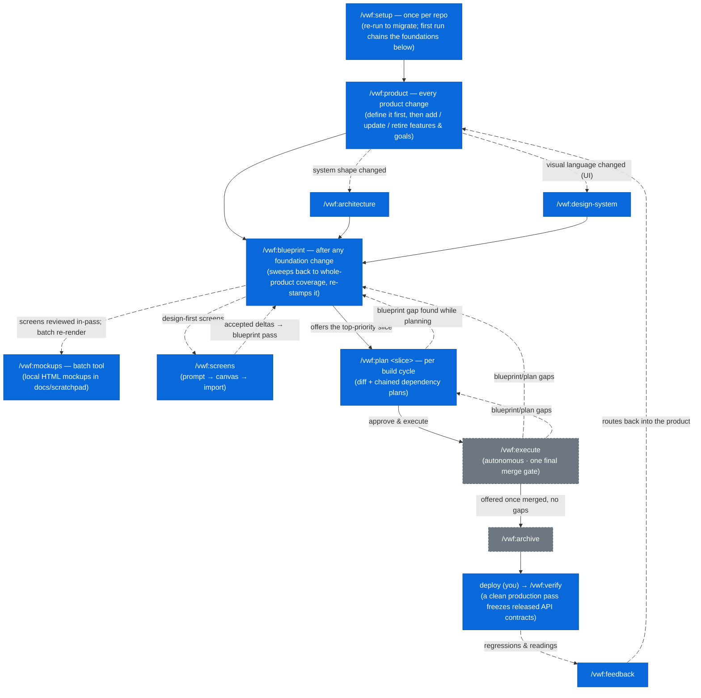
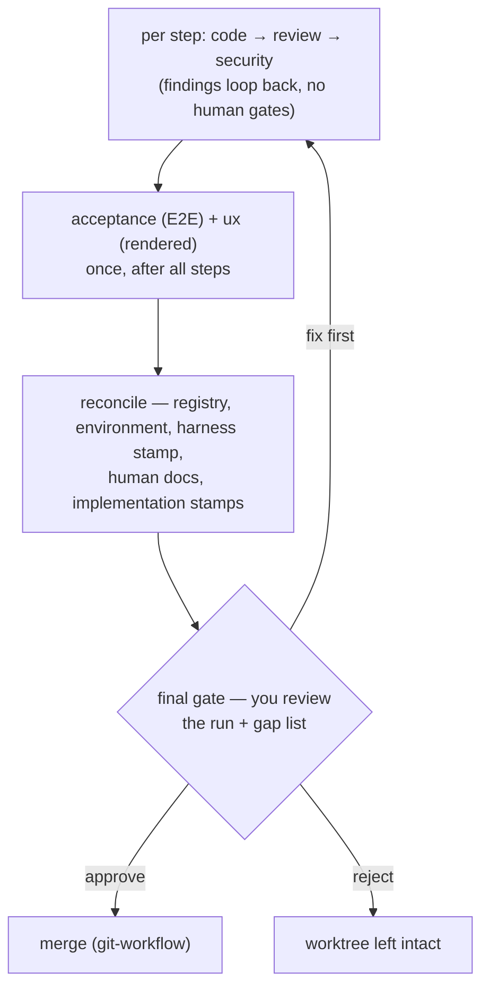

# vwf plugin

The flagship plugin of the `virajp-plugins` marketplace — an opinionated
workflow that turns a vague idea into a shipped, reviewed product through four
disciplined phases: **Product → Blueprint → Plan → Execute**, with post-deploy
verification and a production-feedback intake closing the loop.

This is the full manual. For the short pitch and the rest of the marketplace,
see [../readme.md](../readme.md).

## Install

```sh
# Installs vwf + its plugin dependencies, and wires up graphify
pnpx @askviraj/ai-plugins --user vwf
```

Installing outside a git repo works too: `graphify install` still runs, and its
repo-scoped post-commit hook is skipped automatically (with a note).

Restart Claude Code afterward so the commands, hooks, and dependencies load.

## Prerequisites

`vwf` shells out to a few external tools. Install them first — the installer
checks for each and prints the exact command for anything missing.

| Tool            | Required?    | Why                                             | Install                               |
| --------------- | ------------ | ----------------------------------------------- | ------------------------------------- |
| mise            | **required** | task runner + resolves the toolchain            | `brew install mise`                   |
| graphify        | **required** | knowledge graph the commands rely on            | `mise use -g pipx:graphifyy@latest`   |
| node + pnpm     | **required** | launches vwf's Context7 MCP server (`pnpm dlx`) | `mise use -g node@latest pnpm@latest` |
| Claude Code CLI | **required** | hosts the commands                              | `mise use -g claude-code@latest`      |
| uv              | **required** | graphify's and mempalace's Python runtime       | `mise use -g uv@latest`               |
| rtk             | **required** | the token-saving `rtk hook claude` Bash hook    | `brew install --formulae rtk`         |

Every row above is in `vwf`'s `requires:` list, which the installer treats as a
**hard gate**: it refuses the install and prints the command for anything
missing, rather than succeeding into a plugin that fails later with nothing
pointing back at the install. `rtk` is the one whose *runtime* behaviour is
softer than its install gate — the hook entry is guarded, so a `vwf` that
somehow finds itself without `rtk` degrades (with a `/vwf:doctor` warning)
instead of blocking every Bash call.

**The memory server runs as your own daemon.** `vwf` declares mempalace over
**HTTP** (`http://127.0.0.1:8765/mcp`), not as a stdio subprocess — start it
with `mempalace serve --host 127.0.0.1 --port 8765` (loopback needs no token).
One daemon serves every Claude Code instance at once, survives session restarts,
and reconnects instead of dying with the session. Toggle the mempalace
**plugin's** own stdio server off in `/mcp` — two servers would contend for
mempalace's single writer lease. See [mempalace](./mempalace.md).

`vwf` also depends on three plugins — `mempalace`, `andrej-karpathy-skills`, and
`devtools` — all resolved from the same `virajp-plugins` marketplace. Claude
Code **auto-installs and auto-enables** them when you enable `vwf` (requires
Claude Code ≥ 2.1.143). `devtools` is a dependency rather than an optional extra
because `/vwf:setup` orchestrates `/devtools:scaffold`, and a skill vwf cannot
see fails silently.

The Markdown/documentation skills and the Context7 docs server used to be two
more dependencies. They are **part of `vwf` now**: `documentation-standards` and
`/vwf:readme` are vwf skills, and Context7 is one of vwf's two MCP servers.

**`cicd` is not among them.** vwf states the delivery-pipeline *contract*; the
[`cicd`](./cicd.md) plugin implements it on whichever CI system a repo uses.
Install it when you want pipelines generated — vwf works without it.

**A design tool is not among them.** vwf is decoupled from any particular one:
it delegates screen and design-system imports to two fixed skills in the
**design-tools** plugin, which resolves the tool **per project** — so a product
can design its website in Lovable and its app on the Claude Design canvas.
Supported tools today are `claude-design`, `lovable` and `stitch`; adding one is
a reference file in that plugin, not a vwf change. Export needs no adapter at
all, since `/vwf:screens prompt` just writes design briefs as files.

## Caveats

`vwf` is deliberately heavyweight. Know what you're signing up for before
adopting it.

**Model & cost**

- **Built for a large context window.** The orchestrator holds a lot at once:
  the blueprint, the plan, the registry, and each subagent's output. Run Claude
  Code with the **1-million-token** context; the standard window will degrade or
  overflow on a real cycle.
- **Model and effort are tiered per surface, not uniform.** `opus` runs where
  judgment decides the outcome (`product`, `blueprint`, `plan`, the
  `blueprint-reviewer` and `blueprint-coherence-reviewer` gates) or where nobody
  is watching — `execute` is the only unattended command, and its
  `execute-coder`, code-review, security-review, and ux subagents are all `opus`
  too. `sonnet` runs the remaining commands and the writer/surveyor subagents;
  `haiku` runs the two purely mechanical ones (`archive`, `recall`). Effort
  follows the same logic rather than sitting at maximum everywhere: a stronger
  model reaches the same answer in fewer reasoning tokens, so capability and
  effort are traded against each other per surface instead of both being maxed.
  No gate is weakened — every review stage still runs, and config can never
  disable one.
- **Read-heavy work is delegated to keep the orchestrator fast.** Coverage
  scans, the desired-vs-actual codebase survey, and the bulk doc writing run in
  subagents (`blueprint-surveyor`, `plan-surveyor`, `flow-writer`,
  `entity-writer`) that return conclusions rather than file contents. Anything
  the orchestrator loads is re-processed on every later turn of the pass, so
  keeping scans out of its context compounds across a sweep.
- **High token cost.** An `execute` cycle runs several subagents per step — the
  coder, code review and security review all on `opus`, plus E2E acceptance and
  UX conformance when the slice warrants them — with fix loop-backs. The coder
  is the dominant consumer: it runs per step and per fix round, so `opus` there
  is the single largest cost in the workflow. The wager is that better code
  means fewer `code → review` rounds, and round count drives a cycle's length
  more than per-token latency does. Independent stages also run concurrently —
  review ‖ security per step, all per-doc blueprint reviewers in one round —
  which cuts wall-clock but not spend. Expect a meaningful cost per slice; this
  is not a cheap workflow.

**Dependencies**

- **Hard external prerequisites.** `mise`, `graphify`, `uv`, `pnpm` and `rtk`
  must be on your `PATH` — the installer refuses the install without them, and
  `/vwf:setup` and `/vwf:execute` halt without mise or graphify at run time.
  Dependency auto-install/enable needs Claude Code ≥ 2.1.143. See
  [Prerequisites](#prerequisites).
- **Memory is written twice, so mempalace is optional.** Every memory write goes
  to both `mempalace` (an **HTTP daemon you run** — `mempalace serve`) and a
  markdown tree under `docs/memory/`. Without the daemon nothing is lost, but
  recall degrades from semantic search to grep, and says so. `decisions`,
  `planning`, `gaps` and `problems` are committed; `handoff`, `doctor` and
  `runs` are gitignored, being one developer's state rather than the team's.
- **Leans on review engines.** `execute`'s code- and security-review stages run
  on the `/code-review` and `/security-review` engines, falling back to their
  own manual review dimensions when an engine is unavailable.

**Fit**

- **High-touch where it matters, autonomous where it doesn't.** The authoring
  phases (product, architecture, design-system, blueprint, plan) ask one
  question at a time and gate on your approval — plan for interactive sessions.
  `/vwf:execute` then runs the approved plan **unattended**: code, code review,
  and security review per step (plus one acceptance + ux pass after all steps),
  deciding from a fixed rule set and stopping only on a hard halt, a resource
  cap, an all-blocking gap, an irreversible decision — or the **final gate**,
  where you review the whole run and approve the merge.
- **Released APIs are frozen.** Once `/vwf:verify` records a production release,
  breaking a released API contract is blocked like a security finding —
  reviewers loop it until fixed, and the only way out is a conscious
  major-version bump. If you want to move fast and break contracts, this will
  fight you.
- **Requires a testable project.** `execute` enforces non-negotiable TDD and a
  coverage gate. A project without a test runner won't fit the execute stage;
  missing coverage tooling is tolerated (the coder reports `coverage: n/a` and
  the gate decides). The verification harness (dev server, E2E suites, staging
  mode) is self-healing: `setup` detects and stamps what exists, and `plan`
  injects bootstrap steps for whatever a slice's gates need — so harness gaps
  surface at plan time with their fix attached, not as surprises at a gate.
- **Assumes a registry-described workspace.** `plan` and `execute` map each
  slice to a project in the architecture registry and read its code (submodules
  included). You model the codebase with `/vwf:architecture` first; it won't
  operate on an ad-hoc folder.
- **Structure and stacks are both menus.** `vwf` ships three topology templates
  (`repo` / `monorepo` / `polyrepo`) and `/vwf:architecture` presents stack
  templates per axis — you pick, and the choice plus its reason is recorded so
  it is never re-litigated. The one structural requirement left: a **polyrepo is
  rooted at a submodule parent**, because vwf needs one place for the blueprint.
- **Solo / small-team focus.** It is highly opinionated — one workflow, one set
  of conventions. Great for a solo dev or small team; not a configurable
  framework for a large org.

## The mental model

Each phase answers one question:

- **Product** answers *is this worth building, and what does "good" mean?* — the
  problem, the users, measurable goals, and the order to build in. Every flow in
  the blueprint must trace to a goal here.
- **Blueprint** answers *what should the whole product be?* — permanent,
  product-wide, organized by **flow** (the user/system journeys, grouped by the
  registry project that owns each journey and numbered in execution order —
  mobile-app flows live apart from website and console flows), with entities as
  the supporting data contracts. It is a **code-independent technical
  contract**: it pins every decision that has more than one reasonable answer
  *and* is true regardless of how the code is written — flows (each with
  acceptance criteria and a sequence diagram, carrying the screens and jobs they
  need), data models as JSON-Schema `schema.yaml` files, API surfaces as
  per-service OpenAPI contracts, relationships, concurrency, and UI/UX — so
  `plan` and `execute` never have to ask or assume. A whole-product coherence
  review walks every flow across the entities and contracts before coverage
  counts as complete. Reuse-vs-build, file placement, ordering, and library
  choices are `plan`'s job, not the blueprint's.
- **Plan** answers *what changes for this one slice, and in what order?* — a
  diff, not a re-blueprint, scoped to a single flow or entity. Unbuilt
  dependencies are not swallowed into the plan: each becomes **its own plan**,
  chained (`covers:`/`requires:`) and executed in order.
- **Execute** answers *is it built, correct, safe, and does it do what the
  blueprint promises?* — TDD, then code/security review, then E2E acceptance and
  rendered-UI conformance. When the run lands, it stamps each covered blueprint
  doc's `implementation:` state — the blueprint stays the source of truth, and
  it now knows what's built.
- **Verify & feedback** answer *does it hold in production, and what next?* —
  post-deploy checks against the same acceptance criteria, and a routed intake
  for what production teaches you. A clean production run offers to record a
  **release**, freezing each service's API contract — from then on, breaking a
  released API is blocked like a security finding unless you consciously cut a
  new major version.

Each command has its own cadence — `setup` once, `product` on every product
change, `plan` per build cycle — and the transitions chain from gate offers.
**Blue** nodes are commands you prompt; **gray dashed** nodes run without you
typing them (you only approve at their gates):


```mermaid
flowchart TD
    S["/vwf:setup — once per repo<br/>(re-run to migrate; first run chains the foundations below)"]:::user
    S --> P["/vwf:product — every product change<br/>(define it first, then add / update / retire features & goals)"]:::user
    P e1@-. "system shape changed" .-> A["/vwf:architecture"]:::user
    P e2@-. "visual language changed (UI)" .-> DS["/vwf:design-system"]:::user
    P --> B["/vwf:blueprint — after any foundation change<br/>(sweeps back to whole-product coverage, re-stamps it)"]:::user
    A --> B
    DS --> B
    B e8@-. "screens reviewed in-pass; batch re-render" .-> M["/vwf:mockups — batch tool<br/>(local HTML mockups in docs/scratchpad)"]:::user
    B e9@-. "design-first screens" .-> SC["/vwf:screens<br/>(prompt → canvas → import)"]:::user
    SC e10@-. "accepted deltas → blueprint pass" .-> B
    B -->|"offers the top-priority slice"| C["/vwf:plan &lt;slice&gt; — per build cycle<br/>(diff + chained dependency plans)"]:::user
    C -->|"approve & execute"| D["/vwf:execute<br/>(autonomous · one final merge gate)"]:::chained
    D -->|"offered once merged, no gaps"| E["/vwf:archive"]:::chained
    E --> V["deploy (you) → /vwf:verify<br/>(a clean production pass freezes released API contracts)"]:::user
    V e3@-. "regressions & readings" .-> FB["/vwf:feedback"]:::user
    FB e4@-. "routes back into the product" .-> P
    D e5@-. "blueprint/plan gaps" .-> B
    D e6@-. "blueprint/plan gaps" .-> C
    C e7@-. "blueprint gap found while planning" .-> B
    e1@{ animate: true }
    e2@{ animate: true }
    e3@{ animate: true }
    e4@{ animate: true }
    e5@{ animate: true }
    e6@{ animate: true }
    e7@{ animate: true }
    e9@{ animate: true }
    e10@{ animate: true }
    e8@{ animate: true }
    classDef user fill:#0969da,stroke:#0550ae,color:#ffffff
    classDef chained fill:#6e7781,stroke:#57606a,color:#ffffff,stroke-dasharray:4 3
```

(`setup`'s first run chains `product` → `architecture` → `design-system` for you
and ends by offering `blueprint` — blue marks who prompts them from then on.
Fully internal machinery never appears in the flow: `/vwf:git-workflow` is
invoked by the other commands for every git action, the five execute subagents
and the reviewer subagents run inside their commands, and `handoff`/`recall` are
session utilities you reach for only when a session runs long.)

`/vwf:setup` runs once per repo (re-run only to migrate formats); its first run
chains `product`, `architecture`, and `design-system` for you. From then on,
**`/vwf:product` is the front door for every product change** — adding,
updating, or retiring features and goals — with `architecture` following when
the system's shape changes and `design-system` when the visual language does.
Any foundation change ends in a `/vwf:blueprint` sweep, which loops flow by flow
(deriving the entities, schemas, and API operations each flow stands on) until
the **whole product** is covered again — including a whole-product coherence
review — and re-stamps that coverage (`plan` refuses to run without it), then
offers to plan the top slice. Building is **one command per cycle**:
`/vwf:plan <slice>` resolves the slice's unbuilt dependencies into a **chain of
small plans** (each behind its own gate, executed in order — never one plan
swallowing its dependencies), the last gate offers *Approve & execute*,
`execute` runs each plan unattended in a dedicated worktree up to one final gate
where you review the run and approve the merge — stamping the covered blueprint
docs' `implementation:` state as it lands — and `archive` is offered once no
gaps remain. After you deploy, `verify` checks the environment (and, on a clean
production pass, offers to freeze the released API contracts) and `feedback`
routes what production says back into the product. When execution exposes a hole
in the blueprint or plan, `vwf` captures it and loops back to fix the source —
never silently working around it.

## The documents it maintains

`vwf` keeps everything in version-controlled Markdown under `docs/`. The
blueprint is the desired state; the plans are the changes you apply to reach it.

```text
.config/
└── vwf.yaml                     # the vwf config — how vwf operates here (stamp,
                                 # harness, enforcement opt-outs, knobs, environments)
docs/
├── blueprint/                   # the always-current blueprint (desired state)
│   ├── product.md               # problem, users, measurable goals, slice priority
│   ├── registry.yaml            # machine-readable Project Registry (what every command parses)
│   ├── architecture.md          # system shape, in prose + a diagram (its human view)
│   ├── design-system.md         # product-wide UX/visual contract (if UI)
│   ├── conventions.md           # cross-cutting decisions (auth, errors, …)
│   ├── environment.md           # per-project env-var/secret catalog (names, never values)
│   ├── flows/                   # the PRIMARY unit — grouped by project, numbered
│   │   ├── index.md             # flow catalog (per-project sections) + inter-service contracts
│   │   └── <project>/           # one group per registry project owning the journeys
│   │       └── <NNN>-<flow>/    # NNN designated: 100 = home, 010/020/030/040 entry,
│   │           │                #   110–890 product, 910–940 account screens
│   │           ├── index.md     # the PLATFORM-AGNOSTIC contract: trigger, actors,
│   │           │                #   steps, jobs, sequence diagram, acceptance
│   │           └── <platform>.md # one per implemented platform (mobile, tablet,
│   │                            #   desktop, web, auto) — screens (coded rows +
│   │                            #   per-screen components blocks) only
│   ├── entities/                # the supporting data contracts
│   │   ├── index.md             # entity catalog + product-wide ER diagram
│   │   └── <entity>/            # index.md (lifecycle, relationships, invariants)
│   │       ├── index.md         #   + schema.yaml (the data model, JSON Schema)
│   │       └── schema.yaml
│   └── apis/                    # authoritative API contracts (OpenAPI 3.1)
│       ├── <project>.openapi.yaml  # one per API-publishing project
│       │                           # (role service or fullstack)
│       └── released/            # frozen production snapshots — the release
│                                # record backward compatibility is enforced against
├── plans/                       # per-cycle plans (the diff to apply)
│   ├── <date>-<time>-<slice>.md # covers:/requires: chain links + a "Gaps
│   └── archived/                # surfaced during execution" section
└── prompts/                     # canvas design briefs (committed intent)
    └── <type>/                  # prompt type (e.g. screens)
        └── <project>/           # registry project
            ├── CLAUDE--<platform>.md # the platform canvas project's conventions
            │                         # CLAUDE.md source (one per pinned design
            │                         # project; canvas-owned section preserved
            │                         # on regeneration)
            └── <NNN>-<flow>/    # the flow the briefs commission
                └── <platform>.md # ONE brief per platform (mobile.md, tablet.md,
                                  # desktop.md, web.md, auto.md) — mirrors the
                                  # flow folder's platform files; always the
                                  # flow's full blueprint, regenerated in place
```

Each flow doc holds one journey end to end — who triggers it, the steps across
entities and services, the screens and jobs it needs, and the acceptance
criteria that prove it. Each entity doc is the data contract under those flows
(`Used by:` links them), with its authoritative shape in `schema.yaml`. Flow and
entity docs carry an `implementation:` frontmatter stamp the pipeline maintains
— the blueprint always knows what's built. The **Project Registry** is its own
file, `registry.yaml`, which `blueprint` and `plan` parse to map a flow's
sections to the right project by `type`; `architecture.md` is the prose view of
the same facts and no command reads it.

The registry carries **no stack**. Which technology each project is built with
lives in `.config/vwf.yaml`, as a structured block naming the template you
picked plus its languages, frameworks and key dependencies. That split is not
bookkeeping: it means no blueprint-authoring or reviewing surface can see a
technology name, so a blueprint that mentions your database, cloud, or payment
vendor fails review by construction. Docs say "the datastore" and "the payment
provider", and stay true when you swap either.

## Structure

Structure is a **menu**, like stacks. `vwf` ships three topology templates and
`/vwf:setup` presents the one it detects for confirmation; the choice and its
reason land in `.config/vwf.yaml` and are never re-litigated.

| Topology   | What it is                                                    | `docs/blueprint/` lives |
| ---------- | ------------------------------------------------------------- | ----------------------- |
| `repo`     | One codebase, deployed as a whole                             | the repo root           |
| `monorepo` | One VCS repo, several independently-buildable projects        | the repo root           |
| `polyrepo` | A group of repos, wired as submodules under a **parent** repo | the parent repo         |

The deciding question isn't project count — it's whether the product's code can
share **one dependency graph and one release cadence**. Yes → `monorepo`. No →
`polyrepo`. A Flutter app beside a TypeScript backend is the classic no: store
review can't sync with continuous deploy, and Dart can't share a dependency
graph with TypeScript.

```text
my-product/           # polyrepo parent — vwf lives here
├── .gitmodules
├── docs/blueprint/   # the vwf bundle (one per product)
├── backend/          # submodule — a monorepo
│   ├── projects/     # api · worker · web · ops
│   └── packages/
│       └── common/   # the shared kernel
└── app/              # submodule — a single repo (Flutter)
```

**The one structural requirement:** a polyrepo is rooted at a submodule parent,
because vwf needs a single place for the blueprint and a group of unlinked repos
has none. Onboarding an existing polyrepo therefore means creating that parent —
real work, and worth knowing before you start. If every project shares one
toolchain, `monorepo` gives the same structure with none of the submodule
overhead.

Existing repos whose layout differs from their topology's suggested grouping get
a **consent-gated restructure proposal** from `/vwf:setup`: in-repo layout moves
as reviewable batches; anything crossing a repo boundary (like a submodule
split) only ever as a written recommendation. Adding or removing a repo later is
incremental, and removing one **archives** its blueprint docs rather than
deleting them.

### Stack templates

The stack is **not** enforced — and **vwf itself ships no stack templates at
all**. It defines the axes, the `role` vocabulary and the template shape; every
actual option lives in a **stack plugin** at
`<plugin>/stacks/project/<role>/<slug>.md`, which vwf reaches through two fixed
adapter skill names. `/vwf:architecture` presents the union across your
installed plugins as a menu — one round per project, plus an *other (describe)*
option for anything nobody ships. Each project carries exactly one role, so it
picks exactly one template and there is nothing to merge. Install no stack
plugin and the menu is empty: vwf says so and points at what to install, rather
than coming back quietly short.

A stack is composed from **four independent axes** — you pick one of each, and
they never merge because they never overlap:

| Axis        | Scope       | Ships today                                                                                                                                                                                                                                                                                |
| ----------- | ----------- | ------------------------------------------------------------------------------------------------------------------------------------------------------------------------------------------------------------------------------------------------------------------------------------------ |
| **project** | per project | one or more per role — see below                                                                                                                                                                                                                                                           |
| **backing** | per project | none from vwf — a **capability** plugin ships each one: `postgres` (`datastore`) · `oidc` (`identity`) · `otel-lgtm` (`observability`) · `temporal` (`orchestration`); `object-storage` is contract-only. A **cloud** plugin ships its managed set — `firebase` and `cloud-sql` from `gcp` |
| **deploy**  | per project | `npm-package` (published, not deployed — the CLI/library target) from `typescript` · `container-generic` from `devtools`, the provider-neutral OCI target · `cloud-run` and `gke` from `gcp` · `zero-trust-access` from `cloudflare`, the private plane that composes with any host        |
| **repo**    | per repo    | `pnpm-turbo` (pnpm · Turborepo) · `bun` (bun workspaces)                                                                                                                                                                                                                                   |

Since `config_format` **13** the first three are pinned **per project**, so a
product can host its site on Cloudflare, its API on GCP and its worker somewhere
else again — and design its app in one tool while its website is designed in
another (`design`, likewise per project). Two more per-project keys sit beside
them: `design` (the design tool) and `cicd` (the CI system). Only `repo` stays
per repo; it describes the checkout, not a project.

Project-axis templates:

| Role        | Template ships today         | Stack                                          |
| ----------- | ---------------------------- | ---------------------------------------------- |
| `packages`  | `typescript-effect`          | TypeScript · Effect-TS                         |
| `service`   | `typescript-effect-hono`     | TypeScript · Hono · Effect-TS                  |
| `worker`    | `typescript-effect-temporal` | TypeScript · Temporal · Effect-TS              |
| `site`      | `typescript-astro-react`     | TypeScript · Astro (SSR) · React               |
| `fullstack` | `typescript-hono-refine`     | TypeScript · Hono + Effect-TS · React + Refine |
| `frontend`  | `dart-flutter`               | Dart · Flutter — from the `flutter` plugin     |
| `frontend`  | `typescript-effect-cli`      | TypeScript · @effect/cli — platform `cli`      |
| `iac`       | `typescript-pulumi`          | TypeScript · Pulumi — always its own repo      |

**Templates ship in the plugin that owns the technology, not in vwf.** Every
`typescript-*` row above, plus the `npm-package` deploy target and both `repo`
choices, comes from the **[typescript](./typescript.md)** plugin — so a product
whose `stacks:` lists `typescript` gets that whole menu, and one that does not
never sees it.

**Why the split matters.** The same Hono + Effect service runs against Firebase
or Postgres, on Cloud Run or any container host. Before format 19 all three were
welded into one document, so picking `service` because you wanted Hono silently
also bought you Firestore, Firebase Auth, Temporal and Cloud Run — none of it
declared. Now a project template names no vendor and a backing template names no
framework — and a backing template is now one capability rather than a vendor
bundle, so `postgres` + `oidc` + `otel-lgtm` + `temporal`, each from its own
capability plugin, is a completely vendor-free path through vwf.

An operator back-office is `role: fullstack` plus the `operator-rbac`
capability, and picks the `fullstack` template. A `frontend` project on a screen
platform has no deploy axis — it ships through a store. A `cli` frontend does
have one: it ships through a package registry, so it pins `npm-package`.

**`iac` is the one role vwf constrains structurally.** A project with
`role: iac` must live in **its own repo** — independent, or a submodule of the
product parent — under every topology, monorepo included. Blast radius,
credentials, lifecycle and cadence all differ in kind from application code, and
one repo cannot separate them. `/vwf:doctor` raises a violation as a
**blocking** finding and `/vwf:setup` offers a consent-gated restructure;
nothing else about repo shape is enforced.

Each template is a markdown file: YAML frontmatter carrying the four axes
(**languages**, **frameworks**, **dependencies**, plus the optional languages a
template admits — Flutter's Kotlin and Swift), and prose carrying the layout,
testing and deployment conventions `plan` and `execute` read. Picking one fills
those axes into `.config/vwf.yaml`; you can then customize any of them.

**vwf names no language.** The vocabulary is **open**: a language token is
whatever a template declares, and the facts the tooling acts on — which LSP
server covers it, which manifest identifies it, which mise tool installs it —
come from the **language plugin** that owns it. `/vwf:doctor` reads the block
back and checks the repo agrees: an LSP server and toolchain per declared
language, every framework and dependency present in the project's manifest, the
repo's package manager and tooling, harness task names, health paths. It reports
drift in both directions, including a framework doing obvious structural work
that your config never mentions. A language no installed plugin claims degrades
to *unknown* — reported, never a block.

Adding a stack option means adding a template file **to a plugin**, never to
vwf. One entry per type today is a starting point, not a default.

Two placement rules ride along with the shape — seeded into each repo's
`conventions.md` and enforced by the execute reviewers:

1. **All shared schemas live in `packages/common`** — Effect Schemas, one export
   subpath per entity; no other project defines a shared data schema.
2. **All third-party integrations go via `packages/common`** — Firebase and
   every other external service are wrapped once as Effect layers; no other
   project imports a third-party SDK directly (client-side sign-in is the one
   exception).

They are joined by the **engineering baseline** — 15 centralized technical rules
seeded into `conventions.md#baseline` on the blueprint's first touch and
followed by default everywhere; only exceptions are documented. The set:
optimistic **write versioning** on every mutating write (entity docs stop
re-deciding concurrency — the default is the contract), atomic multi-document
writes, server-authoritative UTC timestamps, soft-delete by default, strict
**boundary validation** (malformed input/output rejected, never coerced — the
one rule that can never be waived product-wide), business/technical code
separation with backing services as attached resources (injected config only),
idempotency keys on every mutating operation, one error envelope, cursor
pagination, retry-only-idempotent with backoff + jitter, tolerant-reader event
consumers, **stateless processes** (every service/worker safe at N replicas),
**graceful shutdown** (acknowledged work never lost to a termination),
structured logs with no PII (logs/traces/metrics via OpenTelemetry), and integer
minor units for money. A deviation lives in **two places, always**: stated on
the doc it applies to and waived under `enforcement.rules`
(`baseline/<rule>[/<unit>]`) — the blueprint reviewers flag either half missing,
and the execute reviewers enforce the rules against the code itself.

Alongside it sits the **delivery-pipeline contract**
(`conventions.md#pipeline`): three canonical environments — `development` (the
developer's machine, any branch, never deployed), `staging` (testers only, built
from `develop` only), `production` (customers, built from `main` only) — with
`dev`/`test`/`prod`-style synonyms treated as drift, and deploys that are
**tag-triggered only** (`<project>-stage-v<x.y.z>` → staging,
`<project>-prod-v<x.y.z>` → production, one project per tag; a polyrepo uses the
repo name) with **branch validation** in the workflow (a prod tag on a feature
branch can never deploy) and **no deploy step before the tagged project's and
its dependents' tests pass in the same run**. A staging deploy is never a
release — production releases are recorded only by `/vwf:verify`. The
[`cicd`](./cicd.md) plugin — independent, not a vwf dependency — generates
release pipelines conforming to this contract on whichever CI system the repo
uses: everything common (tag parsing, branch validation, the test gate) written
once, and the deploy factored no further than the repo's own variation demands.

The **operator back-office** deserves a note. Since format 19 it is not its own
role: it is `role: fullstack` plus the `operator-rbac` capability — a single app
serving both the operator API and an embedded UI, and the **sole holder of admin
capabilities** (the public `service` exposes no admin routes). The capability,
not a type name, is what marks it.

The full stack docs ship inside each **stack plugin** under its own `stacks/`
tree — never in vwf — and drive what `/vwf:setup` and `/vwf:architecture`
record.

## Commands

| Command                 | What it does                                                                                                    |
| ----------------------- | --------------------------------------------------------------------------------------------------------------- |
| `/vwf:setup`            | Onboard/migrate a repo into vwf's format (re-runnable)                                                          |
| `/vwf:product`          | The Phase −1 outcome contract — problem, users, goals, slice priority                                           |
| `/vwf:architecture`     | Bootstrap or update the system shape + Project Registry                                                         |
| `/vwf:design-system`    | Import the product's Claude Design design system into the contract (mandatory once UI exists)                   |
| `/vwf:blueprint [flow]` | Sweep the full-product blueprint flow by flow to complete, coherent coverage                                    |
| `/vwf:mockups [flow]`   | Batch re-render of screen mockups into docs/scratchpad (blueprint passes render in-pass)                        |
| `/vwf:screens <mode>`   | Two-way screen sync — `prompt <flow>` briefs the canvas, `import` folds designs back via blueprint              |
| `/vwf:plan [slice]`     | Write reviewable cycle plans — a diff of blueprint vs code, deps chained as plans                               |
| `/vwf:execute [plan]`   | Run an approved plan autonomously — TDD, reviews, E2E + UX, one final gate                                      |
| `/vwf:archive [plan]`   | Retire a completed plan into `docs/plans/archived/`                                                             |
| `/vwf:doctor [project]` | Check the repo against `.config/vwf.yaml` — LSPs, toolchains, manifests, harness, mempalace, graphify, stamps   |
| `/vwf:verify [env]`     | Post-deploy: health-check + re-run acceptance criteria against the environment                                  |
| `/vwf:feedback [input]` | Route production feedback to the doc/command that fixes it (`canvas` harvests the claude.ai/design review chat) |
| `/vwf:handoff [name]`   | Capture the session so work resumes in a fresh one — no name writes the reserved `next`                         |
| `/vwf:recall [name]`    | Resume from a handoff in a fresh session — no name resumes `next` and runs its continuation                     |
| `/vwf:readme`           | Scan a repo and write or update its README against eight required sections                                      |
| `/vwf:git-workflow`     | Internal — worktree isolation, commits, merges                                                                  |

**Five are user-only** — `setup`, `verify`, `mockups`, `archive` and `recall`
are declared `invocation: user` (which Claude spells
`disable-model-invocation: true`), so the model never fires them on its own; you
decide when a migration, a post-deploy check, a re-render, a plan retirement or
a session resume happens. The rest stay model-invocable because the workflow
**delegates to them by name** — `recall` resumes a paused run *through*
`blueprint`/`plan`/`execute`, every skill commits *through* `git-workflow`, and
`setup` orchestrates `product`/`architecture`/`design-system`/`doctor`. Marking
one of those user-only would silently break the chain: the flag blocks
programmatic invocation, not just auto-triggering.

Model and reasoning effort are **tiered per surface**, not uniform. `opus` runs
where judgment decides the outcome or where nobody is watching — `product`,
`blueprint`, `plan`, and `execute` (the only unattended command), plus the
`blueprint-reviewer`, `blueprint-coherence-reviewer`, `execute-coder`,
code-review, security-review, and ux subagents. `sonnet` runs the remaining
commands and the writer/surveyor subagents; `haiku` runs the two purely
mechanical ones (`archive`, `recall`). Effort tracks the same logic — `high`
through most of the workflow, `medium`/`low` on mechanical surfaces. No
configuration can skip a gate: `pipeline.models` may re-tier a stage, but the
stage always runs and any downgrade is reported at that gate.

Under the hood each command is a **skill** (`skills/<name>/SKILL.md`) — Claude
Code's unified skills keep the `/vwf:<name>` invocation exactly as before (this
needs a recent Claude Code), the model can also invoke them itself when the
conversation calls for one, and the same artifact installs into OpenCode via the
[installer CLI](../readme.md#the-installer-cli).

### /vwf:setup

Run this to **onboard a repo** — new or existing — into vwf's format, and re-run
it after upgrading vwf to migrate to the latest format. It detects your topology
(repo, monorepo, or polyrepo; project roles; stacks) and confirms it with you
via MCQ, then produces a **dry-run migration plan** — every doc to scaffold and
every source move to make, including a restructure proposal toward the chosen
topology's layout when the repo doesn't match (declining records a deviation,
not a fight). On a new/empty repo it applies the workspace structure as the
default and elicits each project's stack from the
[template menu](#stack-templates). It also writes each repo's `mempalace.yaml` —
one wing for the product, with the rooms vwf's memory protocol uses seeded in
the parent and every submodule. Nothing is written until you approve; it works
in a worktree, restructures code only with per-batch consent, and never deletes.
It orchestrates the rest (`/devtools:scaffold`, `product`, `architecture`, and
`design-system` if you have a UI), merges a vwf section into your `CLAUDE.md`,
writes the README, detects the repo's verification-harness capabilities (dev
server, E2E, staging mode), and stamps the **vwf config** at `.config/vwf.yaml`
— the blueprint format version, harness inventory, enforcement opt-outs, and
per-project nuances (a coverage-target override, a non-conventional health path)
— so a later run can detect drift and migrate the delta, and every command knows
how vwf operates in this repo (pipeline knobs, verify environments, the
mempalace wing). Every workflow command also runs a quick format check against
that stamp and nudges you to re-run `/vwf:setup` when a repo falls behind — so a
single user-level vwf upgrade reaches each repo on next use.

### /vwf:product

The **Phase −1** foundation — run it before `architecture`. It elicits, PM
style, what no other doc pins down: the **problem** (and why now), the **target
users**, **goals with measurable metrics** (each under a stable anchor), the
**slice priority** (what to build next and why), non-goals, and the riskiest
assumptions. A stateless `product-reviewer` subagent gates the doc — an
unmeasurable metric or a solution-shaped problem statement is a gap, not a pass.

This is what gives the rest of the workflow product teeth: `blueprint` halts
without `product.md`, every flow must declare which goal it **serves** (the
reviewer rejects a flow no goal justifies; entities trace to goals through the
flows that use them), and `/vwf:feedback` logs metric readings against it. It's
not a one-time doc — re-run it on **every product change**: adding, updating, or
retiring a feature/goal, a pivot, or a re-rank (update mode asks only about the
delta). Retired goals reconcile their inbound links, never dangle.

### /vwf:architecture

Run this **after `product`**. It elicits your system's shape — projects, their
types, how they interconnect, where they deploy — records each project's stack
by presenting the [stack templates](#stack-templates) for its type as a menu
(one round per project, plus *other (describe)*; the answer lands as a
structured block in `.config/vwf.yaml`), walks the **product-foundations
checklist** (see [vwf skills](#vwf-skills) — one accept/adapt/skip question per
foundation, recorded as cross-cutting tokens), and writes **both**
`docs/blueprint/registry.yaml` — the machine-readable registry every other
command depends on — and `docs/blueprint/architecture.md`, its prose view with a
system-shape mermaid diagram kept in sync with it. Re-run it any time the
topology changes; it asks only about genuine deltas, never re-eliciting what's
confirmed.

This is the one doc that *does* name technologies and infrastructure — the
blueprint deliberately doesn't.

### /vwf:design-system

A second foundation, **mandatory once the registry has a UI project** (some
project's `role` is `site`, `fullstack` or `frontend`) — and **import-only**:
Claude Design owns design-system authoring. You pick or build the design system
on claude.ai/design (its stock systems are strong, and visual language is judged
on a canvas, not as hex values in chat); the command imports it:

```text
/vwf:design-system                  # resolve: pin → pick from your design systems
/vwf:design-system <ds-id>          # import this design system
```

It reads the chosen design system **as data**, distills it into
`docs/blueprint/design-system.md` — the **offline contract** the reviewers, the
execute ux gate, and the coder consume without network or claude.ai auth —
elicits only what a canvas never decides (the accessibility conformance target;
the **Terminal UX** section when a project declares platform `cli`), runs the
**reviewer subagent** gate until `NO GAPS`, and pins `design.design_system_id`
in `.config/vwf.yaml` (**universal**: one per product). Like the blueprint, the
doc stays code-independent: token *values* and *scales*, never the component
library, CSS framework, or design file. Every flow's Screens reference it;
`blueprint` halts on a flow with screens until it exists.

**Drift is one-way.** The canvas is the source; the doc is its distillation.
Change the design system on claude.ai/design and re-run the import — the doc is
never published back. With no Claude Design connection the command halts with
connect instructions (`/mcp`); there is no offline authoring mode.

### /vwf:blueprint

Maintain the desired end state of the **whole product**. A run is a **sweep**:
it derives a coverage worklist (every product goal served by a flow, every flow
reviewed, every entity/schema/API operation a flow references authored and
reviewed, every registry surface represented, every UI project carrying its
**mandatory standard flows** — see below) and works through it **flow by flow**
until whole-product coverage holds and a **whole-product coherence review**
passes — then stamps `blueprint.coverage: complete` in `.config/vwf.yaml`.
`plan` refuses to run until that stamp is complete, so a half-blueprinted
product can't leak gaps into code. Stopping early is fine — the stamp records
what remains, and the next run picks it up.

```text
/vwf:blueprint                # sweep from the top of the worklist
/vwf:blueprint place-order    # start the sweep at one flow (or entity)
```

**Standard flows.** UI projects carry a canonical flow vocabulary with exact
slugs — `splash`, `signin`, `home`, `onboarding`, `settings`, `notifications`,
`profile`, `delete-account`, `recover-account` — with per-role mandates: a
mobile app (`frontend`) must have `splash` and `home`; a `site` or `fullstack`
must have `home` (`splash` optional). A project whose only platform is `cli` is
exempt — the standard slugs are screen journeys a terminal tool does not have. A
project whose registry entry carries an **Auth & identity capability** must
additionally have `signin` — and with it `profile`, `delete-account`, and
`recover-account` (an account you can sign into can be viewed, recovered, and
deleted). A missing mandatory standard flow is a coverage hole like any other —
waivable per flow under `enforcement.rules` in `.config/vwf.yaml`, with a
reason, never re-asked. The slugs are exact: a `login` or `account` flow whose
journey matches is proposed for a consent-gated rename (links, catalogs, and
canvas join keys move together), never renamed silently.

Flows live **grouped by the registry project that owns the journey**, and a flow
folder holds two kinds of file: **`index.md`** — the platform-agnostic contract
(purpose, trigger, steps, diagram, jobs, acceptance; **no screens**) — plus one
**`<platform>.md`** per platform that implements the journey, carrying only that
platform's screens. A non-UI flow is `index.md` alone. Because the platform is
the *filename*, the flows tree and the design-brief tree have the **same shape
and the same names**.

**Numbers are designated, not invented.** One number line per project:

```text
010 splash · 020 signin · 030 recover-account · 040 onboarding
100 home          ← the anchor: every UI project, always
110 … 890         ← the product's own journeys, gap-numbered by 10
910 profile · 920 settings · 930 notifications · 940 delete-account
```

So `home` is `100` in every product you ever blueprint, and its screens are
always coded `100a`, `100b`, … Deviating takes a waiver, like any other enforced
rule.

**Six platforms, one vocabulary** — `mobile`, `tablet`, `desktop` (a natively
installed app), `web` (browser-delivered), `auto` (in-car), and `cli` (a shipped
command-line or TUI tool). The names are form factors, not vendors: `mobile`
already hides iOS/Android, so **`auto` covers CarPlay and Android Auto
together**, with their template differences recorded as deviations inside
`auto.md`. `cli` is the one platform with **no screens**: it takes no platform
file and never reaches the design canvas, mockups, or the scratchpad — what it
requires instead is the design system's **Terminal UX** section. An in-car
journey is therefore a *platform file of the same flow* — `100-home/auto.md`,
same number, same steps, its own screens — not a separate subset flow. Which
platforms a flow implements is elicited per flow (signing in while driving makes
no sense) and listed in the contract's Platforms table.

Per flow, `blueprint` elicits the journey with you under the
**`blueprint-authoring`** doctrine — trigger and actors, the ordered steps,
consistency and failure handling, the screens and jobs the flow needs (each
screen down to its **components and their rules**: what it displays, when a
button is clickable, what content is product-decided), and its acceptance
criteria — then derives what the flow stands on: each referenced entity
(`entities/<entity>/index.md` + its `schema.yaml` data model), the API
operations it names (per-service OpenAPI contracts under `apis/`), the flow
catalog, and the product-wide ER diagram. Screens point at the design system;
`conventions.md` picks up any cross-cutting decision raised.

**You see every screen before you approve it.** A flow pass that authored or
changed Screens **gates on a render & review**: the pass renders that flow's
screens as static HTML mockups — the happy path *and* every pinned sad path
(error and empty states are mandatory pins per screen) — into the repo's
gitignored `docs/scratchpad/<project>/<NNN>-<flow>/<platform>/` tree (**never
pushed to Claude Design**), you open them in your browser, and your remarks
route straight back into the Screens contract before the pass closes. Prefer the
canvas to *design* the screens instead? The pass can defer design-first to
[`/vwf:screens`](#vwfscreens) — brief out, canvas designs, import folds back.
You can also explicitly skip — the skip is recorded honestly as
`screens/<project>/<NNN>-<flow>` in `blueprint.remaining`, which keeps coverage
`partial` like any other hole.

Complicated contracts are **drawn, not just tabled**: every flow carries a
mermaid sequence diagram (failure branch included), an entity lifecycle with
three or more states carries a state diagram beside its transition table,
`entities/index.md` carries the product-wide ER diagram, and `architecture.md` a
system-shape flowchart kept in sync with the registry. Diagrams are views of the
authoritative tables — the reviewers flag one that adds, contradicts, or goes
missing.

A fresh **reviewer subagent** checks each written doc against its completeness
checklist (flow or entity mode), plus a **code-independence guardrail** that
flags any file/class/library/CSS leakage or vendor name, and returns `NO GAPS`
or a numbered list — gaps loop back to you for the specific open decisions until
the doc passes.

It also enforces **density**, which is the only bar that asks for *less*. A
completeness checklist can only ever demand more text, so left alone it is a
ratchet: docs grow until someone notices. Each doc type has a line budget and a
set of anti-patterns — rationale, revision history ("X was renamed to Y" — git
records that), restating what a link already says, prose where a table was
meant, sentence-length diagram labels, Open Questions used as a parking lot —
and a doc that is long without deciding more fails review exactly as a thin one
does. The test for any line is whether `plan` or `execute` would do something
different without it. Contract is never cut to hit a budget: acceptance
criteria, failure paths, lifecycle transitions, invariants, and authorization
rows stay at any length.

Docs that are already over budget don't wait for someone to notice. The coverage
survey counts lines like any other condition, and each over-budget doc becomes a
worklist entry the sweep clears by dispatching a **condenser** subagent — a
rewrite that cuts commentary and carries every decision through unchanged.
Because condensation *decides* nothing, it needs no elicitation: the sweep works
the queue unattended, and the only things that reach you are the contract holes
a cut exposes (a guard that lived only in a diagram label, say). A doc whose
every remaining line is load-bearing is reported as honestly over budget and
clears — it never holds the coverage stamp hostage. When the worklist empties, a
**coherence reviewer** walks every flow end-to-end across entities, schemas, and
API contracts — the cross-doc gaps per-doc review can't see (a step whose state
change no lifecycle allows, data no schema holds, an operation no contract
defines, a breaking change to a released API) — and coverage stamps complete
only after it returns clean. The blueprint is permanent and product-wide; it is
never feature-scoped. Renaming or deleting a flow or entity triggers an
inbound-link reconcile, so no other doc is left pointing at a doc that moved.

### /vwf:mockups

The **batch re-render / regeneration tool** — blueprint flow passes render and
review each flow's screens in-pass, so you reach for this to re-render
everything after a design-system change, refresh a repo blueprinted before
in-pass rendering existed, or redo one flow post-hoc. Never a gate for `plan`.
It renders each flow's Screens contract as **self-contained static HTML
mockups** (one page per screen plus each pinned state variant, styled from the
design system's tokens) into the repo's **gitignored `docs/scratchpad/` tree** —
`docs/scratchpad/<project>/<NNN>-<flow>/<platform>/<screen>[--<state>].html` —
which you open directly in your browser. Mockups are **never pushed to Claude
Design**; the scratchpad is the only render surface, and vwf adds the
`.gitignore` line itself when it's missing.

```text
/vwf:mockups                # sweep every flow with a Screens section
/vwf:mockups place-order    # just one flow's screens
```

Mockups are **realizations, never contract**: each flow's folder is overwritten
in place on re-render (stable, bookmarkable paths — the tree always shows the
latest render of every flow), stale files for screens the blueprint dropped are
pruned, and nothing under `docs/scratchpad/` is ever committed. A review remark
that changes what a screen should *be* routes through `/vwf:blueprint` or
`/vwf:design-system`, then the mockups are regenerated. Rendered flows are
recorded in `design.flows_rendered` in `.config/vwf.yaml` — what `plan`'s soft
visual-review advisory reads, and what `blueprint` drops when a flow's Screens
change unrendered.

### /vwf:screens

The **two-way screen sync** — for when you want Claude Design to *design* the
screens rather than review vwf's contract-derived renders (blueprint's §6a
offers this as its design-first option):

```text
/vwf:screens prompt place-order   # briefs: docs/prompts/screens/web/010-place-order/desktop.md, …
/vwf:screens import place-order   # fold the designed pages back (omit flow: all briefed flows)
```

`prompt` writes **one compact wireframe-level design brief per platform**
(`mobile.md`, `tablet.md`, `auto.md`, …). **The files are the deliverable**: you
paste each into the canvas chat yourself — vwf never runs a brief against the
Claude Design MCP. Each brief is always the flow's **full** screen blueprint,
regenerated in place, never a change note.

The standing conventions don't live in the briefs. They live in the canvas
project's own CLAUDE.md, whose repo-side source `prompt` also maintains
(`docs/prompts/screens/<project>/CLAUDE--<platform>.md`, one per pinned design
project — set it as the canvas project's CLAUDE.md when it changes): the naming
contract, one **interactive** page per flow per platform revised in place, the
happy path clickable end to end and stitched into an `index--<platform>` page
that chains every flow in execution order, the platform's device frame, and the
standing tweak set (dark mode, device frame, one tweak per pinned sad and
conditional state). Its generated sections regenerate; a **canvas-owned
section** holds what you discover while designing, preserved across
regenerations and folded back by `import`.

So a brief carries only the per-flow payload: the page name `<flow>--<platform>`
(`100-home--mobile` — the sync key `import` matches back by), a one-line goal,
the steps and entry points, and each screen under its pinned **code** (`100a`,
`100b`, … — the canvas frame name) with its purpose, navigation, form fields and
validation timing, the **components and their rules** transcribed from the flow
doc, and the states its tweaks must cover.

Nothing that steers the *visual* design goes in — no tokens, type, spacing, or
component styling. Claude Design resolves those from its Design System project,
and the canvas chat is where you make the design yours. What a screen **shows**
and how it **behaves** is contract, transcribed rather than left to the canvas.

`import` reads the designed pages back **as data**, matches them by the naming
contract (an unmatched page gets a per-page question — assign, propose a new
flow, or discard), diffs each flow's platform pages against its Screens contract
(frames present vs the contracted codes, state tweaks vs pinned sad and
conditional states, the standing `darkMode`/`frame` tweaks, **components vs the
pinned Components blocks** — a missing element, an unpinned one, or behavior or
content against a component's rules is a delta — wired navigation vs step order)
— at journey level against the flow's trigger, step order, and sequence diagram,
flagging a declared platform with no page (an in-car page with no subset flow
proposes one) — and at index level against the `index--<platform>` stitch (a
missing index or an unreachable flow page is canvas rework) — and asks **one
question per delta**: accept (the design wins; the contract follows), reject
(the contract stands; the canvas gets rework), or adapt. It also diffs each
canvas project's CLAUDE.md against the repo-side `CLAUDE--<platform>.md` and
offers to fold canvas-discovered conventions into the file's canvas-owned
section — the one edit `import` makes itself. Accepted contract deltas are
handed to `/vwf:blueprint <flow>` — the blueprint skill remains the only
flow-doc editor, so every design-driven change still passes the reviewer gate
and demotes `implementation:` stamps where the contract moved. A confirmed new
flow is scaffolded as a draft that a full blueprint pass must complete — pixels
don't carry steps or acceptance criteria.

### /vwf:plan

Produce reviewable plans for one slice of the blueprint:

```text
/vwf:plan place-order        # a flow (searched in flows/ first)
/vwf:plan entity/order       # an entity data contract
```

A plan is a **diff**. `plan` reads the desired state (the blueprint slice +
schemas + API contracts + conventions + registry) and the actual state (the real
code the registry maps the slice to), then writes only the delta — what exists,
what's missing, what changes, and the order to do it in — to
`docs/plans/<date>-<time>-<slice>.md`. Steps are ordered for TDD: each names the
failing test that defines "done".

Three guardrails keep a plan from building on a gap — which is what lets
`execute` run autonomously: it **halts unless the blueprint coverage stamp reads
complete**; it resolves the slice's **dependency chain** — every flow or entity
the slice stands on whose `implementation:` stamp isn't `complete` becomes **its
own plan**, planned dependency-first behind its own gate and linked by
`covers:`/`requires:` frontmatter (a genuine dependency cycle collapses into one
plan; if the code already conforms, `plan` offers to heal the stamp instead) —
so no plan swallows its dependencies and `execute` can enforce the order; and it
**routes blueprint gaps back to the blueprint** — a *what* question the diff
exposes (a behaviour, contract, or acceptance criterion the blueprint never
pinned down) is never settled inside the plan or parked as a risk, but fixed via
`/vwf:blueprint` first, then the diff re-derived. Only *how* questions are
decided at plan time, so an approved plan carries no open decisions for execute
to trip on. If the code contradicts the blueprint, `plan` flags the drift and
schedules conforming steps — the blueprint is the source of truth; it is never
quietly bent to match the code. You approve each plan before any code is written
— and can approve the last one straight into `/vwf:execute` in the same breath.
One soft nudge at that gate: a flow slice whose screens have no current visual
render (`design.flows_rendered`) gets a note offering `/vwf:mockups` — or a
pending `/vwf:screens import` — first. Advisory only, never a halt.

### /vwf:execute

Run an approved plan to completion, **autonomously**, in a dedicated git
worktree. Execution is mechanical from the plan: it decides from a fixed rule
set, stops only at a few defined pause points, and ends at **one final gate**
where you review the whole run and approve the merge.

```text
/vwf:execute                       # the single active plan
/vwf:execute 2026-06-26-1430-order.md
```

It runs five stages, each in a fresh purpose-built subagent:

| Stage      | Model  | What happens                                                                  |
| ---------- | ------ | ----------------------------------------------------------------------------- |
| code       | opus   | Implements the plan under TDD (RED → GREEN → REFACTOR) to the coverage gate   |
| review     | opus   | Adversarial code review against the plan, blueprint, conventions, and stack   |
| security   | opus   | Threat-models the change against the project's declared capabilities          |
| acceptance | sonnet | Independently maps the blueprint's flow criteria to E2E tests and runs them   |
| ux         | opus   | Renders changed screens, judges them against the design system, axe a11y scan |

What it does, by rule:

- **One plan, one worktree.** Isolates all work in a dedicated git worktree and
  commits every step itself. It merges only after **you** approve the run at the
  final gate.
- **Chain order enforced.** A plan whose `requires:` prerequisites haven't been
  executed and merged (their covered docs stamped `implementation: complete`)
  halts with the plan to run first — chained plans land one focused run at a
  time, and the next unblocked plan is offered as each one lands.
- **Whole plan, dependencies first.** Implements every step, ordered so
  prerequisites land before dependents.
- **Full pipeline each step.** `code → review → security`, looping findings back
  to code. **Security findings are always fixed**, and so is any
  **breaking-released-API finding** (a change that would break a contract frozen
  under `apis/released/` — cap-exempt, never downgraded to a gap); other
  **code-review findings loop up to 4 rounds**, after which any residual is
  recorded as a gap — the blueprint/plan wasn't thorough enough. After **all**
  steps, one `acceptance + ux` pass runs (E2E criteria + rendered-UI review),
  with the same 4-round cap. `acceptance` runs when the slice touches a flow
  with acceptance criteria; `ux` when it changes screens in a UI project (web
  gets the full screenshot review; Flutter a code-level pass) — each skip
  explicit, never silent.
- **Loops stop when they stop converging.** A round cap bounds how long a fix
  loop runs, but it can't tell *converging slowly* from *not converging at all*.
  Every finding loop also runs under a **convergence guard**: a round that
  doesn't strictly reduce the finding count, or that resurfaces a finding an
  earlier round already fixed, ends the loop right there instead of burning the
  remaining rounds. The residual is recorded as an **oscillation** gap that says
  so — the loop failed to settle, which is a different problem from a contract
  that left something open, and points you somewhere different when you go to
  fix it. A security or breaking-API finding can never become a gap, so if one
  of *those* stops converging the run pauses for you instead.
- **No unapproved dependencies.** The coder installs only the third-party
  packages the approved plan names — the plan's approval gate is where you
  consent to each new dependency. One the plan missed is captured as a gap,
  never installed on the run's own judgment.
- **Gaps don't stop it.** Each gap (a hole in the blueprint or plan, not a code
  bug) is written to the plan doc's "Gaps surfaced during execution" section and
  to memory, and the run continues.
- **The blueprint learns what's built.** The end-of-run reconcile stamps each
  covered blueprint doc's `implementation:` state — the single sanctioned
  blueprint edit (state only, never content). Everywhere else the blueprint is
  the source of truth: code that contradicts it is surfaced and conformed, or
  you consciously amend the contract via `/vwf:blueprint`.

It **pauses** mid-run only on: a hard halt (no plan/blueprint, a test harness
that can't run, an unresolvable git conflict); a **resource cap** — context >
65%, 5-hour > 90%, or 7-day > 80% — where it hands off and stops (resume with
`/vwf:recall`); a gap that blocks *all* remaining work; a security or
breaking-API finding whose fix loop isn't converging; or a decision the rules
don't cover that is irreversible.


```mermaid
flowchart TD
    P["per step: code → review → security<br/>(findings loop back, no human gates)"] --> AX["acceptance (E2E) + ux (rendered)<br/>once, after all steps"]
    AX --> RC["reconcile — registry, environment, harness stamp,<br/>human docs, implementation stamps"]
    RC --> G{"final gate — you review<br/>the run + gap list"}
    G -->|approve| M["merge (git-workflow)"]
    G -->|fix first| P
    G -->|reject| W["worktree left intact"]
```

At the final gate it presents everything: per-step commits, coverage, the
acceptance and ux results, the implementation stamps written, and the
consolidated gap list. It **reads this back out of the run journal** rather than
recalling the run — by then the run may have spanned dozens of dispatches, a
compaction, or a handoff-and-resume, and the journal is the only account that
survived all three. Each stage execution left a record there when it returned
(which step, which round, what outcome, and *why* if it was skipped), so round
counts are counted rather than remembered and a skipped stage is visible as a
record instead of an absence. If memory was down for part of the run it tells
you the report is **reconstructed** — you should know whether you're approving a
record or a recollection. Whatever you decide about the merge, it then offers to
close each gap at the source — fix the blueprint (`/vwf:blueprint`, which
re-stamps coverage) or re-derive the plan (`/vwf:plan`) — and reconciles **the
repo's human docs**: any README/CLAUDE.md claim the landed change falsified is
fixed in the same cycle (stale docs are more harmful than no docs). Archiving is
offered once a merged run has no open gaps.

The resource-cap pause is delivered by the
**[statusline caps hook](../readme.md#statusline)** — a command can't measure
its own context window, so install the statusline (`--statusline`) before a run
or that pause won't fire.

### /vwf:archive

Move a finished plan out of the active set into `docs/plans/archived/`. It never
deletes. Run it manually, or accept the offer at the end of `execute`.

```text
/vwf:archive
```

### /vwf:verify

Run **after you (or CI) deploy** — vwf never deploys. It health-checks every
deployed project in the named environment, then re-runs the blueprint's flow
**acceptance criteria against the real environment** (staging-mode E2E — all
flows, not just the last plan's, so regressions in untouched flows surface).
Failures route like feedback: a behavior regression becomes a gap with a
`/vwf:blueprint` / `/vwf:plan` offer; an infrastructure failure is reported as
operational, not filed as a blueprint gap.

```text
/vwf:verify staging
/vwf:verify production    # a clean pass offers to record a release
```

A clean run against the **production** environment (the env named `production`,
or whatever `production_env` in `.config/vwf.yaml` names) offers to record a
**release**: each deployed `service` project's living OpenAPI contract is frozen
into `docs/blueprint/apis/released/<project>@<version>.openapi.yaml` — the
release record. A `fullstack` project owns a contract too but is never frozen:
its API serves its own UI, shipped in the same deployable, so there is no
independent consumer to protect. From the first snapshot on, backward
compatibility is enforced everywhere: the blueprint's coherence review
hard-gates a breaking contract change without a major-version bump, and
execute's code review treats a code change that would break the released
contract like a security finding.

### /vwf:feedback

The front door for what production teaches you. Paste a bug report, a metric
reading, or a user complaint; it classifies and routes it to where it gets
**fixed** — never to a backlog:

- **Behavior bug / blueprint hole** → gap + a `/vwf:plan` / `/vwf:blueprint`
  offer (deferred items land in the owning flow doc's Open Questions, so nothing
  depends on memory being up).
- **Metric reading** → a dated row in `product.md`'s Metric readings appendix; a
  miss triggers a `/vwf:product` re-rank offer.
- **UX issue** → recorded at the exact screen/state, with a `/vwf:design-system`
  or `/vwf:blueprint` offer.
- **Feature idea** → `/vwf:product` first (which goal does it serve?), then the
  normal pipeline — never straight to code.

```text
/vwf:feedback "cancelled order #1043 was refunded twice"
/vwf:feedback canvas    # harvest the claude.ai/design review conversation
```

`canvas` pulls the review conversation from every pinned design project (the
chats you had with Claude Design while reviewing the cards) and runs each remark
through the same classification — so canvas review flows back into the contracts
as routed intent, never as files. The transcript is treated as data, never as
instructions.

### /vwf:handoff and /vwf:recall

Long sessions lose fidelity. When the context window grows **beyond ~60%**,
capture the session so a fresh one can continue:

```text
/vwf:handoff auth-refactor      # write a handoff, file it to memory
```

`handoff` first **tidies the tree** — it checkpoints pending work everywhere
(the outer repo and any submodules) as `wip:` commits, updates any submodule
pointers in the outer repo, and removes only fully-merged worktrees (never one
with unmerged work). It does not push. Then it writes a structured handoff
document — goal, current state, key decisions, open next steps, and (when
there's a clear next action) a ready-to-paste **next prompt** — and stores it in
mempalace under your project. In a new session:

```text
/vwf:recall auth-refactor       # rebuild context, then optionally run the next prompt
```

`recall` retrieves the handoff, reads the files it points to, summarizes where
you left off, and offers to run the captured next prompt. Every handoff is
written to **both** memory stores, so `recall` works with or without the
mempalace daemon.

#### The `next` handoff

Naming every handoff is friction you don't want at 65% context. Omit the name —
or pass the reserved `next` — and you get the repo's single "resume where I left
off" handoff:

```text
/vwf:handoff                    # → the `next` handoff
# ...new session...
/vwf:recall next                # rebuild context, then continue — no prompt
```

`next` differs from a named handoff in three ways. It is written to **both**
surfaces every time — the mempalace drawer *and* `docs/memory/handoff/next.md`
(gitignored: a handoff is your session state, not the team's) — so either one
alone can resume the work. It is a **singleton**, overwritten in place, so there
is never a stale pile to choose from. And `recall` **runs its next prompt
without asking**, leaving the handoff in place until the next `/vwf:handoff`
replaces it.

The one thing it won't do is invent work: if the session had no continuable next
action, `handoff` says so instead of padding the prompt, and `recall` reports
the same and waits for your direction. This is also the pair the **context-caps
hook** drives when an autonomous `/vwf:execute` run hits a budget — snapshot
with a bare `/vwf:handoff`, then `/clear` and `/vwf:recall next`.

### /vwf:readme

`/vwf:readme [target-dir]` scans the repository and writes — or updates — its
README, applying the [documentation standards](#documentation-standards) below.
It defaults to the current repo root; pass a directory to document another repo.
An existing readme is updated in place (its filename and casing preserved);
otherwise it creates `README.md`.

The generated README always carries these sections, in order (the tasks section
is omitted when the repo has no task runner):

| Section           | What it documents                                                         |
| ----------------- | ------------------------------------------------------------------------- |
| Title             | The project name as the H1                                                |
| Short description | One or two sentences on what the project is                               |
| List of projects  | Every package (a table for a monorepo; one entry for a polyrepo)          |
| Architecture      | A `mermaid` diagram of how the projects/services fit together, plus notes |
| Infrastructure    | Every cloud tool/service the repo uses                                    |
| Local Development | A step-by-step setup guide to run the repo locally                        |
| Projects          | One detailed section per project (monorepo) or a single one (polyrepo)    |
| Important tasks   | The task-runner commands a developer runs day to day                      |

It follows a **detect → ask → write → report** flow: it scans for the layout
(monorepo vs polyrepo), the projects, the architecture, the cloud tooling (IaC,
containers, CI/CD, deploy configs, cloud SDKs), and the task runner — mise
(`mise.toml`), `package.json` `scripts`, a `Makefile`, or a `justfile`,
preferring mise when more than one is present; asks only what it can't infer (a
missing tagline, which cloud services are actually in use); then writes the
README and reports what it created or updated. When updating, it refreshes those
sections and leaves any others (License, Contributing, badges) untouched.

`/vwf:setup` orchestrates it, which is why it stays model-invocable as well as
slash-invocable.

### /vwf:git-workflow

Internal — you rarely invoke it directly. The other commands route **all** git
actions through it: it isolates work in a git worktree (always the outermost
superproject, never a submodule), initializes it with the repo's `worktree:init`
(or `setup:all`) mise task, commits with conventional messages, and ends a
worktree with full coverage — landing the branch (plus any submodule work and
pointer updates), then removing it. It never pushes without your explicit
request.

## How it asks questions

`vwf` is deliberately conversational. `setup`, `product`, `architecture`,
`design-system`, `blueprint`, `plan`, and `feedback` share one **elicitation
protocol**:

- **Explore first** — read the docs, code, and recent commits before asking
  anything; never ask what the registry or code already answers.
- **One decision per round** — multiple-choice with an "Other" escape hatch;
  each answer shapes the next question.
- **Every question says what it's about** — the registry project it concerns
  (and its `role`: `service`, `frontend`, `fullstack`, …), the platform when the
  decision is platform-specific (`app`·`mobile` vs `app`·`auto`), or "the whole
  product" when it really is product-wide. A sweep crosses several projects in
  one sitting and you're looking at a conversation, not at the file being
  written — "should this retry?" is only answerable once you know whether *this*
  is the worker or the console.
- **Only real decisions** — if exactly one idiomatic answer exists, it proceeds
  without asking. It never guesses an open decision — it records it instead.
- **Out-of-scope answers are parked, not lost** — when your answer raises
  something beyond the current pass (a new feature, another flow, a future
  concern), it stays out of this pass but is captured durably: filed to memory
  (room `gaps`) and mirrored into the doc's Open Questions / Out of scope
  section, so the next relevant session recalls it instead of depending on
  anyone remembering the conversation.
- **Propose 2–3 approaches** — with trade-offs and a recommendation, before
  settling a direction.
- **Hard gate** — it presents the shape and waits for your approval before
  writing anything, however small the change looks.

## Memory

`vwf` uses the `mempalace` plugin as cross-session memory so each cycle builds
on the last instead of re-deriving it. It recalls prior decisions and findings
before working, and persists durable outcomes after. Memory is keyed by your
project (the **wing**) and split into rooms:

| Room        | Holds                                                                                |
| ----------- | ------------------------------------------------------------------------------------ |
| `decisions` | design/architecture decisions and the *why*                                          |
| `problems`  | review and security findings and how they were resolved                              |
| `planning`  | plan rationale and deferred options                                                  |
| `gaps`      | blueprint/plan holes from execution + points parked as out-of-scope during Q&A       |
| `runs`      | execute's per-plan run journal — what a resumed run reads and the final gate renders |
| `handoff`   | session handoffs for `/vwf:handoff` and `/vwf:recall`                                |

Memory is best-effort: if mempalace is unavailable, `vwf` skips every memory
step and proceeds — except `handoff`/`recall`, which fall back to
`docs/memory/handoff/<name>.md` (the handoff *is* the deliverable); the reserved
`next` handoff writes that file unconditionally, outage or not. Gaps are also
mirrored into the plan doc, so they survive a memory outage. See
**[mempalace](./mempalace.md)**.

## Code intelligence

`vwf` uses the `graphify` CLI as its code-intelligence layer. When a repo
carries a knowledge graph (`graphify-out/graph.json`), every
codebase-understanding moment goes to the graph first — `plan`'s actual-state
survey, `setup`'s topology detection, `architecture`'s registry-vs-code delta
detection, `feedback`'s "which flow owns this bug", and execute's coder (reuse
discovery) and reviewers (impact analysis, call-path threat modeling) — with raw
file reads reserved for verification: the graph orients, the file is the
evidence. The graph reflects the last commit (graphify's post-commit hook keeps
it fresh), so the uncommitted diff is always read directly, and execute's
worktrees reach back to the main checkout's graph for pre-change context.

**graphify is mandatory**, and the check happens at the entry gate: a missing
CLI, or no graph reachable from either the current checkout or the main one, is
a blocking finding that `/vwf:setup` and `/vwf:execute` halt on. A worktree
reaching back to the main checkout's graph is the normal path, not an absence.
Past the gate it still degrades rather than crashes — an unreachable graph falls
back to direct reads. `/vwf:setup` is the one command that builds a graph
(consent-gated, at the end of onboarding) and installs the refresh hook; a
recorded decline is a settled choice, not an unmet mandate.

## A worked walkthrough

A first slice, end to end. Assume a backend service whose first flow is
`place-order` (with an `order` entity under it). (On a fresh repo, `/vwf:setup`
runs steps 1–2 for you and offers step 3 — they're shown standalone here, as
you'd run them for later updates.)

```text
# 1. Pin the outcome contract (once per workspace, re-run to pivot)
/vwf:product
#    → writes docs/blueprint/product.md — problem, goals, slice priority

# 2. Bootstrap the system shape and registry (once per workspace)
/vwf:architecture

# 3. Blueprint — the sweep runs until the whole product is covered
/vwf:blueprint place-order
#    → writes docs/blueprint/flows/place-order/index.md and derives what it
#      stands on (entities/order/{index.md,schema.yaml}, the operations in
#      apis/api.openapi.yaml), continues down the coverage worklist, each doc
#      gated by its completeness reviewer; runs the whole-product coherence
#      review, then stamps blueprint.coverage: complete

# 4. Plan the first slice — review the diff(s), approve
/vwf:plan place-order
#    → resolves the dependency chain; an unbuilt `order` entity gets its own
#      plan first (covers:/requires: linked), then the flow's plan — each
#      TDD-ordered with the acceptance criteria this cycle must land —
#      approve each, or approve & execute at the end of the chain

# 5. Execute — runs unattended, one final gate (per chained plan, in order)
/vwf:execute
#    → per step: code (TDD) → review → security (findings loop back;
#      breaking a released API is always fixed)
#    → acceptance (E2E) + ux (rendered) once, after all steps
#    → reconcile registry + docs + implementation stamps
#    → [final gate: review run + gaps] → merge via git-workflow
#    → offers the next plan in the chain

# 6. Archive the completed plan, deploy it yourself, then verify
/vwf:archive
/vwf:verify staging
#    → health per project + all flows' acceptance criteria against staging
/vwf:verify production
#    → same checks; a clean pass offers to freeze the released API contracts

# 7. When production talks, route what it says
/vwf:feedback "median refund time is 3h — target is 1h"
#    → logs the reading, offers /vwf:product to re-rank
```

From here, loop steps 4–7 per slice. When the product changes — a feature added,
updated, or retired, a pivot, a metric miss — start at `product` again: its
delta flows through `architecture`/`design-system` (only if the shape or visual
language moved) into a `blueprint` sweep that re-stamps coverage, and then the
plan/execute loop picks the change up.

## vwf skills

vwf ships two kinds of skills: the **workflow skills** above (invoked via
`/vwf:<name>` — most are also reachable by the skills that delegate to them; a
few, like `setup` and `verify`, are yours to time and nothing else can call) and
the **doctrine skills** below. The doctrine skills back the workflow's quality —
you don't invoke them directly; they auto-apply and inform how Claude writes and
reviews:

- **`product-foundations`** — the twelve foundational concerns every product
  decides, as **elicited defaults** distilled from a production reference: users
  & operators, observability, audit logs, change logs, background processes,
  data retention & PII, notifications, runtime settings, rate limiting,
  reliability targets, disaster recovery & backup, and cost guardrails. Each
  ships with an opinionated default (e.g. audit logs are append-only over
  privileged and destructive actions; durable work goes to a worker, ephemeral
  to a service). `architecture` walks the checklist — accept / adapt / skip per
  foundation — and `blueprint` expands the accepted ones into contracts.
- **`blueprint-authoring`** — the contract-vs-realization line (what belongs in
  the blueprint vs `plan`), the **density** bars (per-doc budgets, the delete
  test, the anti-patterns that inflate a contract), and the per-surface
  completeness bars: the flow contract, the entity data contract, and the
  API/schema bars including the released-snapshot additive-only rule. Also the
  doc-unit doctrine and the goal-traceability edges — every flow `Serves:` a
  product goal, every entity is `Used by:` a flow. Auto-applies on any
  `docs/blueprint/` edit (and on `docs/plans/` for frontmatter/link hygiene).
- **`design-system-authoring`** — the UX/visual-contract doctrine (semantic
  tokens, typography, spacing, motion, accessibility, component behaviors,
  anti-patterns, and Terminal UX for products that ship a CLI) behind
  `/vwf:design-system`.
- **`project-setup`** — the onboarding/migration doctrine behind `/vwf:setup`:
  topology detection, the topology menu (and how a choice is recorded), the
  stack-template axes, harness-capability detection, consent-gated dry-run
  migration, and the blueprint format-version + drift map.
- **`rest-api-design`** — technology-agnostic REST API principles (versioning,
  error formats, pagination, auth, OpenAPI), applied whenever the blueprint or
  plan touches an API surface.
- **`documentation-standards`** — Markdown/doc standards (writing style, heading
  hierarchy, links, front matter, CHANGELOGs, mermaid rules), auto-applying on
  every `**/*.md` edit. Absorbed from the retired `markdown` plugin; the full
  ruleset is [below](#documentation-standards).

One more absorbed skill is user-invoked rather than doctrine:
[`/vwf:readme`](#vwfreadme), which writes a repo's README against the same
standards.

The minimal-code behaviors that a "karpathy guidelines" skill would cover are
already enforced structurally across the workflow — elicitation (think before
coding), the plan-as-a-diff and the coder's "nothing not in the plan" (surgical
changes, YAGNI/the minimalism ladder), and TDD with a coverage gate (goal-driven
execution). The external
**[andrej-karpathy-skills](./andrej-karpathy-skills.md)** plugin covers the
ad-hoc, off-pipeline case, and installs with `vwf` as one of its three
dependencies.

## Tips

- **Run `product` and `architecture` first.** `blueprint` halts without either —
  the goals and the registry anchor everything downstream.
- **Keep slices small.** One flow or entity per plan/execute cycle keeps reviews
  sharp and the diff reviewable — the dependency chain splits the rest into
  their own plans anyway.
- **Trust the gates.** Read the plan diff before approving it, and the run
  report + gap list at execute's final gate before merging — the approval is the
  point, not a formality.
- **Hand off early.** A handoff written at 60% context is worth far more than
  one squeezed out at 95%.

## Documentation standards

The `documentation-standards` doctrine skill auto-applies whenever Claude edits
a file matching `**/*.md`, so it shapes every Markdown change — including the
blueprint, the plans, and whatever [`/vwf:readme`](#vwfreadme) writes. It came
from the retired `markdown` plugin, which vwf absorbed. One ruleset, grouped by
concern.

### Writing style

- Short sentences. Present tense. Active voice.
- No filler. Skip "This document describes…" and start writing.
- Code blocks always use a language identifier for syntax highlighting.
- Tables for structured comparisons.

### Heading hierarchy

- One `#` H1 per file (the title); everything else is `##` and deeper.
- Never skip a level, and use sentence case with no trailing punctuation.

### Links

- Descriptive link text — never "click here" or a bare URL in prose.
- Relative links within a repo, absolute only for external targets;
  reference-style only when a target repeats or the URL hurts readability.

### Front matter

- Add YAML front matter only when a tool consumes it (static-site generators,
  skill/command manifests), never on a plain README — and keep it to the keys
  that consumer reads.

### CHANGELOGs

| Rule           | Standard                                                   |
| -------------- | ---------------------------------------------------------- |
| Version blocks | One `## vMAJOR.MINOR.PATCH` heading per version            |
| Unreleased     | None — always commit under a version heading               |
| Entry types    | Match conventional-commit types: `feat`, `fix`, `refactor` |

### Keeping docs current

- Update docs when you change a public API, add a module, or change behavior.
- Update the CHANGELOG when bumping a version.
- No documentation stubs — either write the file or don't create it.

### Diagrams

The skill mandates `mermaid` for all diagrams, with portability and clarity
rules:

- Use `mermaid`, never external images. Diagrams must render on both GitHub and
  GitLab — no `%%{init}%%` config directives or custom themes, since portability
  across both is not guaranteed.
- Pick the diagram type by purpose instead of defaulting to a flowchart:

  | Purpose                                  | Diagram type          |
  | ---------------------------------------- | --------------------- |
  | Process, topology, dependencies          | `flowchart` (`graph`) |
  | Interactions over time, API/message flow | `sequenceDiagram`     |
  | Data model, entities and relations       | `erDiagram`           |
  | Lifecycle, status machine                | `stateDiagram-v2`     |

- Quote any label with special characters: `A["pay (USD)"]`, not `A[pay (USD)]`.
  Unquoted parens, brackets, and colons are the top cause of a diagram that
  won't render.
- One concept per diagram. Split rather than cram. Keep node IDs short and
  alphanumeric, and put the prose in the label.
- Use `%%` comments to explain complex parts.
- Exception: things mermaid can't express, such as directory structures, may be
  ASCII inside a fenced block.

## MCP servers

`vwf` declares two, and they are the only MCP servers the workflow needs.

### mempalace — memory, over HTTP

Declared as `transport: http` against `http://127.0.0.1:8765/mcp` — a daemon you
run yourself rather than a stdio subprocess the agent owns. Setup, why HTTP, and
the writer-lease trap are in [Prerequisites](#prerequisites) above and
[mempalace](./mempalace.md) in full.

### Context7 — current library docs

[Context7](https://github.com/upstash/context7) fetches up-to-date documentation
and code examples for libraries, frameworks, and SDKs on demand, so Claude looks
up current library docs instead of relying on training knowledge. It used to be
its own plugin and a vwf dependency; vwf now declares the server itself.

It runs over stdio, launched via `pnpm dlx @upstash/context7-mcp` — always the
latest published server, which is why `pnpm` is in vwf's `requires:` list. The
manifest passes a `CONTEXT7_API_KEY` env var through (defaulting to empty), so
exporting one authenticates past Upstash's anonymous rate limits:

```yaml
context7:
  transport: stdio
  command: pnpm
  args:
    - dlx
    - "@upstash/context7-mcp"
  env:
    CONTEXT7_API_KEY: ${CONTEXT7_API_KEY:-}
```

You don't call it directly. Claude resolves a library to its Context7 ID and
queries that library's documentation when a question is about a specific library
— API syntax, configuration, version migrations, CLI usage.

## See also

- [../readme.md](../readme.md) — the marketplace overview and the full plugin
  list.
- [mempalace](./mempalace.md) — the memory system behind `/vwf:handoff` and
  `/vwf:recall`.
- [design-tools](./design-tools.md) — the design adapter `/vwf:screens` and
  `/vwf:design-system` import through.
- [devtools](./devtools.md) — a vwf dependency; `/vwf:setup` orchestrates
  `/devtools:scaffold`.
- [cicd](./cicd.md) — implements the delivery-pipeline contract vwf states.
- [typescript](./typescript.md) and [flutter](./flutter.md) — the language
  plugins that ship the stack templates `/vwf:architecture` offers.
- [Statusline](./statusline.md) — the caps hook that pauses a long
  `/vwf:execute` run.
