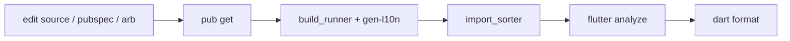

# Build: How It Stitches Together

This skill connects the **dart**, **pubspec**, and **internationalization**
skills. A Flutter app has several generators whose output is committed and must
stay in sync with source; this is the order they run and how they relate.

## The generators

| Generator | Trigger | Output |
|---|---|---|
| `flutter pub get` | `pubspec.yaml` changed | `pubspec.lock`, `.dart_tool/` |
| `build_runner` | `@GenerateNiceMocks`, `@JsonSerializable` changed | `*.mocks.dart`, `*.g.dart` |
| `flutter gen-l10n` | ARB files changed | `lib/_shared/l10n/app_localizations*.dart` |
| `import_sorter` | any Dart imports changed | rewritten import blocks |
| `flutter_launcher_icons` | icon asset/config changed | platform icon sets |
| `flutter_native_splash` | splash asset/config changed | platform splash screens |

Generated output is **excluded from analysis** (`analyzer.exclude` lists
`lib/_shared/l10n/**`) and from `import_sorter` (`ignored_files`), so the linter
never fights the generators.

## The pipeline

After a change, run the steps that apply, in this order:

```text
flutter pub get                                              # if pubspec changed
build_runner build --delete-conflicting-outputs              # if mocks/json changed
flutter gen-l10n                                             # if ARB changed
flutter pub run import_sorter:main                           # always, before commit
flutter analyze                                              # gate: zero issues
dart format .                                                # 120-col, trailing commas
```



`--delete-conflicting-outputs` is mandatory for `build_runner` — without it, a
renamed mock or removed annotation leaves a stale generated file that fails the
build.

## Analyzer & formatter

`analysis_options.yaml` extends `flutter_lints` and turns on an extensive rule
set — `prefer_single_quotes`, `always_use_package_imports`,
`always_declare_return_types`, `require_trailing_commas`,
`prefer_final_parameters`, `type_annotate_public_apis`, and many more. The
`formatter` block pins `page_width: 120` and `trailing_commas: automate`. A clean
`flutter analyze` is the merge gate; the **dart** skill's style rules are these
lints made concrete.

## dependency_validator

`dependency_validator` fails the build if a file imports a package not declared
in `pubspec.yaml` (or declares one it never imports). Whitelist legitimate
exceptions — code-gen-only or transitively-needed packages — in
`dart_dependency_validator.yaml` under `ignore:`.

## Native features

For platform capabilities Flutter/Dart can't reach, the app drops to native via
platform channels — see the **swift** (iOS) and **kotlin** (Android) skills. The
Dart side defines the `MethodChannel`; each native side registers a handler. The
`swift-lsp` and `kotlin-lsp` language servers (this plugin's dependencies) give
those files real diagnostics.

## Checklist when builds break

- Analyzer flags a generated file → it shouldn't be analyzed; confirm the path is
  in `analyzer.exclude`.
- Stale mock / "no such method" after a rename → re-run `build_runner` with
  `--delete-conflicting-outputs`.
- Missing localization getter → ARB edited but `flutter gen-l10n` not run, or
  `flutter.generate` is off in `pubspec.yaml`.
- `dependency_validator` failure → add the package to `pubspec.yaml` or whitelist
  it in `dart_dependency_validator.yaml`.
- Import-order lint churn → run `import_sorter` before `analyze`.
