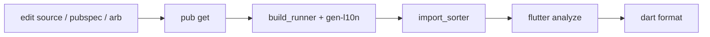

# Flutter — build, flavors & signing

## Build: How It Stitches Together

This reference connects
[Standards & architecture](standards-and-architecture.md), the `pubspec.yaml`
manifest (see [Project layout](project-layout.md)) and
[Internationalization](internationalization.md). A Flutter app has several
generators whose output is committed and must stay in sync with source; this is
the order they run and how they relate.

## The generators

| Generator                | Trigger                                           | Output                                     |
| ------------------------ | ------------------------------------------------- | ------------------------------------------ |
| `flutter pub get`        | `pubspec.yaml` changed                            | `pubspec.lock`, `.dart_tool/`              |
| `build_runner`           | `@GenerateNiceMocks`, `@JsonSerializable` changed | `*.mocks.dart`, `*.g.dart`                 |
| `flutter gen-l10n`       | ARB files changed                                 | `lib/_shared/l10n/app_localizations*.dart` |
| `import_sorter`          | any Dart imports changed                          | rewritten import blocks                    |
| `flutter_launcher_icons` | icon asset/config changed                         | platform icon sets                         |
| `flutter_native_splash`  | splash asset/config changed                       | platform splash screens                    |

Generated output is **excluded from analysis** (`analyzer.exclude` lists
`lib/_shared/l10n/**`) and from `import_sorter` (`ignored_files`), so the linter
never fights the generators.

## The pipeline

After a change, run the steps that apply, in this order:

```text
flutter pub get                                              # if pubspec changed
build_runner build --delete-conflicting-outputs              # if mocks/json changed
flutter gen-l10n                                             # if ARB changed
flutter pub run import_sorter:main                           # always, before commit
flutter analyze                                              # gate: zero issues
dart format .                                                # 120-col, trailing commas
```



`--delete-conflicting-outputs` is mandatory for `build_runner` — without it, a
renamed mock or removed annotation leaves a stale generated file that fails the
build.

## Analyzer & formatter

`analysis_options.yaml` extends `flutter_lints` and turns on an extensive rule
set — `prefer_single_quotes`, `always_use_package_imports`,
`always_declare_return_types`, `require_trailing_commas`,
`prefer_final_parameters`, `type_annotate_public_apis`, and many more. The
`formatter` block pins `page_width: 120` and `trailing_commas: automate`. A
clean `flutter analyze` is the merge gate; the style rules in
[Standards & architecture](standards-and-architecture.md) are these lints made
concrete.

## dependency_validator

`dependency_validator` fails the build if a file imports a package not declared
in `pubspec.yaml` (or declares one it never imports). Whitelist legitimate
exceptions — code-gen-only or transitively-needed packages — in
`dart_dependency_validator.yaml` under `ignore:`.

## App size

Measure on a **release** build — debug builds carry VM overhead and skip AOT
tree-shaking, so their size is meaningless. Pass `--analyze-size` to any build
target; it writes a `*-code-size-analysis_*.json` under `build/`:

```sh
flutter build appbundle --analyze-size      # or apk / ios / macos / …
```

Open the JSON in DevTools (`dart devtools` → **App Size** tool) to drill the
treemap into the heaviest packages, libraries, and assets; its **Diff** tab
compares two builds to confirm a reduction. **Asset/media weight and unused
dependencies dominate** — audit `assets/` and `pubspec.yaml`, drop anything
unreferenced, and compress images (WebP/`pngquant`) before shrinking code.

Strip debug symbols into separate files (and optionally obfuscate) to shave the
binary:

```sh
flutter build apk --obfuscate --split-debug-info=build/symbols
```

Keep the emitted symbol directory — it is required to de-obfuscate later stack
traces.

## Native features

For platform capabilities Flutter/Dart can't reach, the app drops to native via
platform channels — see the `flutter-ios` (Swift) and `flutter-android` (Kotlin)
skills. The Dart side defines the `MethodChannel`; each native side registers a
handler.

## Checklist when builds break

- Analyzer flags a generated file → it shouldn't be analyzed; confirm the path
  is in `analyzer.exclude`.
- Stale mock / "no such method" after a rename → re-run `build_runner` with
  `--delete-conflicting-outputs`.
- Missing localization getter → ARB edited but `flutter gen-l10n` not run, or
  `flutter.generate` is off in `pubspec.yaml`.
- `dependency_validator` failure → add the package to `pubspec.yaml` or
  whitelist it in `dart_dependency_validator.yaml`.
- Import-order lint churn → run `import_sorter` before `analyze`.

## Overview

A typical setup uses two flavors:

| Flavor | Bundle ID (iOS)       | App ID (Android)      | Firebase Project |
| ------ | --------------------- | --------------------- | ---------------- |
| `dev`  | `com.example.app.dev` | `com.example.app.dev` | `myapp-dev`      |
| `prod` | `com.example.app`     | `com.example.app`     | `myapp-prod`     |

Each flavor gets its own:

- Firebase `google-services.json` (Android) and `GoogleService-Info.plist` (iOS)
- App name and icon (optional — e.g., "My App DEV" vs "My App")
- API base URL and feature flags

---

## Dart — Flavor Entry Points

Create a separate `main_*.dart` for each flavor. Keep `main.dart` as a launcher
or remove it.

```text
lib/
  main_dev.dart
  main_prod.dart
  config/
    env.dart        ← environment config singleton
```

```dart
// lib/main_dev.dart
import 'package:my_app/config/env.dart';
import 'package:my_app/app.dart';

void main() {
  Env.init(flavor: AppFlavor.dev);
  runFlavorApp();
}
```

```dart
// lib/main_prod.dart
import 'package:my_app/config/env.dart';
import 'package:my_app/app.dart';

void main() {
  Env.init(flavor: AppFlavor.prod);
  runFlavorApp();
}
```

---

## Environment Config Class

Centralize all flavor-specific values:

```dart
// lib/config/env.dart

enum AppFlavor { dev, prod }

class Env {
  Env._();

  static late AppFlavor flavor;

  static void init({required AppFlavor flavor}) {
    Env.flavor = flavor;
  }

  static bool get isDev => flavor == AppFlavor.dev;
  static bool get isProd => flavor == AppFlavor.prod;

  static String get apiBaseUrl => switch (flavor) {
    AppFlavor.dev  => 'https://api-dev.example.com',
    AppFlavor.prod => 'https://api.example.com',
  };

  static String get appName => switch (flavor) {
    AppFlavor.dev  => 'My App DEV',
    AppFlavor.prod => 'My App',
  };

  static String get rcApiKey => switch (flavor) {
    AppFlavor.dev  => Platform.isIOS ? 'appl_dev_key' : 'goog_dev_key',
    AppFlavor.prod => Platform.isIOS ? 'appl_prod_key' : 'goog_prod_key',
  };
}
```

---

## Android — Product Flavors

Edit `android/app/build.gradle`:

```groovy
android {
  flavorDimensions 'env'

  productFlavors {
    dev {
      dimension 'env'
      applicationId 'com.example.app.dev'
      versionNameSuffix '-dev'
      resValue 'string', 'app_name', 'My App DEV'
    }
    prod {
      dimension 'env'
      applicationId 'com.example.app'
      resValue 'string', 'app_name', 'My App'
    }
  }
}
```

### Firebase config files (Android)

Place per-flavor `google-services.json` in flavor-specific source directories:

```text
android/app/
  src/
    dev/
      google-services.json    ← dev Firebase project
    prod/
      google-services.json    ← prod Firebase project
```

The Google Services Gradle plugin automatically picks the correct file based on
the active flavor.

### App icons per flavor (optional)

```text
android/app/src/dev/res/mipmap-*/ic_launcher.png
android/app/src/prod/res/mipmap-*/ic_launcher.png
```

---

## iOS — Schemes and Configurations

### 1. Create Build Configurations in Xcode

In Xcode: **Runner → PROJECT → Runner → Configurations**

Duplicate `Debug` and `Release` for each flavor:

| Configuration Name |
| ------------------ |
| `Debug-dev`        |
| `Release-dev`      |
| `Profile-dev`      |
| `Debug-prod`       |
| `Release-prod`     |
| `Profile-prod`     |

### 2. Create Schemes

**Product → Scheme → New Scheme** for each flavor:

- Scheme `dev`: Build Configuration `Debug-dev` (run), `Release-dev` (archive)
- Scheme `prod`: Build Configuration `Debug-prod` (run), `Release-prod`
  (archive)

### 3. Set Bundle ID per Configuration

In **Runner TARGET → Build Settings → Product Bundle Identifier**:

```text
Debug-dev   = com.example.app.dev
Release-dev = com.example.app.dev
Debug-prod  = com.example.app
Release-prod = com.example.app
```

Use a User-Defined build setting `BUNDLE_ID_SUFFIX`:

```text
Debug-dev   BUNDLE_ID_SUFFIX = .dev
Release-dev BUNDLE_ID_SUFFIX = .dev
Debug-prod  BUNDLE_ID_SUFFIX =
Release-prod BUNDLE_ID_SUFFIX =
```

Then set `PRODUCT_BUNDLE_IDENTIFIER = com.example.app$(BUNDLE_ID_SUFFIX)`.

### 4. App Display Name per Configuration

Add `APP_DISPLAY_NAME` user-defined setting:

```text
Debug-dev:    My App DEV
Release-dev:  My App DEV
Debug-prod:   My App
Release-prod: My App
```

In `Info.plist`:

```xml
<key>CFBundleDisplayName</key>
<string>$(APP_DISPLAY_NAME)</string>
```

### 5. Flutter-specific: `flutter_export_environment.sh`

Flutter passes `--flavor` to the iOS build. Xcode picks the matching scheme. The
`-config` flag maps to the build configuration.

---

## Firebase per Flavor

### iOS — per-scheme `GoogleService-Info.plist`

Create one plist per flavor and add a **Run Script Phase** in Xcode that copies
the correct one before the build:

```bash
# Run Script Phase — "Copy Firebase Config"
# Place BEFORE "Compile Sources" phase

PLIST_DEST="${BUILT_PRODUCTS_DIR}/${PRODUCT_NAME}.app/GoogleService-Info.plist"

if [ "${CONFIGURATION}" == "Debug-dev" ] || [ "${CONFIGURATION}" == "Release-dev" ]; then
  cp "${PROJECT_DIR}/Runner/Firebase/dev/GoogleService-Info.plist" "${PLIST_DEST}"
else
  cp "${PROJECT_DIR}/Runner/Firebase/prod/GoogleService-Info.plist" "${PLIST_DEST}"
fi
```

Directory structure:

```text
ios/Runner/Firebase/
  dev/GoogleService-Info.plist
  prod/GoogleService-Info.plist
```

### Dart — FlutterFire CLI per flavor

Generate separate options files:

```bash
# Dev
flutterfire configure \
  --project=myapp-dev \
  --out=lib/config/firebase_options_dev.dart \
  --ios-bundle-id=com.example.app.dev \
  --android-package-name=com.example.app.dev

# Prod
flutterfire configure \
  --project=myapp-prod \
  --out=lib/config/firebase_options_prod.dart \
  --ios-bundle-id=com.example.app \
  --android-package-name=com.example.app
```

Initialize based on flavor:

```dart
await Firebase.initializeApp(
  options: Env.flavor == AppFlavor.dev
      ? DevFirebaseOptions.currentPlatform
      : ProdFirebaseOptions.currentPlatform,
);
```

---

## Running Flavors

```bash
# Run dev
flutter run --flavor dev -t lib/main_dev.dart

# Run prod
flutter run --flavor prod -t lib/main_prod.dart

# Build APK (Android)
flutter build apk --flavor prod -t lib/main_prod.dart --release

# Build App Bundle (Android — Play Store)
flutter build appbundle --flavor prod -t lib/main_prod.dart --release

# Build iOS (Xcode archive)
flutter build ipa --flavor prod -t lib/main_prod.dart --release
```

---

## Editor launch configuration

A flavor needs **both** halves — the entry point and the `--flavor` argument —
and an editor that supplies only one produces a build that looks right and reads
the wrong config. Commit one launch entry per flavor so nobody assembles the
pair by hand.

### VS Code — `.vscode/launch.json`

```json
{
  "version": "0.2.0",
  "configurations": [
    {
      "name": "DEV",
      "request": "launch",
      "type": "dart",
      "flutterMode": "debug",
      "program": "lib/main_dev.dart",
      "args": ["--flavor", "dev"]
    },
    {
      "name": "PROD",
      "request": "launch",
      "type": "dart",
      "flutterMode": "debug",
      "program": "lib/main_prod.dart",
      "args": ["--flavor", "prod"]
    }
  ]
}
```

### Android Studio — run configurations

**Run/Debug Configurations** → add a Flutter configuration per flavor:

- **Dart entrypoint:** `lib/main_dev.dart`
- **Additional run args:** `--flavor dev`

---

## Anti-Patterns

| Anti-Pattern                                        | Why                                                               | Fix                                                                     |
| --------------------------------------------------- | ----------------------------------------------------------------- | ----------------------------------------------------------------------- |
| Single `main.dart` with an `if (kDebugMode)` switch | `kDebugMode` ≠ flavor; debug builds of prod are also `kDebugMode` | Use separate `main_*.dart` entry points with `Env.flavor`               |
| Hardcoding Firebase options in `main.dart`          | Different environments need different projects                    | Use per-flavor generated options files                                  |
| Committing `GoogleService-Info.plist` at the root   | Only one environment's config is bundled                          | Use the Run Script approach to copy the correct plist                   |
| Sharing the same bundle ID across flavors           | Both flavors install as the same app; they overwrite each other   | Give each flavor a unique bundle/app ID                                 |
| Using `kReleaseMode` to determine environment       | Release builds of dev should still hit dev API                    | Use `Env.flavor` for environment; `kReleaseMode` only for debug tooling |
| Not adding flavor suffix to app name                | Can't tell which build is installed on a device                   | Set `APP_DISPLAY_NAME` / `resValue` per flavor                          |

---

## Code Signing

**Automatic signing** (recommended for development):

- Target > Signing & Capabilities > check "Automatically manage signing"
- Select your Team
- Xcode generates the provisioning profile

**Manual signing** (CI/CD):

```sh
xcodebuild \
  -scheme ios \
  -configuration Release \
  CODE_SIGN_IDENTITY="iPhone Distribution" \
  PROVISIONING_PROFILE_SPECIFIER="My Profile Name" \
  archive -archivePath build/ios.xcarchive
```

Common signing errors:

- "No matching provisioning profile" → regenerate in Apple Developer portal or
  toggle automatic signing off/on
- "Certificate not found" → import .p12 into Keychain Access
- "Team ID mismatch" → ensure bundle ID matches provisioning profile

## Build Settings

Access via: Target > Build Settings (or project-level for defaults).

Key settings:

| Setting              | Key                              | Typical value                    |
| -------------------- | -------------------------------- | -------------------------------- |
| Swift version        | `SWIFT_VERSION`                  | `6.0`                            |
| Deployment target    | `IPHONEOS_DEPLOYMENT_TARGET`     | `17.0`                           |
| Bundle ID            | `PRODUCT_BUNDLE_IDENTIFIER`      | `com.example.app`                |
| Code sign identity   | `CODE_SIGN_IDENTITY`             | `iPhone Developer`               |
| Provisioning profile | `PROVISIONING_PROFILE_SPECIFIER` | auto or specific                 |
| Debug info           | `DEBUG_INFORMATION_FORMAT`       | `dwarf-with-dsym` (Release)      |
| Optimization         | `SWIFT_OPTIMIZATION_LEVEL`       | `-Onone` (Debug), `-O` (Release) |

Build settings resolve in order (highest wins):

1. Platform defaults
2. Project-level settings
3. Target-level settings
4. Configuration file (xcconfig)

Use xcconfig files for environment-specific overrides without touching
`project.pbxproj`:

```xcconfig
// Debug.xcconfig
SWIFT_ACTIVE_COMPILATION_CONDITIONS = DEBUG
OTHER_SWIFT_FLAGS = -Xfrontend -debug-constraints
```

## Schemes & Configurations

Default configurations: **Debug** and **Release**. Add more (e.g., Staging) via
Product > Scheme > Edit Scheme, or Project > Info > Configurations.

Scheme controls:

- **Build**: which targets to build and in what order
- **Run**: launch arguments, environment variables, diagnostics
- **Test**: test targets and plans
- **Profile**: typically Release config for accurate Instruments data
- **Archive**: always Release config

Add launch arguments in scheme for feature flags:

```text
Product > Scheme > Edit Scheme > Run > Arguments
-FlagName YES
```

Access in code:

```swift
if ProcessInfo.processInfo.arguments.contains("-FlagName") { ... }
```
