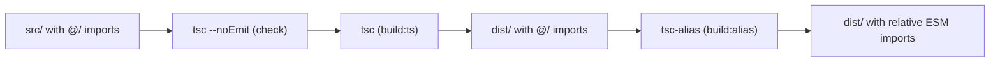

# Build: How It Stitches Together

This skill connects the pieces the **tsconfig**, **package-json**, and **pnpm**
skills define. The goal: write `@/` imports and clean barrels in source, ship
correct relative ESM in `dist/`.

## The `@/` path alias

Inside a package, import siblings via `@/*` (mapped to `./src/*` in
`tsconfig.json`) instead of brittle `../../` chains:

```typescript
import { MyError, StatusCodes } from "@/utils";
import { UserSchema } from "@/user/user.schema";
```

`@/` is a **compile-time** alias — Node and the browser don't understand it. So
the build rewrites every `@/` import to a real relative path after `tsc` emits
(see the pipeline below). `tsx`/Vitest resolve it directly via the tsconfig, so
dev and test need no rewrite step.

## Barrels

Each module exposes a single `index.ts` barrel that re-exports its public
surface; consumers import the barrel, never deep files. Barrels also let you
**wrap a dependency once** — e.g. an `@/effect` barrel re-exports the framework
plus internal helpers so the rest of the code has one import site:

```typescript
// src/effect/index.ts
export { Context, Effect, Layer, Schema } from "effect";
export { withSpan, schemaParser } from "@/effect/effect";
```

Published packages mirror each barrel as an `exports` subpath in `package.json`
(`@scope/common/effect` → `dist/effect/index.js`) — see the **package-json**
skill.

## The build pipeline

`build` runs four steps in strict order (from the **package-json** skill):

```text
clean      →  rm -rf ./dist                      (start fresh)
check      →  tsc -p tsconfig.build.json --noEmit (type-gate before emit)
build:ts   →  tsc -p tsconfig.build.json          (emit JS + .d.ts to dist/)
build:alias→  tsc-alias -p tsconfig.build.json    (rewrite @/ → relative paths)
```

Order matters: type-check first so a broken build never emits; `tsc-alias` runs
**last** because it rewrites the already-emitted `dist/` output, not the source.



`tsc-alias` reads the `tsc-alias` block in `tsconfig.build.json`; keep
`base-url` replacer disabled so only the explicit `@/*` mapping is rewritten.

## Project references across the monorepo

Each package references its workspace dependencies' `tsconfig.build.json`
(**tsconfig** skill). That lets `tsc --build` order the graph and rebuild only
what changed. At the package boundary, code imports the dependency by its
published name (`@scope/common/utils`) — `@/` never crosses a package edge.

## turbo orchestration

The root `package.json` fans builds out with `turbo run build` and
`pnpm run --filter '<pkg>' <script>`. turbo caches per-package output and honors
the reference graph, so a no-op rebuild is instant. Keep all cross-workspace
fan-out in the root scripts; per-package scripts stay single-package.

## Checklist when builds break

- `@/` import unresolved at **runtime** → `build:alias` didn't run, or the
  `tsc-alias` config block is missing/misconfigured.
- `@/` unresolved in **editor/test** → missing `paths` in `tsconfig.json`, or
  Vitest missing `vite-tsconfig-paths`.
- Stale cross-package types → a workspace `references` entry is missing, or
  `injectWorkspacePackages` / a rebuild of the upstream package is needed.
- Emit produced no `dist/` → you're running the editor `tsconfig.json`
  (`noEmit: true`), not `tsconfig.build.json`.
