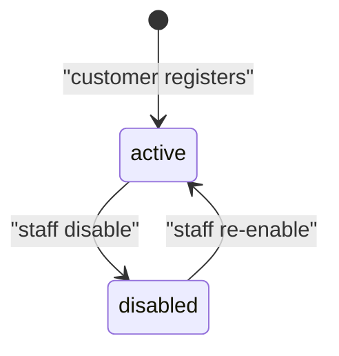

# Entity: Customer

<!-- Conformance example (blueprint-format 9). See order/index.md for the bundle
     note. Customer has no Screens — screens live on the flows that use it. -->

## Purpose

A Customer is the account that places and owns orders. It holds the minimal
identity and contact detail needed to attribute purchases and communicate about
them.

Used by: [Place order](../../flows/place-order/index.md),
[Order cancellation & refund](../../flows/cancel-refund/index.md)

## Out of Scope

- Authentication credentials and sessions (an Auth concern).
- Marketing preferences and segmentation.

## Lifecycle / State Machine

| From       | To         | Trigger (actor/system) | Guard        | Side effect            |
| ---------- | ---------- | ---------------------- | ------------ | ---------------------- |
| —          | `active`   | Customer registers     | Email unique | Send welcome message   |
| `active`   | `disabled` | Staff disable          | —            | Revoke active sessions |
| `disabled` | `active`   | Staff re-enable        | —            | —                      |

## Invariants

- `email` is unique across all non-deleted customers.
- A `disabled` customer cannot place new orders, but existing orders remain.

## Data Model

Authoritative schema: [schema.yaml](./schema.yaml)

- `id` is prefixed `cus_` per [ids](../../conventions.md#ids).
- `email` is stored lowercased; uniqueness is enforced against the lowercased
  form.

## Relationships

| Related entity             | Cardinality | Ownership | On delete | Required |
| -------------------------- | ----------- | --------- | --------- | -------- |
| [Order](../order/index.md) | 1–N         | reference | restrict  | no       |

<!-- 1 Customer is referenced by N Orders. restrict mirrors Order's side of the
     relation: a customer with orders cannot be hard-deleted. -->

## Concurrency & Consistency

- Concurrent-write resolution: last-write-wins on profile fields; `email`
  uniqueness enforced atomically at write.
- Uniqueness under races: `email` uniqueness holds even for simultaneous
  registrations (one wins, the other gets a `conflict`).
- Idempotency: registration is idempotent per email (a repeat returns the
  existing account rather than creating a duplicate).

## References

- [ids](../../conventions.md#ids), [errors](../../conventions.md#errors)

## Open Questions

- [ ] Merge flow for duplicate accounts — deferred. (2026-07-01)
