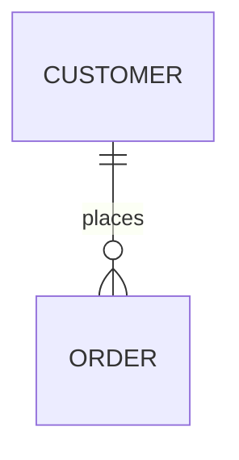

# Entities

<!-- Conformance example (blueprint-format 9). A catalog plus ONE product-wide
     erDiagram — a view of the union of every entity's Relationships table, which
     stays authoritative. -->

## Entity catalog

| Entity                          | Purpose (one line)                                          |
| ------------------------------- | ----------------------------------------------------------- |
| [Order](./order/index.md)       | A customer's completed purchase — one row per placed order. |
| [Customer](./customer/index.md) | The account that places and owns orders.                    |

## Relationship view

