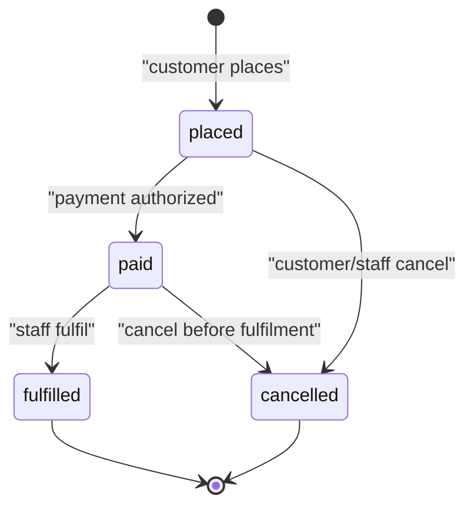

# Entity: Order

<!-- Conformance example (blueprint-format 14). A worked, format-valid entity doc:
     a supporting data contract whose behavior lives in the flows that use it and
     whose data model is the sibling schema.yaml. Mandatory frontmatter;
     Relationships/References as resolving links. -->

## Purpose

An Order records a customer's intent to buy a set of items at agreed prices, and
tracks that purchase from placement through fulfilment. It is the system of
record for what was bought, by whom, and for how much.

Used by: [Place order](../../flows/web/010-place-order/index.md),
[Order cancellation & refund](../../flows/web/020-cancel-refund/index.md)

## Out of Scope

- Payment instrument storage (a Payments concern, not Order).
- Inventory reservation (owned by the Catalog entity).
- Shipping carrier tracking beyond the terminal `fulfilled` transition.

## Lifecycle / State Machine

| From     | To          | Trigger (actor/system)      | Guard                      | Side effect                  |
| -------- | ----------- | --------------------------- | -------------------------- | ---------------------------- |
| —        | `placed`    | Customer places             | Cart non-empty             | Snapshot line items + prices |
| `placed` | `paid`      | System (payment authorized) | Amount matches order total | Record paid timestamp        |
| `placed` | `cancelled` | Customer/staff cancel       | —                          | Release any soft holds       |
| `paid`   | `fulfilled` | Staff fulfil                | All items in stock         | Emit `order.fulfilled` event |
| `paid`   | `cancelled` | Customer/staff cancel       | Before fulfilment          | Trigger refund flow          |

## Invariants

- An order's `total_amount` equals the sum of its line-item subtotals at
  placement time, and never changes after `placed`.
- Every non-initial state is reachable only via a listed transition.
- A `cancelled` order is terminal; no transition leaves it.

## Data Model

Authoritative schema: [schema.yaml](./schema.yaml)

- `id` is prefixed `ord_` per [ids](../../conventions.md#ids).
- `total_amount` is held in the currency's smallest unit (minor units) to avoid
  floating-point money; `currency` names the unit.

## Relationships

| Related entity                   | Cardinality | Ownership | On delete | Required |
| -------------------------------- | ----------- | --------- | --------- | -------- |
| [Customer](../customer/index.md) | N–1         | reference | restrict  | yes      |

<!-- N Orders reference 1 Customer. Reference (not composition): an Order is not a
     child of Customer. restrict: a Customer with orders cannot be hard-deleted. -->

## Concurrency & Consistency

- Concurrent-write resolution: optimistic — a version token guards each state
  transition; a stale write returns a conflict error.
- Uniqueness under races: `id` is unique; no two placements share it.
- Idempotency: the transition to `paid` is idempotent per payment reference
  (re-delivery of the same authorization is a no-op).

## References

- [ids](../../conventions.md#ids), [errors](../../conventions.md#errors)

## Open Questions

- [ ] Partial fulfilment (split shipments) — deferred to a later cycle.
      (2026-07-01)
