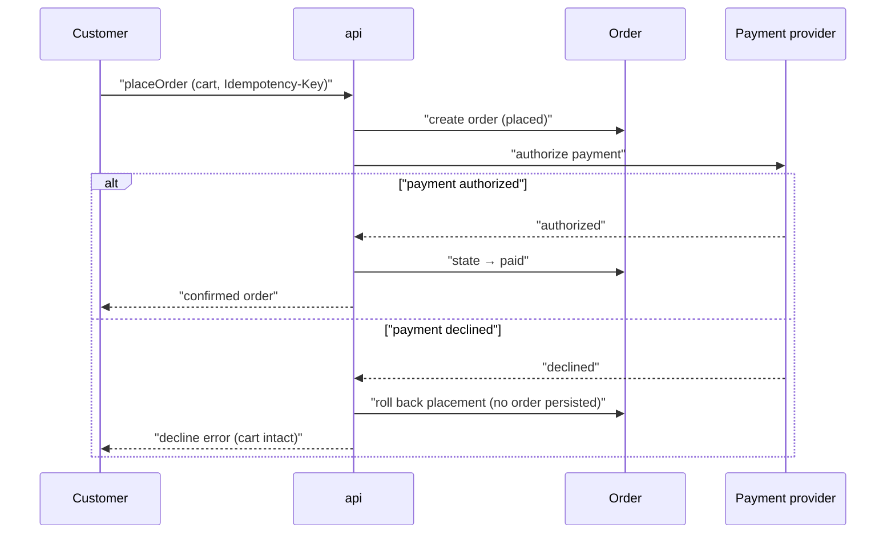

# Flow: Place order

<!-- Conformance example (blueprint-format 9). A worked, format-valid flow doc:
     the goal-traceability spine runs product goal → this flow → entity/API/screen.
     Code-independent: names entities, the `api` service, and operationIds only. -->

## Purpose

A shopper reviews their cart and pays for it in a single checkout sitting,
receiving a confirmed order they can revisit later. This is the primary path by
which an Order comes into being, so it carries the "no lost orders" promise.

Serves: [Reliable ordering](../../../product.md#goal-reliable-ordering)

## Trigger & Actors

| Actor    | May trigger              | Authorization     | Audit-recorded |
| -------- | ------------------------ | ----------------- | -------------- |
| Customer | Submitting cart checkout | Owner of the cart | no             |

## Steps

1. Customer submits their cart on the Checkout screen — creates an
   [Order](../../../entities/order/index.md) in `placed` via `placeOrder`.
2. System authorizes payment with the payment provider inside the same checkout
   transaction; on success the [Order](../../../entities/order/index.md) moves
   `placed → paid`.
3. Customer reviews the confirmed order and their past orders — reads
   [Order](../../../entities/order/index.md) via `getOrder`.

## Consistency boundary

- Checkout is atomic: the order is committed only once payment authorizes. A
  declined payment rolls the placement back, so no order persists and the cart
  is left untouched. Everything after confirmation (fulfilment, notifications)
  is eventual.

## Failure handling

- Payment declined: the placement transaction rolls back — no `placed` order is
  retained and the customer's cart is intact for a retry.
- Provider timeout: treated as a decline for this attempt; a retry with the same
  `Idempotency-Key` never creates a second order.

## Idempotency

- `placeOrder` carries an `Idempotency-Key` header; a retried submission of the
  same checkout returns the original order rather than creating a duplicate.

## Diagram

## Screens → web

| Screen        | Route     | Reads (operationId) | States (loading/error/empty)          | Actions     | Form validation                 |
| ------------- | --------- | ------------------- | ------------------------------------- | ----------- | ------------------------------- |
| Checkout      | /checkout | `placeOrder`        | loading · error (decline inline) · —  | Place order | Cart non-empty; payment details |
| Order history | /orders   | `getOrder`          | loading · error · empty (first order) | Open detail | —                               |

<!-- Home flow for the Checkout and Order history screens; the Order detail
     screen is homed by the cancel-refund flow. Visual language comes from
     ../../design-system.md; record only deviations here. -->

## Acceptance

- Given a signed-in customer with a non-empty cart, when they check out and
  payment authorizes, then exactly one order is created reading `paid` and it
  appears in their order history.
- Given a customer at checkout whose payment is declined, when they submit, then
  no order is persisted, their cart is unchanged, and the decline is shown
  inline.

## References

- [api API contract](../../../apis/api.openapi.yaml) — for `placeOrder` /
  `getOrder`
- [auth](../../../conventions.md#auth), [errors](../../../conventions.md#errors)
- [design-system](../../../design-system.md) — this flow has Screens

## Open Questions

- [ ] Saved payment methods for repeat customers — deferred. (2026-07-01)
