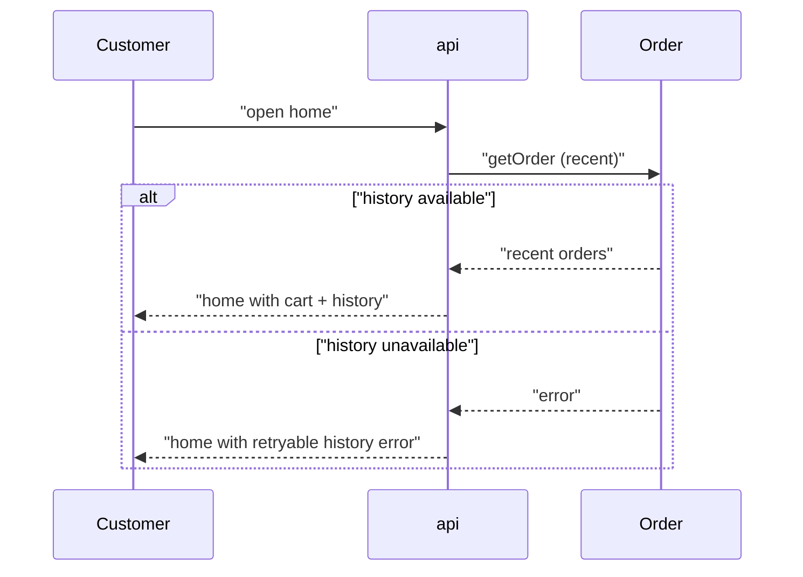

# Flow: Home

<!-- Conformance example (blueprint-format 24). The ANCHOR flow: every screen-platform
     project carries `100-home`, so its screens are always coded 100a, 100b, …
     Platform-agnostic contract only — screens live in webapp.md. -->

## Purpose

The shopper's landing surface: it shows what they can act on right now — their
cart if one is open, and their recent orders — and routes them into the checkout
and order-management journeys. Home exists so every other journey has one
predictable place to start and return to.

Serves: [Reliable ordering](../../../product.md#goal-reliable-ordering)

## Platforms

| Platform | File            | Notes                           |
| -------- | --------------- | ------------------------------- |
| webapp   | [webapp](./webapp.md) | The shop's only shopper surface |

## Trigger & Actors

| Actor    | May trigger                         | Authorization | Audit-recorded |
| -------- | ----------------------------------- | ------------- | -------------- |
| Customer | Opening the shop or returning to it | Any visitor   | no             |

## Steps

1. Customer opens the shop — reads their open cart and recent
   [Order](../../../entities/order/index.md) history via `getOrder`.
2. Customer chooses a journey — continues to checkout (the
   [Place order](../110-place-order/index.md) flow) or opens an order to manage
   it (the [Order cancellation & refund](../120-cancel-refund/index.md) flow).

## Guarantees

| Step / group | Consistency                  | On failure                                                                                                                                  | Idempotency                  | Load & latency                        |
| ------------ | ---------------------------- | ------------------------------------------------------------------------------------------------------------------------------------------- | ---------------------------- | ------------------------------------- |
| all          | read-only, nothing committed | Order history unavailable → home still renders with navigation intact and a retryable error in the history region; checkout stays reachable | pure read, repeatable freely | default — per conventions#reliability |

## Diagram

## Acceptance

- Given a customer with an open cart and past orders, when they open the shop,
  then home shows the cart and their recent orders and offers a route to
  checkout.
- Given the order history is unavailable, when a customer opens the shop, then
  home still renders and offers checkout, with the history region showing a
  retryable error.
- Abuse case: n/a — a read-only surface with nothing to mutate; any visitor is
  authorized for everything it shows, and order-history reads are owner-scoped
  per [auth](../../../conventions.md#auth).

## References

- [api API contract](../../../apis/api.openapi.yaml) — for `getOrder`
- [auth](../../../conventions.md#auth), [errors](../../../conventions.md#errors)
- [design-system](../../../design-system.md) — this flow has platform files

## Open Questions

- [ ] Personalised recommendations on home — out of scope for now. (2026-07-01)
