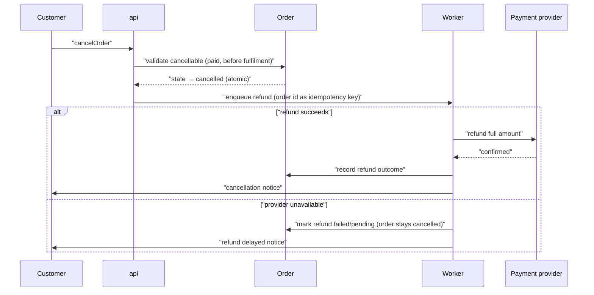

# Flow: Order cancellation & refund

<!-- Conformance example (blueprint-format 11). A worked, format-valid flow doc
     with an operator actor, a background job, and a compensation branch. -->

## Purpose

A customer or support operator cancels a paid order before it is fulfilled, and
the payment is refunded in full without manual intervention. The refund is
prompt and issued exactly once, so shoppers trust the shop enough to reorder.

Serves: [Trusted refunds](../../../../product.md#goal-trusted-refunds)

## Trigger & Actors

| Actor            | May trigger                       | Authorization      | Audit-recorded |
| ---------------- | --------------------------------- | ------------------ | -------------- |
| Customer         | Cancelling their order            | Owner of the order | no             |
| Support operator | Cancelling on a customer's behalf | Role `support`     | yes            |

<!-- The operator path is a privileged action on someone else's order, so it is
     audit-recorded per the product-foundations baseline. -->

## Steps

1. Customer or support operator cancels a `paid`
   [Order](../../../../entities/order/index.md) before fulfilment via
   `cancelOrder`; the order moves `paid → cancelled` **(audit-recorded when an
   operator acts)**.
2. The refund worker requests the refund from the payment provider and records
   the outcome on the [Order](../../../../entities/order/index.md).
3. The [Customer](../../../../entities/customer/index.md) is notified of the
   refund result.

## Consistency boundary

- The state move to `cancelled` is atomic (single system of record); the refund
  and the customer notification are eventual.

## Failure handling

- A failed refund never reverts the cancellation — the order stays `cancelled`
  with the refund marked failed/pending for staff retry, and the customer is
  told the refund is delayed, not silently dropped.

## Idempotency

- Cancelling an already-`cancelled` order is a no-op returning the current
  order.
- The refund request carries the order id as its idempotency key, so a retry
  never issues a second refund.

## Diagram

## Screens → web

| Code | Screen       | Route        | Reads (operationId)       | States (loading/error/empty) | Actions          | Form validation |
| ---- | ------------ | ------------ | ------------------------- | ---------------------------- | ---------------- | --------------- |
| 020a | Order detail | /orders/{id} | `getOrder`, `cancelOrder` | loading skeleton · error · — | Cancel (confirm) | —               |

<!-- Home flow for the Order detail screen. Cancel is destructive: it uses the
     design-system `danger` role behind a confirmation overlay. Visual language
     comes from ../../../../design-system.md; record only deviations here. -->

## Background Jobs → worker

| Job    | Trigger                        | Timer / Retry                  | Activities                                               | On failure                                              |
| ------ | ------------------------------ | ------------------------------ | -------------------------------------------------------- | ------------------------------------------------------- |
| refund | Order moved `paid → cancelled` | 10s timeout / retry w/ backoff | request refund (idempotency key), record outcome, notify | mark refund failed/pending on the order; notify delayed |

## Acceptance

- Given a `paid` order before fulfilment, when its owner cancels it, then the
  order reads `cancelled`, the payment provider records exactly one refund for
  its full amount, and the customer receives a cancellation notice.
- Given the payment provider is unavailable, when the owner cancels a `paid`
  order, then the order still reads `cancelled`, the refund is visibly marked
  failed/pending for staff, and no second refund is issued when the retry later
  succeeds.

## References

- [api API contract](../../../../apis/api.openapi.yaml) — for `cancelOrder` /
  `getOrder`
- [auth](../../../../conventions.md#auth),
  [errors](../../../../conventions.md#errors)
- [design-system](../../../../design-system.md) — this flow has Screens

## Open Questions

- [ ] Partial refunds for split shipments — deferred with partial fulfilment.
      (2026-07-01)
