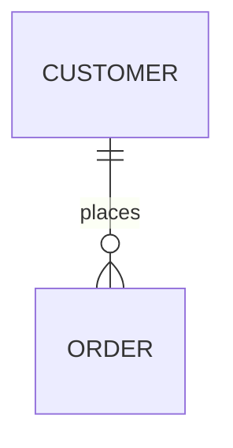

# Entities

<!-- Deliberately thin: a catalog plus ONE product-wide erDiagram. The diagram
     is a VIEW of the union of every entity's Relationships table (which stays
     authoritative) — same nodes and edges, nothing more. The coherence
     reviewer checks the two stay in sync. -->

## Entity catalog

| Entity                          | Purpose (one line) |
| ------------------------------- | ------------------ |
| [<Entity>](./<entity>/index.md) |                    |

## Relationship view

