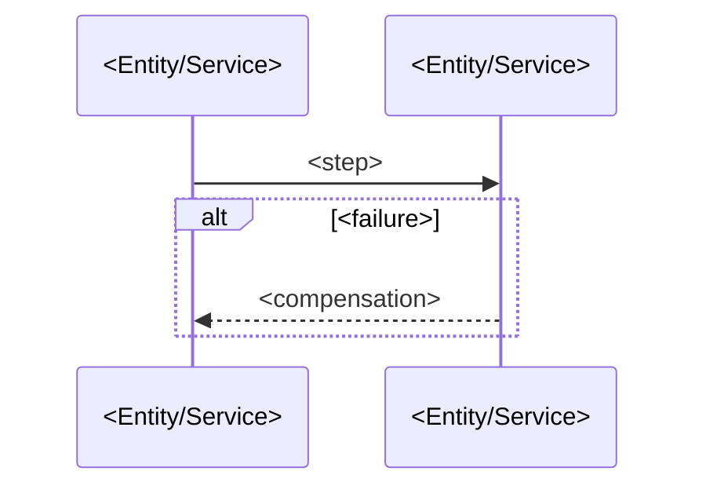

# Flow: <Flow name>

<!-- One flow per FOLDER: docs/blueprint/flows/<project>/<device>/<NNN>-<flow>/index.md
     for a UI project (<device> = mobile | web | carplay | android-auto),
     docs/blueprint/flows/<project>/<NNN>-<flow>/index.md for a non-UI project —
     always index.md only (a flow too big for one file is several flows). Flows
     are the PRIMARY blueprint unit: the goal-traceability spine runs product
     goal → flow → entity/API/screen. See the blueprint-authoring skill
     (flow-contract). Link depths below assume the device-grouped (UI) form;
     drop one ../ per link for a non-UI flow.

     Stack-agnostic and code-independent: name entities, services (by registry
     project name), and operationIds — never queues, libraries, classes, or
     transports. Section→project mapping resolves via the Project Registry in
     docs/blueprint/architecture.md (by project `type`). Omit Screens if the
     registry has no UI project; omit Background Jobs if it has no worker. -->

## Purpose

One paragraph. The observable outcome this flow delivers and why it exists.

Serves: [<goal name>](../../../../product.md#goal-<slug>)

<!-- Every flow serves at least one product.md goal — the OKF edge the
     blueprint-reviewer verifies. A flow no goal justifies is scope drift.
     An in-car flow (carplay / android-auto subgroup) additionally carries a
     mandatory parent link — it is always a subset of a phone journey:

     Subset of: [<parent flow>](../../mobile/<NNN>-<flow>/index.md) -->

## Trigger & Actors

| Actor | May trigger | Authorization | Audit-recorded |
| ----- | ----------- | ------------- | -------------- |

<!-- Who/what can start this flow and under which role. This absorbs the
     authorization contract formerly on entity Actors & Actions; per-operation
     auth also lives in the OpenAPI contract's security. Mark operator and
     destructive triggers audit-recorded (product-foundations baseline). -->

## Steps

1. <actor/system> <action> — touches
   [<Entity>](../../../../entities/<entity>/index.md) via `<operationId>`
2. ...

<!-- Ordered, each step naming its actor, the action, and the entity/service
     touched as a resolving markdown link. API-backed steps name the operation
     as `operationId` (defined in docs/blueprint/apis/<project>.openapi.yaml —
     link the contract once under References). Mark audit-recorded steps
     `(audit-recorded)`. A step that changes an entity's state must match a
     transition in that entity's Lifecycle table. -->

## Consistency boundary

- Atomic vs eventual, per step group.

## Failure handling

- Compensation / rollback per failure point.

## Idempotency

- Of the flow as a whole and of retried steps.

## Diagram

<!-- Every flow carries a mermaid sequenceDiagram of its steps — participants
     are the entities/services named above; the failure/compensation path is an
     alt/else branch. A view of the steps, never the contract: it must not add
     or contradict them. Code-independent participant names. -->

## Screens → <UI project(s), from registry>

| Code | Screen | Route | Reads (operationId) | States (loading/error/empty) | Actions | Form validation |
| ---- | ------ | ----- | ------------------- | ---------------------------- | ------- | --------------- |

<!-- The screens this flow traverses. Code = <NNN><letter> (020a, 020b, … in
     step order) — the per-screen sync key: canvas frames are named by it and
     /vwf:screens import matches on it. Stable once assigned: an inserted
     screen takes the next free letter, never a re-letter. HOME RULE: every
     screen is defined in exactly one flow (its home journey); another flow
     that touches it links the home flow's row instead of redefining it. Error
     and empty are MANDATORY pins per screen (or an explicit "n/a — <why>") —
     sad paths are contract; so are the CONDITIONAL product states the screen
     genuinely has (empty data, an entity-state variant). The blueprint pass
     renders every pinned state for visual review. Visual
     language (tokens, type, spacing, motion, component behavior) comes from
     docs/blueprint/design-system.md — reference it; record only deviations.
     An optional screen-navigation mermaid flowchart is allowed only when the
     flow has 3+ screens with branching navigation — a judgement, not a bar. -->

### `<code>` — `<Screen>` components

| Component | Rules |
| --------- | ----- |

<!-- One Components block per Screens row (format 12), headed by the row's
     Code. Component = each element the screen displays — text, info, error
     surfaces, buttons, inputs, lists, media — named with its kind. Rules =
     the behavior contract where more than one reasonable answer exists: when
     the component is visible or enabled (e.g. a button clickable only once
     the form validates), what activating it does (naming the operationId it
     calls or the coded screen it navigates to), and its content where the
     wording is a product decision (error messages, empty-state copy, CTA
     labels). Every entry in the row's Actions cell appears as a component;
     rules must agree with the row's States and the flow's steps.
     Code-independent: kinds and behavior only — never component-library
     names, CSS, or pixels. -->

## Background Jobs → <worker project(s), from registry>

| Job | Trigger | Timer / Retry | Activities | On failure |
| --- | ------- | ------------- | ---------- | ---------- |

<!-- The jobs this flow requires. Sync/async classification and
     worker-vs-service placement (product-foundations) are decided here. -->

## Acceptance

<!-- Observable Given/When/Then outcomes — what a user or system can verify
     from the outside once the flow ran. At least one success and one
     failure/compensation criterion. Code-independent: name observable state,
     never test files, fixtures, or tooling. Verified end-to-end by execute's
     acceptance stage and re-run by /vwf:verify against deployed environments. -->

- Given <initial state>, when <trigger>, then <observable outcome>
- Given <failure mid-flow>, when <...>, then <compensation observable>

## References

<!-- Markdown links (OKF edges), not bare text — each must resolve. -->

- [<project> API contract](../../../../apis/<project>.openapi.yaml) — for the
  operationIds the steps name
- [auth](../../../../conventions.md#auth),
  [errors](../../../../conventions.md#errors) (only the cross-cutting sections
  this flow relies on)
- [design-system](../../../../design-system.md) — for any flow with Screens

## Open Questions

- [ ] item + date
