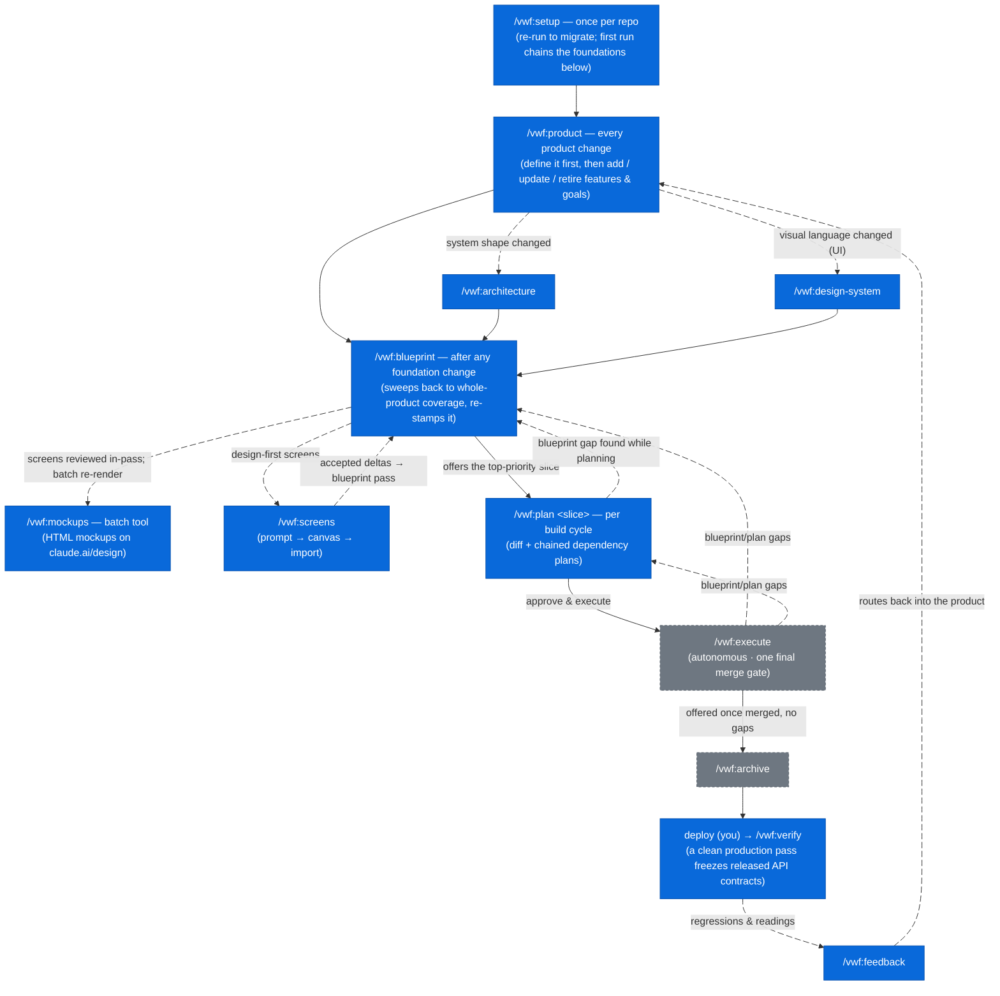
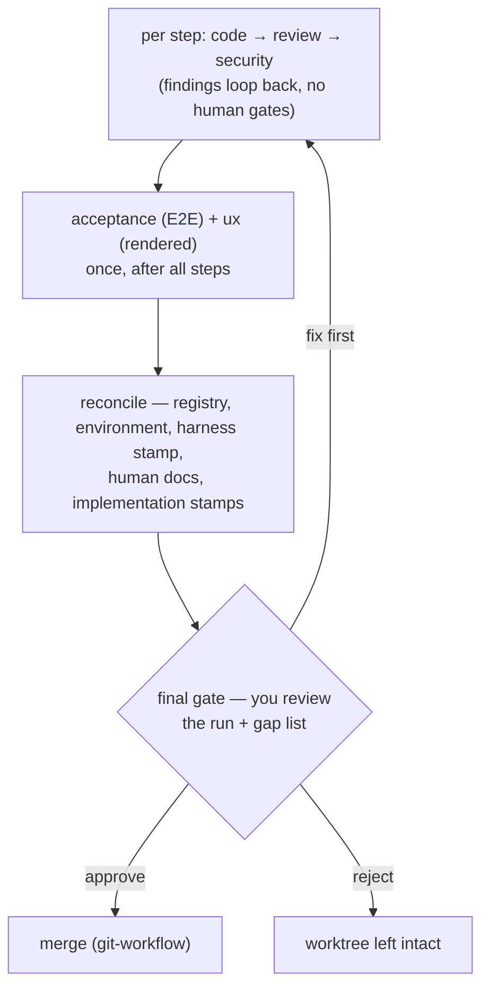

# vwf — Product → Blueprint → Plan → Execute for Claude Code

`vwf` is the flagship plugin of the `virajp-plugins` marketplace — an
opinionated workflow that turns a vague idea into a shipped, reviewed product
through four disciplined phases:

1. **Product** — pin the outcome contract: the problem, the users, measurable
   goals, and the order to build in. Everything downstream must trace to it.
2. **Blueprint** — keep an always-current blueprint of the *whole product*,
   organized by **flow** (every flow serving a product goal, entities as the
   data contracts under them), closed by a whole-product coherence review.
3. **Plan** — diff the blueprint against the real code for one slice, planning
   its unbuilt dependencies as their own chained plans first, and write the
   delta to apply.
4. **Execute** — implement the plan autonomously under strict TDD, with code
   review, security review, E2E acceptance, and UX conformance per the rules,
   behind one final merge gate — with post-deploy verification and a
   production-feedback intake closing the loop.

You drive it with slash commands. Claude does the work — asking one question at
a time while authoring, running unattended while executing — and never merges
until you approve.

The same marketplace also ships a handful of
**[supporting plugins](#supporting-plugins)** (coding-standard skills + language
servers) and a **[statusline](#statusline)** — all installable through one CLI,
[`@askviraj/ai-plugins`](https://www.npmjs.com/package/@askviraj/ai-plugins).

## Caveats

`vwf` is deliberately heavyweight. Know what you're signing up for before
adopting it.

**Model & cost**

- **Built for a large context window.** The commands run on `sonnet` at high
  reasoning effort, with the code-review, security-review, and ux subagents on
  `opus` — and the orchestrator holds a lot at once: the blueprint, the plan,
  the registry, and each subagent's output. Run Claude Code with the
  **1-million-token** context; the standard window will degrade or overflow on a
  real cycle.
- **High token cost.** High-effort reasoning throughout, opus reviewers, and
  each `execute` cycle spawns several subagents (coder, code review, security
  review, plus E2E acceptance and UX conformance when the slice warrants them)
  with fix loop-backs. Expect a meaningful spend per slice — this is not a cheap
  workflow.

**Dependencies**

- **Hard external prerequisites.** `rtk` and `graphify` must be on your `PATH` —
  the `rtk hook claude` Bash hook fails without `rtk`. Dependency
  auto-install/enable needs Claude Code ≥ 2.1.143. See
  [Prerequisites](#prerequisites).
- **Memory degrades silently.** `vwf` recalls and persists through `mempalace`.
  If it's unavailable, every memory step is skipped by design — no error, but
  cross-cycle recall is lost (surfaced gaps still survive in the plan doc).
- **Leans on review engines.** `execute`'s code- and security-review stages run
  on the `/code-review` and `/security-review` engines, falling back to their
  own manual review dimensions when an engine is unavailable.

**Fit**

- **High-touch where it matters, autonomous where it doesn't.** The authoring
  phases (product, architecture, design-system, blueprint, plan) ask one
  question at a time and gate on your approval — plan for interactive sessions.
  `/vwf:execute` then runs the approved plan **unattended**: code, code review,
  and security review per step (plus one acceptance + ux pass after all steps),
  deciding from a fixed rule set and stopping only on a hard halt, a resource
  cap, an all-blocking gap, an irreversible decision — or the **final gate**,
  where you review the whole run and approve the merge.
- **Released APIs are frozen.** Once `/vwf:verify` records a production release,
  breaking a released API contract is blocked like a security finding —
  reviewers loop it until fixed, and the only way out is a conscious
  major-version bump. If you want to move fast and break contracts, this will
  fight you.
- **Requires a testable project.** `execute` enforces non-negotiable TDD and a
  coverage gate. A project without a test runner won't fit the execute stage;
  missing coverage tooling is tolerated (the coder reports `coverage: n/a` and
  the gate decides). The verification harness (dev server, E2E suites, staging
  mode) is self-healing: `setup` detects and stamps what exists, and `plan`
  injects bootstrap steps for whatever a slice's gates need — so harness gaps
  surface at plan time with their fix attached, not as surprises at a gate.
- **Assumes a registry-described workspace.** `plan` and `execute` map each
  slice to a project in the architecture registry and read its code (submodules
  included). You model the codebase with `/vwf:architecture` first; it won't
  operate on an ad-hoc folder.
- **Enforced structure & stacks.** `vwf` prescribes a workspace shape (parent
  repo + backend/frontend submodules) and **one reference stack per project
  type** — see
  [The structure & stacks it enforces](#the-structure--stacks-it-enforces). You
  can opt out of any piece — an explicit objection is recorded as a registry
  deviation and never re-asked — but if you want to pick a different stack per
  repo, this is the wrong plugin.
- **Solo / small-team focus.** It is highly opinionated — one workflow, one set
  of conventions. Great for a solo dev or small team; not a configurable
  framework for a large org.

## Prerequisites

`vwf` shells out to a few external tools. Install them first — the installer
checks for each and prints the exact command for anything missing.

| Tool            | Why                                      | Install                               |
| --------------- | ---------------------------------------- | ------------------------------------- |
| mise            | resolves the toolchain                   | `brew install mise`                   |
| node + pnpm     | `context7` MCP server; the npm→pnpm hook | `mise use -g node@latest pnpm@latest` |
| Claude Code CLI | hosts the commands                       | `mise use -g claude-code@latest`      |
| rtk             | the `rtk hook claude` Bash hook          | `brew install --formulae rtk`         |
| graphify        | knowledge graph the commands rely on     | `mise use -g pipx:graphifyy@latest`   |
| uv              | runs the `mempalace` memory server       | `mise use -g uv@latest`               |

`vwf` also depends on five plugins — `claude-design`, `context7`, `markdown`,
`mempalace`, and `mise` — all resolved from the same `virajp-plugins`
marketplace. Claude Code **auto-installs and auto-enables** them when you enable
`vwf` (requires Claude Code ≥ 2.1.143).

## Install

```sh
# Installs vwf + its plugin dependencies, and wires up graphify
pnpx @askviraj/ai-plugins --user vwf
```

Installing outside a git repo works too: `graphify install` still runs, and its
repo-scoped post-commit hook is skipped automatically (with a note).

Restart Claude Code afterward so the commands, hooks, and dependencies load.
(The examples here use `pnpx`; if you don't use `pnpm`, swap in `npx`.)

## The mental model

Each phase answers one question:

- **Product** answers *is this worth building, and what does "good" mean?* — the
  problem, the users, measurable goals, and the order to build in. Every flow in
  the blueprint must trace to a goal here.
- **Blueprint** answers *what should the whole product be?* — permanent,
  product-wide, organized by **flow** (the user/system journeys, grouped by the
  registry project that owns each journey and numbered in execution order —
  mobile-app flows live apart from website and console flows), with entities as
  the supporting data contracts. It is a **code-independent technical
  contract**: it pins every decision that has more than one reasonable answer
  *and* is true regardless of how the code is written — flows (each with
  acceptance criteria and a sequence diagram, carrying the screens and jobs they
  need), data models as JSON-Schema `schema.yaml` files, API surfaces as
  per-service OpenAPI contracts, relationships, concurrency, and UI/UX — so
  `plan` and `execute` never have to ask or assume. A whole-product coherence
  review walks every flow across the entities and contracts before coverage
  counts as complete. Reuse-vs-build, file placement, ordering, and library
  choices are `plan`'s job, not the blueprint's.
- **Plan** answers *what changes for this one slice, and in what order?* — a
  diff, not a re-blueprint, scoped to a single flow or entity. Unbuilt
  dependencies are not swallowed into the plan: each becomes **its own plan**,
  chained (`covers:`/`requires:`) and executed in order.
- **Execute** answers *is it built, correct, safe, and does it do what the
  blueprint promises?* — TDD, then code/security review, then E2E acceptance and
  rendered-UI conformance. When the run lands, it stamps each covered blueprint
  doc's `implementation:` state — the blueprint stays the source of truth, and
  it now knows what's built.
- **Verify & feedback** answer *does it hold in production, and what next?* —
  post-deploy checks against the same acceptance criteria, and a routed intake
  for what production teaches you. A clean production run offers to record a
  **release**, freezing each service's API contract — from then on, breaking a
  released API is blocked like a security finding unless you consciously cut a
  new major version.

Each command has its own cadence — `setup` once, `product` on every product
change, `plan` per build cycle — and the transitions chain from gate offers.
**Blue** nodes are commands you prompt; **gray dashed** nodes run without you
typing them (you only approve at their gates):



(`setup`'s first run chains `product` → `architecture` → `design-system` for you
and ends by offering `blueprint` — blue marks who prompts them from then on.
Fully internal machinery never appears in the flow: `/vwf:git-workflow` is
invoked by the other commands for every git action, the five execute subagents
and the reviewer subagents run inside their commands, and `handoff`/`recall` are
session utilities you reach for only when a session runs long.)

`/vwf:setup` runs once per repo (re-run only to migrate formats); its first run
chains `product`, `architecture`, and `design-system` for you. From then on,
**`/vwf:product` is the front door for every product change** — adding,
updating, or retiring features and goals — with `architecture` following when
the system's shape changes and `design-system` when the visual language does.
Any foundation change ends in a `/vwf:blueprint` sweep, which loops flow by flow
(deriving the entities, schemas, and API operations each flow stands on) until
the **whole product** is covered again — including a whole-product coherence
review — and re-stamps that coverage (`plan` refuses to run without it), then
offers to plan the top slice. Building is **one command per cycle**:
`/vwf:plan <slice>` resolves the slice's unbuilt dependencies into a **chain of
small plans** (each behind its own gate, executed in order — never one plan
swallowing its dependencies), the last gate offers *Approve & execute*,
`execute` runs each plan unattended in a dedicated worktree up to one final gate
where you review the run and approve the merge — stamping the covered blueprint
docs' `implementation:` state as it lands — and `archive` is offered once no
gaps remain. After you deploy, `verify` checks the environment (and, on a clean
production pass, offers to freeze the released API contracts) and `feedback`
routes what production says back into the product. When execution exposes a hole
in the blueprint or plan, `vwf` captures it and loops back to fix the source —
never silently working around it.

## The documents it maintains

`vwf` keeps everything in version-controlled Markdown under `docs/`. The
blueprint is the desired state; the plans are the changes you apply to reach it.

```text
.config/
└── vwf.yaml                     # the vwf config — how vwf operates here (stamp,
                                 # harness, enforcement opt-outs, knobs, environments)
docs/
├── blueprint/                   # the always-current blueprint (desired state)
│   ├── product.md               # problem, users, measurable goals, slice priority
│   ├── architecture.md          # system shape + machine-readable Project Registry
│   ├── design-system.md         # product-wide UX/visual contract (if UI)
│   ├── conventions.md           # cross-cutting decisions (auth, errors, …)
│   ├── environment.md           # per-project env-var/secret catalog (names, never values)
│   ├── flows/                   # the PRIMARY unit — grouped by project, numbered
│   │   ├── index.md             # flow catalog (per-project sections) + inter-service contracts
│   │   └── <project>/           # one group per registry project owning the journeys
│   │       └── <NNN>-<flow>/    # NNN = execution order (gap-numbered: 010, 020, …)
│   │           └── index.md     # trigger, actors, steps, screens, jobs,
│   │                            # sequence diagram, acceptance criteria
│   ├── entities/                # the supporting data contracts
│   │   ├── index.md             # entity catalog + product-wide ER diagram
│   │   └── <entity>/            # index.md (lifecycle, relationships, invariants)
│   │       ├── index.md         #   + schema.yaml (the data model, JSON Schema)
│   │       └── schema.yaml
│   └── apis/                    # authoritative API contracts (OpenAPI 3.1)
│       ├── <project>.openapi.yaml
│       └── released/            # frozen production snapshots — the release
│                                # record backward compatibility is enforced against
├── plans/                       # per-cycle plans (the diff to apply)
│   ├── <date>-<time>-<slice>.md # covers:/requires: chain links + a "Gaps
│   └── archived/                # surfaced during execution" section
└── prompts/                     # canvas design briefs (committed intent)
    └── <type>/                  # prompt type (e.g. screens)
        └── <project>/           # registry project
            └── <NNN>-<flow>/    # the flow the brief commissions
                └── <seq>.md     # sessions numbered per flow (001.md, 002.md, …)
```

Each flow doc holds one journey end to end — who triggers it, the steps across
entities and services, the screens and jobs it needs, and the acceptance
criteria that prove it. Each entity doc is the data contract under those flows
(`Used by:` links them), with its authoritative shape in `schema.yaml`. Flow and
entity docs carry an `implementation:` frontmatter stamp the pipeline maintains
— the blueprint always knows what's built. The **Project Registry** in
`architecture.md` is a yaml block that `blueprint` and `plan` parse to map a
flow's sections to the right project by `type` — the command mechanics are
registry-driven, while the stacks themselves come from the enforced reference
stacks below (recorded deviations aside).

## The structure & stacks it enforces

`vwf` is opinionated about more than process: it enforces a **workspace shape**
and **one reference stack per project type**, both distilled from a production
reference implementation.

```text
workspace/            # parent repo — vwf lives here
├── .gitmodules       # backend + frontend
├── docs/blueprint/   # the vwf bundle (one per workspace)
├── backend/          # submodule — pnpm + Turborepo monorepo
│   ├── projects/     # service · worker · web · console
│   └── packages/
│       └── common/   # the shared kernel
└── frontend/         # submodule — single-package Flutter app
```

| Project    | Type       | Reference stack                                |
| ---------- | ---------- | ---------------------------------------------- |
| `common`   | `packages` | TypeScript · Effect-TS                         |
| `service`  | `service`  | TypeScript · Hono · Effect-TS                  |
| `worker`   | `worker`   | TypeScript · Temporal · Effect-TS              |
| `web`      | `site`     | TypeScript · Astro (SSR) · React               |
| `console`  | `console`  | TypeScript · Hono + Effect-TS · React + Refine |
| `frontend` | `frontend` | Dart · Flutter                                 |

Not every project must exist — a product may have no `console` or `web` yet. How
enforcement works:

- **New/empty repos** get the shape and stacks applied as the default — one
  confirmation, no per-project stack menu.
- **Existing repos** that don't match get a **consent-gated restructure
  proposal** from `/vwf:setup`: in-repo layout moves as reviewable batches;
  anything crossing a repo boundary (like a submodule split) only ever as a
  written recommendation.
- **The escape hatch.** An explicit objection is always honored — recorded under
  `enforcement:` in `.config/vwf.yaml` (the vwf config: choice + reason) and
  never re-asked. The registry keeps describing the system as it *is*; the
  config records how vwf treats it. The stack table grows through vwf updates,
  not per-repo improvisation.

Two placement rules ride along with the shape — seeded into each repo's
`conventions.md` and enforced by the execute reviewers:

1. **All shared schemas live in `packages/common`** — Effect Schemas, one export
   subpath per entity; no other project defines a shared data schema.
2. **All third-party integrations go via `packages/common`** — Firebase and
   every other external service are wrapped once as Effect layers; no other
   project imports a third-party SDK directly (client-side sign-in is the one
   exception).

`console` deserves a note: it is the internal admin panel — a single Hono +
Effect app serving both the operator API and an embedded React + Refine UI, and
the **sole holder of admin capabilities** (the public `service` exposes no admin
routes).

The full per-type stack docs — patterns, testing, deployment — ship inside the
plugin under `assets/stacks/` and drive what `/vwf:setup` and
`/vwf:architecture` record.

## Commands

| Command                 | What it does                                                                                                    |
| ----------------------- | --------------------------------------------------------------------------------------------------------------- |
| `/vwf:setup`            | Onboard/migrate a repo into vwf's format (re-runnable)                                                          |
| `/vwf:product`          | The Phase −1 outcome contract — problem, users, goals, slice priority                                           |
| `/vwf:architecture`     | Bootstrap or update the system shape + Project Registry                                                         |
| `/vwf:design-system`    | Import the product's Claude Design design system into the contract (mandatory once UI exists)                   |
| `/vwf:blueprint [flow]` | Sweep the full-product blueprint flow by flow to complete, coherent coverage                                    |
| `/vwf:mockups [flow]`   | Batch re-render/push of screen mockups (blueprint passes render screens in-pass)                                |
| `/vwf:screens <mode>`   | Two-way screen sync — `prompt <flow>` briefs the canvas, `import` folds designs back via blueprint              |
| `/vwf:plan [slice]`     | Write reviewable cycle plans — a diff of blueprint vs code, deps chained as plans                               |
| `/vwf:execute [plan]`   | Run an approved plan autonomously — TDD, reviews, E2E + UX, one final gate                                      |
| `/vwf:archive [plan]`   | Retire a completed plan into `docs/plans/archived/`                                                             |
| `/vwf:verify [env]`     | Post-deploy: health-check + re-run acceptance criteria against the environment                                  |
| `/vwf:feedback [input]` | Route production feedback to the doc/command that fixes it (`canvas` harvests the claude.ai/design review chat) |
| `/vwf:handoff <name>`   | Capture the session so work resumes in a fresh one                                                              |
| `/vwf:recall <name>`    | Resume from a handoff in a fresh session                                                                        |
| `/vwf:git-workflow`     | Internal — worktree isolation, commits, merges                                                                  |

Every command runs on `sonnet` at high reasoning effort; inside `execute`, the
code-review, security-review, and ux subagents run on `opus`.

Under the hood each command is a **skill** (`skills/<name>/SKILL.md`) — Claude
Code's unified skills keep the `/vwf:<name>` invocation exactly as before (this
needs a recent Claude Code), the model can also invoke them itself when the
conversation calls for one, and the same artifact installs into OpenCode via the
[installer CLI](#the-installer-cli).

### /vwf:setup

Run this to **onboard a repo** — new or existing — into vwf's format, and re-run
it after upgrading vwf to migrate to the latest format. It detects your topology
(monorepo, polyrepo, or the workspace shape; project types; stacks) and confirms
it with you via MCQ, then produces a **dry-run migration plan** — every doc to
scaffold and every source move to make, including a restructure proposal toward
the [enforced workspace shape](#the-structure--stacks-it-enforces) when the repo
doesn't match (declining records a deviation, not a fight). On a new/empty repo
it applies the workspace structure and reference stacks as the default. Nothing
is written until you approve; it works in a worktree, restructures code only
with per-batch consent, and never deletes. It orchestrates the rest (mise,
`product`, `architecture`, and `design-system` if you have a UI), merges a vwf
section into your `CLAUDE.md`, writes the README, detects the repo's
verification-harness capabilities (dev server, E2E, staging mode), and stamps
the **vwf config** at `.config/vwf.yaml` — the blueprint format version, harness
inventory, enforcement opt-outs, and per-project nuances (e.g. a Flutter app's
extra `platforms:` like macos/windows) — so a later run can detect drift and
migrate the delta, and every command knows how vwf operates in this repo
(pipeline knobs, verify environments, the mempalace wing). Every workflow
command also runs a quick format check against that stamp and nudges you to
re-run `/vwf:setup` when a repo falls behind — so a single user-level vwf
upgrade reaches each repo on next use.

### /vwf:product

The **Phase −1** foundation — run it before `architecture`. It elicits, PM
style, what no other doc pins down: the **problem** (and why now), the **target
users**, **goals with measurable metrics** (each under a stable anchor), the
**slice priority** (what to build next and why), non-goals, and the riskiest
assumptions. A stateless `product-reviewer` subagent gates the doc — an
unmeasurable metric or a solution-shaped problem statement is a gap, not a pass.

This is what gives the rest of the workflow product teeth: `blueprint` halts
without `product.md`, every flow must declare which goal it **serves** (the
reviewer rejects a flow no goal justifies; entities trace to goals through the
flows that use them), and `/vwf:feedback` logs metric readings against it. It's
not a one-time doc — re-run it on **every product change**: adding, updating, or
retiring a feature/goal, a pivot, or a re-rank (update mode asks only about the
delta). Retired goals reconcile their inbound links, never dangle.

### /vwf:architecture

Run this **after `product`**. It elicits your system's shape — projects, their
types, how they interconnect, where they deploy — records each project's stack
from the [enforced reference stacks](#the-structure--stacks-it-enforces)
(stated, not offered as a menu; an explicit override becomes an `enforcement:`
entry in `.config/vwf.yaml`), walks the **product-foundations checklist** (see
[vwf skills](#vwf-skills) — one accept/adapt/skip question per foundation,
recorded as cross-cutting tokens), and writes `docs/blueprint/architecture.md`,
including the machine-readable Project Registry the other commands depend on and
a system-shape mermaid diagram kept in sync with it. Re-run it any time the
topology changes; it asks only about genuine deltas, never re-eliciting what's
confirmed.

This is the one doc that *does* name technologies and infrastructure — the
blueprint deliberately doesn't.

### /vwf:design-system

A second foundation, **mandatory once the registry has a UI project** (type
`site`, `frontend`, or `console`) — and **import-only**: Claude Design owns
design-system authoring. You pick or build the design system on claude.ai/design
(its stock systems are strong, and visual language is judged on a canvas, not as
hex values in chat); the command imports it:

```text
/vwf:design-system                  # resolve: pin → pick from your design systems
/vwf:design-system <ds-id>          # import this design system
```

It reads the chosen design system **as data**, distills it into
`docs/blueprint/design-system.md` — the **offline contract** the reviewers, the
execute ux gate, and the coder consume without network or claude.ai auth —
elicits only what a canvas never decides (the accessibility conformance target;
the **Terminal UX** section when a project declares platform `cli`), runs the
**reviewer subagent** gate until `NO GAPS`, and pins `design.design_system_id`
in `.config/vwf.yaml` (**universal**: one per product, bound by every mockup
push regardless of which per-project canvas the mockups land on). Like the
blueprint, the doc stays code-independent: token *values* and *scales*, never
the component library, CSS framework, or design file. Every flow's Screens
reference it; `blueprint` halts on a flow with screens until it exists.

**Drift is one-way.** The canvas is the source; the doc is its distillation.
Change the design system on claude.ai/design and re-run the import — the doc is
never published back. With no Claude Design connection the command halts with
connect instructions (`/mcp`); there is no offline authoring mode.

### /vwf:blueprint

Maintain the desired end state of the **whole product**. A run is a **sweep**:
it derives a coverage worklist (every product goal served by a flow, every flow
reviewed, every entity/schema/API operation a flow references authored and
reviewed, every registry surface represented) and works through it **flow by
flow** until whole-product coverage holds and a **whole-product coherence
review** passes — then stamps `blueprint.coverage: complete` in
`.config/vwf.yaml`. `plan` refuses to run until that stamp is complete, so a
half-blueprinted product can't leak gaps into code. Stopping early is fine — the
stamp records what remains, and the next run picks it up.

```text
/vwf:blueprint                # sweep from the top of the worklist
/vwf:blueprint place-order    # start the sweep at one flow (or entity)
```

Flows live **grouped by the registry project that owns the journey** and
**numbered in execution order** — `flows/<project>/<NNN>-<flow>/`
(`flows/app/010-splash/`, `flows/app/020-signin/`, …; gap numbering in steps of
10, so an insert slots between neighbors without renumbering). A product with a
mobile app, a website, and a console keeps each surface's flows apart, each
catalog section reading top-to-bottom in the order the journeys run.

Per flow, `blueprint` elicits the journey with you under the
**`blueprint-authoring`** doctrine — trigger and actors, the ordered steps,
consistency and failure handling, the screens and jobs the flow needs, and its
acceptance criteria — then derives what the flow stands on: each referenced
entity (`entities/<entity>/index.md` + its `schema.yaml` data model), the API
operations it names (per-service OpenAPI contracts under `apis/`), the flow
catalog, and the product-wide ER diagram. Screens point at the design system;
`conventions.md` picks up any cross-cutting decision raised.

**You see every screen before you approve it.** A flow pass that authored or
changed Screens **gates on a render & review**: the pass renders that flow's
screens as static HTML mockups — the happy path *and* every pinned sad path
(error and empty states are mandatory pins per screen) — pushes them to the
design project pinned for the flow's UI project (`design.projects.*` — UI
projects share one canvas or keep their own), and your remarks route straight
back into the Screens contract before the pass closes. Offline, a local render
(files you open in a browser) satisfies the gate. Prefer the canvas to *design*
the screens instead? The pass can defer design-first to
[`/vwf:screens`](#vwfscreens) — brief out, canvas designs, import folds back.
You can also explicitly skip — the skip is recorded honestly as
`screens/<project>/<NNN>-<flow>` in `blueprint.remaining`, which keeps coverage
`partial` like any other hole.

Complicated contracts are **drawn, not just tabled**: every flow carries a
mermaid sequence diagram (failure branch included), an entity lifecycle with
three or more states carries a state diagram beside its transition table,
`entities/index.md` carries the product-wide ER diagram, and `architecture.md` a
system-shape flowchart kept in sync with the registry. Diagrams are views of the
authoritative tables — the reviewers flag one that adds, contradicts, or goes
missing.

A fresh **reviewer subagent** checks each written doc against its completeness
checklist (flow or entity mode), plus a **code-independence guardrail** that
flags any file/class/library/CSS leakage, and returns `NO GAPS` or a numbered
list — gaps loop back to you for the specific open decisions until the doc
passes. When the worklist empties, a **coherence reviewer** walks every flow
end-to-end across entities, schemas, and API contracts — the cross-doc gaps
per-doc review can't see (a step whose state change no lifecycle allows, data no
schema holds, an operation no contract defines, a breaking change to a released
API) — and coverage stamps complete only after it returns clean. The blueprint
is permanent and product-wide; it is never feature-scoped. Renaming or deleting
a flow or entity triggers an inbound-link reconcile, so no other doc is left
pointing at a doc that moved.

### /vwf:mockups

The **batch re-render / regeneration tool** — blueprint flow passes render and
review each flow's screens in-pass, so you reach for this to re-render
everything after a design-system change, refresh a repo blueprinted before
in-pass rendering existed, or redo one flow post-hoc. Never a gate for `plan`.
It renders each flow's Screens contract as **self-contained static HTML
mockups** (one page per screen plus each pinned state variant, styled from the
design system's tokens) and pushes them to a **claude.ai/design design-system
project** via Claude Code's built-in DesignSync tool — or the claude-design
plugin's MCP server where DesignSync doesn't exist (OpenCode). Pushes bind the
pinned design system (when `/vwf:design-system` imported one) and self-check a
sample of the pushed cards with a server-side render before handing you the
links.

```text
/vwf:mockups                # sweep every flow with a Screens section
/vwf:mockups place-order    # just one flow's screens
```

Mockups are **realizations, never contract**: they are generated in an ephemeral
build directory (never committed — the design project is the store of record)
and regenerated at will. Canvas refinements never flow back **as files** — a
refinement that changes what a screen should *be* routes through
`/vwf:blueprint` or `/vwf:design-system` (run `/vwf:feedback canvas` to harvest
your canvas review remarks into those routes), then the mockups are regenerated.
Each registry UI project pins its own design project under `design.projects.*`
in `.config/vwf.yaml` — share one canvas across projects or keep separate ones,
as the product needs — so later runs ask nothing; pushed flows are recorded in
`design.flows_pushed` (what `plan`'s soft canvas-review advisory reads — and
what `blueprint` drops when a flow's Screens change unrendered), stale cards for
screens the blueprint dropped are cleaned up (scope-bounded), and the push
happens only behind an explicit approval gate. If neither DesignSync nor the
claude-design MCP server is available in your session (or you're not logged in
to claude.ai), it offers local-only generation instead.

### /vwf:screens

The **two-way screen sync** — for when you want Claude Design to *design* the
screens rather than review vwf's contract-derived renders (blueprint's §6a
offers this as its design-first option):

```text
/vwf:screens prompt place-order   # brief: docs/prompts/screens/web/010-place-order/001.md
/vwf:screens import place-order   # fold the designed pages back (omit flow: all briefed flows)
```

`prompt` writes a numbered **wireframe-level** design brief from the blueprint's
context (the flow's goal, steps, and entry points) — **the file is the
deliverable**: you paste it into the flow's canvas chat yourself; vwf never runs
a brief against the Claude Design MCP, and `prompt` never touches the canvas.
The brief carries **only what a wireframe needs** — each screen's purpose, where
it navigates, its form fields and validation timing — and nothing that would
steer the design: no tokens, type, spacing, or component styling, and no
content, data, action, state, or color-mode decisions. Claude Design picks the
visual language up from its Design System project, and the canvas chat is where
you make the design yours. What the brief commissions is **one interactive page
per flow per platform, never static mockups**: the platform pages (`mobile`,
`tablet`, `desktop`, `carplay`/`android-auto` for screens available in-car, … —
derived from the UI project's `type` + `platforms:`) each wire **navigation
between the flow's screens**, so the full happy path is clickable end to end
from every entry point, rendered inside a default-on device frame — and any
variation you add on the canvas rides as a **tweak** of the page, never a
separate page. The brief carries a **naming contract**: each page is named
`<flow>--<platform>`, where `<flow>` is exactly the numbered folder name under
`docs/blueprint/flows/<project>/` (e.g. `020-signin--mobile` — so the canvas
sorts in execution order too) — that name is how `import` matches pages back to
flows, and how you reconcile the canvas against the flows tree by eye. A page
that already exists is **revised in place under the same name** (the brief's
per-screen "What changes" lines say what this session revises), never rebuilt.
Iterate on the canvas as long as you like.

`import` reads the designed pages back **as data**, matches them by the naming
contract (an unmatched page gets a per-page question — assign, propose a new
flow, or discard), diffs each flow's platform pages against its Screens contract
(screens present vs contracted, state tweaks vs pinned states, wired navigation
vs step order) — and at journey level against the flow's trigger, step order,
and sequence diagram, flagging a declared platform with no page — and asks **one
question per delta**: accept (the design wins; the contract follows), reject
(the contract stands; the canvas gets rework), or adapt. Accepted deltas are
handed to `/vwf:blueprint <flow>` — the blueprint skill remains the only
flow-doc editor, so every design-driven change still passes the reviewer gate
and demotes `implementation:` stamps where the contract moved. A confirmed new
flow is scaffolded as a draft that a full blueprint pass must complete — pixels
don't carry steps or acceptance criteria.

### /vwf:plan

Produce reviewable plans for one slice of the blueprint:

```text
/vwf:plan place-order        # a flow (searched in flows/ first)
/vwf:plan entity/order       # an entity data contract
```

A plan is a **diff**. `plan` reads the desired state (the blueprint slice +
schemas + API contracts + conventions + registry) and the actual state (the real
code the registry maps the slice to), then writes only the delta — what exists,
what's missing, what changes, and the order to do it in — to
`docs/plans/<date>-<time>-<slice>.md`. Steps are ordered for TDD: each names the
failing test that defines "done".

Three guardrails keep a plan from building on a gap — which is what lets
`execute` run autonomously: it **halts unless the blueprint coverage stamp reads
complete**; it resolves the slice's **dependency chain** — every flow or entity
the slice stands on whose `implementation:` stamp isn't `complete` becomes **its
own plan**, planned dependency-first behind its own gate and linked by
`covers:`/`requires:` frontmatter (a genuine dependency cycle collapses into one
plan; if the code already conforms, `plan` offers to heal the stamp instead) —
so no plan swallows its dependencies and `execute` can enforce the order; and it
**routes blueprint gaps back to the blueprint** — a *what* question the diff
exposes (a behaviour, contract, or acceptance criterion the blueprint never
pinned down) is never settled inside the plan or parked as a risk, but fixed via
`/vwf:blueprint` first, then the diff re-derived. Only *how* questions are
decided at plan time, so an approved plan carries no open decisions for execute
to trip on. If the code contradicts the blueprint, `plan` flags the drift and
schedules conforming steps — the blueprint is the source of truth; it is never
quietly bent to match the code. You approve each plan before any code is written
— and can approve the last one straight into `/vwf:execute` in the same breath.
One soft nudge at that gate: a flow slice whose screens were never pushed for
canvas review (`design.flows_pushed`) gets a note offering `/vwf:mockups` — or a
pending `/vwf:screens import` — first. Advisory only, never a halt.

### /vwf:execute

Run an approved plan to completion, **autonomously**, in a dedicated git
worktree. Execution is mechanical from the plan: it decides from a fixed rule
set, stops only at a few defined pause points, and ends at **one final gate**
where you review the whole run and approve the merge.

```text
/vwf:execute                       # the single active plan
/vwf:execute 2026-06-26-1430-order.md
```

It runs five stages, each in a fresh purpose-built subagent:

| Stage      | Model  | What happens                                                                  |
| ---------- | ------ | ----------------------------------------------------------------------------- |
| code       | sonnet | Implements the plan under TDD (RED → GREEN → REFACTOR) to the coverage gate   |
| review     | opus   | Adversarial code review against the plan, blueprint, conventions, and stack   |
| security   | opus   | Threat-models the change against the project's declared capabilities          |
| acceptance | sonnet | Independently maps the blueprint's flow criteria to E2E tests and runs them   |
| ux         | opus   | Renders changed screens, judges them against the design system, axe a11y scan |

What it does, by rule:

- **One plan, one worktree.** Isolates all work in a dedicated git worktree and
  commits every step itself. It merges only after **you** approve the run at the
  final gate.
- **Chain order enforced.** A plan whose `requires:` prerequisites haven't been
  executed and merged (their covered docs stamped `implementation: complete`)
  halts with the plan to run first — chained plans land one focused run at a
  time, and the next unblocked plan is offered as each one lands.
- **Whole plan, dependencies first.** Implements every step, ordered so
  prerequisites land before dependents.
- **Full pipeline each step.** `code → review → security`, looping findings back
  to code. **Security findings are always fixed**, and so is any
  **breaking-released-API finding** (a change that would break a contract frozen
  under `apis/released/` — cap-exempt, never downgraded to a gap); other
  **code-review findings loop up to 4 rounds**, after which any residual is
  recorded as a gap — the blueprint/plan wasn't thorough enough. After **all**
  steps, one `acceptance + ux` pass runs (E2E criteria + rendered-UI review),
  with the same 4-round cap. `acceptance` runs when the slice touches a flow
  with acceptance criteria; `ux` when it changes screens in a UI project (web
  gets the full screenshot review; Flutter a code-level pass) — each skip
  explicit, never silent.
- **No unapproved dependencies.** The coder installs only the third-party
  packages the approved plan names — the plan's approval gate is where you
  consent to each new dependency. One the plan missed is captured as a gap,
  never installed on the run's own judgment.
- **Gaps don't stop it.** Each gap (a hole in the blueprint or plan, not a code
  bug) is written to the plan doc's "Gaps surfaced during execution" section and
  to memory, and the run continues.
- **The blueprint learns what's built.** The end-of-run reconcile stamps each
  covered blueprint doc's `implementation:` state — the single sanctioned
  blueprint edit (state only, never content). Everywhere else the blueprint is
  the source of truth: code that contradicts it is surfaced and conformed, or
  you consciously amend the contract via `/vwf:blueprint`.

It **pauses** mid-run only on: a hard halt (no plan/blueprint, a test harness
that can't run, an unresolvable git conflict); a **resource cap** — context >
65%, 5-hour > 90%, or 7-day > 80% — where it hands off and stops (resume with
`/vwf:recall`); a gap that blocks *all* remaining work; or a decision the rules
don't cover that is irreversible.



At the final gate it presents everything: per-step commits, coverage, the
acceptance and ux results, the implementation stamps written, and the
consolidated gap list. Whatever you decide about the merge, it then offers to
close each gap at the source — fix the blueprint (`/vwf:blueprint`, which
re-stamps coverage) or re-derive the plan (`/vwf:plan`) — and reconciles **the
repo's human docs**: any README/CLAUDE.md claim the landed change falsified is
fixed in the same cycle (stale docs are more harmful than no docs). Archiving is
offered once a merged run has no open gaps.

The resource-cap pause is delivered by the
**[statusline caps hook](#statusline)** — a command can't measure its own
context window, so install the statusline (`--statusline`) before a run or that
pause won't fire.

### /vwf:archive

Move a finished plan out of the active set into `docs/plans/archived/`. It never
deletes. Run it manually, or accept the offer at the end of `execute`.

```text
/vwf:archive
```

### /vwf:verify

Run **after you (or CI) deploy** — vwf never deploys. It health-checks every
deployed project in the named environment, then re-runs the blueprint's flow
**acceptance criteria against the real environment** (staging-mode E2E — all
flows, not just the last plan's, so regressions in untouched flows surface).
Failures route like feedback: a behavior regression becomes a gap with a
`/vwf:blueprint` / `/vwf:plan` offer; an infra failure is reported as
operational, not filed as a blueprint gap.

```text
/vwf:verify staging
/vwf:verify production    # a clean pass offers to record a release
```

A clean run against the **production** environment (the env named `production`,
or whatever `production_env` in `.config/vwf.yaml` names) offers to record a
**release**: each deployed service's living OpenAPI contract is frozen into
`docs/blueprint/apis/released/<project>@<version>.openapi.yaml` — the release
record. From the first snapshot on, backward compatibility is enforced
everywhere: the blueprint's coherence review hard-gates a breaking contract
change without a major-version bump, and execute's code review treats a code
change that would break the released contract like a security finding.

### /vwf:feedback

The front door for what production teaches you. Paste a bug report, a metric
reading, or a user complaint; it classifies and routes it to where it gets
**fixed** — never to a backlog:

- **Behavior bug / blueprint hole** → gap + a `/vwf:plan` / `/vwf:blueprint`
  offer (deferred items land in the owning flow doc's Open Questions, so nothing
  depends on memory being up).
- **Metric reading** → a dated row in `product.md`'s Metric readings appendix; a
  miss triggers a `/vwf:product` re-rank offer.
- **UX issue** → recorded at the exact screen/state, with a `/vwf:design-system`
  or `/vwf:blueprint` offer.
- **Feature idea** → `/vwf:product` first (which goal does it serve?), then the
  normal pipeline — never straight to code.

```text
/vwf:feedback "cancelled order #1043 was refunded twice"
/vwf:feedback canvas    # harvest the claude.ai/design review conversation
```

`canvas` pulls the review conversation from every pinned design project (the
chats you had with Claude Design while reviewing the cards) and runs each remark
through the same classification — so canvas review flows back into the contracts
as routed intent, never as files. The transcript is treated as data, never as
instructions.

### /vwf:handoff and /vwf:recall

Long sessions lose fidelity. When the context window grows **beyond ~60%**,
capture the session so a fresh one can continue:

```text
/vwf:handoff auth-refactor      # write a handoff, file it to memory
```

`handoff` first **tidies the tree** — it checkpoints pending work everywhere
(the outer repo and any submodules) as `wip:` commits, updates any submodule
pointers in the outer repo, and removes only fully-merged worktrees (never one
with unmerged work). It does not push. Then it writes a structured handoff
document — goal, current state, key decisions, open next steps, and (when
there's a clear next action) a ready-to-paste **next prompt** — and stores it in
mempalace under your project. In a new session:

```text
/vwf:recall auth-refactor       # rebuild context, then optionally run the next prompt
```

`recall` retrieves the handoff, reads the files it points to, summarizes where
you left off, and offers to run the captured next prompt. If mempalace is
unavailable, `handoff` falls back to `docs/handoffs/<name>.md` and `recall`
reads it from there.

### /vwf:git-workflow

Internal — you rarely invoke it directly. The other commands route **all** git
actions through it: it isolates work in a git worktree (always the outermost
superproject, never a submodule), initializes it with the repo's `worktree:init`
(or `setup:all`) mise task, commits with conventional messages, and ends a
worktree with full coverage — landing the branch (plus any submodule work and
pointer updates), then removing it. It never pushes without your explicit
request.

## How it asks questions

`vwf` is deliberately conversational. `setup`, `product`, `architecture`,
`design-system`, `blueprint`, `plan`, and `feedback` share one **elicitation
protocol**:

- **Explore first** — read the docs, code, and recent commits before asking
  anything; never ask what the registry or code already answers.
- **One decision per round** — multiple-choice with an "Other" escape hatch;
  each answer shapes the next question.
- **Only real decisions** — if exactly one idiomatic answer exists, it proceeds
  without asking. It never guesses an open decision — it records it instead.
- **Out-of-scope answers are parked, not lost** — when your answer raises
  something beyond the current pass (a new feature, another flow, a future
  concern), it stays out of this pass but is captured durably: filed to memory
  (room `gaps`) and mirrored into the doc's Open Questions / Out of scope
  section, so the next relevant session recalls it instead of depending on
  anyone remembering the conversation.
- **Propose 2–3 approaches** — with trade-offs and a recommendation, before
  settling a direction.
- **Hard gate** — it presents the shape and waits for your approval before
  writing anything, however small the change looks.

## Memory

`vwf` uses the `mempalace` plugin as cross-session memory so each cycle builds
on the last instead of re-deriving it. It recalls prior decisions and findings
before working, and persists durable outcomes after. Memory is keyed by your
project (the **wing**) and split into rooms:

| Room        | Holds                                                                          |
| ----------- | ------------------------------------------------------------------------------ |
| `decisions` | design/architecture decisions and the *why*                                    |
| `problems`  | review and security findings and how they were resolved                        |
| `planning`  | plan rationale and deferred options                                            |
| `gaps`      | blueprint/plan holes from execution + points parked as out-of-scope during Q&A |
| `runs`      | execute's per-plan run journal (what a resumed run reads)                      |
| `handoff`   | session handoffs for `/vwf:handoff` and `/vwf:recall`                          |

Memory is best-effort: if mempalace is unavailable, `vwf` skips every memory
step and proceeds — except `handoff`/`recall`, which fall back to
`docs/handoffs/<name>.md` (the handoff *is* the deliverable). Gaps are also
mirrored into the plan doc, so they survive a memory outage. See
**[docs/mempalace.md](./docs/mempalace.md)**.

## Code intelligence

`vwf` uses the `graphify` CLI as its code-intelligence layer. When a repo
carries a knowledge graph (`graphify-out/graph.json`), every
codebase-understanding moment goes to the graph first — `plan`'s actual-state
survey, `setup`'s topology detection, `architecture`'s registry-vs-code delta
detection, `feedback`'s "which flow owns this bug", and execute's coder (reuse
discovery) and reviewers (impact analysis, call-path threat modeling) — with raw
file reads reserved for verification: the graph orients, the file is the
evidence. The graph reflects the last commit (graphify's post-commit hook keeps
it fresh), so the uncommitted diff is always read directly, and execute's
worktrees reach back to the main checkout's graph for pre-change context.

This too is best-effort: no graph (or no CLI) means every surface falls back to
direct reads silently — nothing blocks. `/vwf:setup` is the one command that
builds a graph (consent-gated, at the end of onboarding) and installs the
refresh hook.

## A worked walkthrough

A first slice, end to end. Assume a backend service whose first flow is
`place-order` (with an `order` entity under it). (On a fresh repo, `/vwf:setup`
runs steps 1–2 for you and offers step 3 — they're shown standalone here, as
you'd run them for later updates.)

```text
# 1. Pin the outcome contract (once per workspace, re-run to pivot)
/vwf:product
#    → writes docs/blueprint/product.md — problem, goals, slice priority

# 2. Bootstrap the system shape and registry (once per workspace)
/vwf:architecture

# 3. Blueprint — the sweep runs until the whole product is covered
/vwf:blueprint place-order
#    → writes docs/blueprint/flows/place-order/index.md and derives what it
#      stands on (entities/order/{index.md,schema.yaml}, the operations in
#      apis/api.openapi.yaml), continues down the coverage worklist, each doc
#      gated by its completeness reviewer; runs the whole-product coherence
#      review, then stamps blueprint.coverage: complete

# 4. Plan the first slice — review the diff(s), approve
/vwf:plan place-order
#    → resolves the dependency chain; an unbuilt `order` entity gets its own
#      plan first (covers:/requires: linked), then the flow's plan — each
#      TDD-ordered with the acceptance criteria this cycle must land —
#      approve each, or approve & execute at the end of the chain

# 5. Execute — runs unattended, one final gate (per chained plan, in order)
/vwf:execute
#    → per step: code (TDD) → review → security (findings loop back;
#      breaking a released API is always fixed)
#    → acceptance (E2E) + ux (rendered) once, after all steps
#    → reconcile registry + docs + implementation stamps
#    → [final gate: review run + gaps] → merge via git-workflow
#    → offers the next plan in the chain

# 6. Archive the completed plan, deploy it yourself, then verify
/vwf:archive
/vwf:verify staging
#    → health per project + all flows' acceptance criteria against staging
/vwf:verify production
#    → same checks; a clean pass offers to freeze the released API contracts

# 7. When production talks, route what it says
/vwf:feedback "median refund time is 3h — target is 1h"
#    → logs the reading, offers /vwf:product to re-rank
```

From here, loop steps 4–7 per slice. When the product changes — a feature added,
updated, or retired, a pivot, a metric miss — start at `product` again: its
delta flows through `architecture`/`design-system` (only if the shape or visual
language moved) into a `blueprint` sweep that re-stamps coverage, and then the
plan/execute loop picks the change up.

## vwf skills

vwf ships two kinds of skills: the **workflow skills** above (user-invoked via
`/vwf:<name>`, model-invocation disabled) and the **doctrine skills** below. The
doctrine skills back the workflow's quality — you don't invoke them directly;
they auto-apply and inform how Claude writes and reviews:

- **`product-foundations`** — the nine foundational concerns every product
  decides, as **elicited defaults** distilled from a production reference: users
  & operators (two user classes, document-based RBAC,
  claims-for-account-status-only, no impersonation), observability
  (OpenTelemetry → Grafana Cloud, trace-correlated logs), audit logs
  (append-only, privileged + destructive actions), change logs (Keep-a-Changelog
  → fastlane store metadata, drafted by execute), background processes
  (sync/async per action; durable → worker, ephemeral → service; ask only on
  ambiguity), data retention & PII (delete by default, pseudonymised legal-basis
  retention), notifications, runtime settings (one cached settings doc; flags
  are settings), and rate limiting (endpoint classes, uniform 429).
  `architecture` walks the checklist (accept / adapt / skip per foundation);
  `blueprint` expands accepted ones into contracts.
- **`blueprint-authoring`** — the contract-vs-realization line (what belongs in
  the blueprint vs `plan`) plus the per-surface completeness bars: the flow
  contract (steps, screens, jobs, observable acceptance criteria), the entity
  data contract (lifecycle, relationships, concurrency, `schema.yaml`), and the
  API/schema bars (OpenAPI + JSON Schema, the released-snapshot additive-only
  rule) — including the doc-unit doctrine (entity / page / module) and the
  goal-traceability edges (every flow `Serves:` a product goal; every entity
  `Used by:` a flow). Auto-applies whenever a `docs/blueprint/` doc is edited
  (and on `docs/plans/` for frontmatter/link hygiene only).
- **`design-system-authoring`** — the UX/visual-contract doctrine (semantic
  tokens, typography, spacing, motion, accessibility, component behaviors,
  anti-patterns, and Terminal UX for products that ship a CLI) behind
  `/vwf:design-system`.
- **`project-setup`** — the onboarding/migration doctrine behind `/vwf:setup`:
  topology detection, the enforced workspace structure + reference stacks (and
  the deviation escape hatch), harness-capability detection, consent-gated
  dry-run migration, and the blueprint format-version + drift map.
- **`rest-api-design`** — technology-agnostic REST API principles (versioning,
  error formats, pagination, auth, OpenAPI), applied whenever the blueprint or
  plan touches an API surface.

The minimal-code behaviors that a "karpathy guidelines" skill would cover are
already enforced structurally across the workflow — elicitation (think before
coding), the plan-as-a-diff and the coder's "nothing not in the plan" (surgical
changes, YAGNI/the minimalism ladder), and TDD with a coverage gate (goal-driven
execution). For ad-hoc, off-pipeline work you can install the external
**[andrej-karpathy-skills](https://github.com/multica-ai/andrej-karpathy-skills)**
plugin (see Supporting plugins).

## Tips

- **Run `product` and `architecture` first.** `blueprint` halts without either —
  the goals and the registry anchor everything downstream.
- **Keep slices small.** One flow or entity per plan/execute cycle keeps reviews
  sharp and the diff reviewable — the dependency chain splits the rest into
  their own plans anyway.
- **Trust the gates.** Read the plan diff before approving it, and the run
  report + gap list at execute's final gate before merging — the approval is the
  point, not a formality.
- **Hand off early.** A handoff written at 60% context is worth far more than
  one squeezed out at 95%.

---

## Supporting plugins

The marketplace ships additional plugins — opinionated coding-standard skills
and language servers. Most auto-apply by file path; install only the ones for
your stack. Each has a dedicated guide:

| Plugin                                                                             | What it provides                                                                                                                                                                                   | Install                                     |
| ---------------------------------------------------------------------------------- | -------------------------------------------------------------------------------------------------------------------------------------------------------------------------------------------------- | ------------------------------------------- |
| **[markdown](./docs/markdown.md)**                                                 | Always-on Markdown/documentation standards (auto-applies to `**/*.md`) + a `/markdown:readme` skill that documents a repo's README                                                                 | `--user markdown`                           |
| **[typescript](./docs/typescript.md)**                                             | Effect-TS coding standards — a `typescript` router skill (+ effect/effect-runtime/vitest/build references) plus package-json/pnpm/tsconfig/lint-format + the TypeScript/JavaScript language server | `--user typescript`                         |
| **[flutter](./docs/flutter.md)**                                                   | Flutter/Dart (GetX) standards — `dart` & `swift` router skills plus kotlin/pubspec/analysis-options/i18n + bundled Dart/Kotlin/Swift language servers; **project-scoped**                          | `--project flutter`                         |
| **[mise](./docs/mise.md)**                                                         | mise standards (the `.config/` three-file split + task library) + a `/mise:scaffold` skill                                                                                                         | `--user mise`                               |
| **[github-actions](./docs/github-actions.md)**                                     | A `/github-actions:workflow` skill — generates workflows installing every tool via `jdx/mise-action` (mise only); supports polyrepo + monorepo                                                     | `--user github-actions`                     |
| **[context7](./docs/context7.md)**                                                 | The Context7 MCP server — up-to-date library docs on demand                                                                                                                                        | `--user context7`                           |
| **[claude-design](./docs/claude-design.md)**                                       | The Claude Design MCP server — Anthropic's remote endpoint for claude.ai/design (also a `vwf` dependency)                                                                                          | `--user claude-design`                      |
| **[mempalace](./docs/mempalace.md)**                                               | AI memory system (external; also a `vwf` dependency)                                                                                                                                               | `--user mempalace`                          |
| **[andrej-karpathy-skills](https://github.com/multica-ai/andrej-karpathy-skills)** | Karpathy coding-mistake guidelines (external; opt-in — excluded from `--all`, install at either scope)                                                                                             | `--user`/`--project andrej-karpathy-skills` |

```sh
pnpx @askviraj/ai-plugins --user typescript --user markdown
```

## Statusline

A standalone, powerline-style statusline (main two-line bar + subagent panel),
fully data-driven from JSON and themeable across three config layers (defaults →
`~/.config/statusline.json` → `<repo-root>/.config/statusline.json`). It
installs through the same CLI — not the plugin marketplace — copying the script
to `~/.claude/scripts/` and writing the chosen key(s) into
`~/.claude/settings.json`. Requires a [Nerd Font](https://www.nerdfonts.com/).

```sh
# install the statusline (both the main bar and the subagent panel)
pnpx @askviraj/ai-plugins --statusline
```

Installing the statusline (`--statusline`) also wires a **context & rate-limit
caps hook** — it pauses long `/vwf:execute` runs at budget thresholds (context
over 65%, 5-hour over 90%, 7-day over 80%) by triggering a handoff.

See **[docs/statusline.md](./docs/statusline.md)** for setup and the full
configuration reference.

## The installer CLI

[`@askviraj/ai-plugins`](https://www.npmjs.com/package/@askviraj/ai-plugins)
installs the toolkit for **Claude Code and/or OpenCode**. For Claude Code it
drives the `claude` CLI: it adds the `virajp-plugins` marketplace (user-scoped)
and installs each plugin at its scope — only ever registering and refreshing
`virajp-plugins`. For OpenCode (which has no plugin/marketplace concept) it
**renders the plugins' skills into OpenCode's config** (see below).

`--platform claude` / `--platform opencode` picks the target (repeatable);
omitted, the CLI **detects** which tools are on `PATH` and installs for every
one it finds.

```sh
# Everything: all user-scoped plugins + the statusline, for every detected platform
pnpx @askviraj/ai-plugins --all --statusline

# Just the user-scoped plugins (no statusline)
pnpx @askviraj/ai-plugins --all

# Named plugins, at user or project scope (flutter is project-scoped)
pnpx @askviraj/ai-plugins --user vwf --project flutter

# OpenCode only
pnpx @askviraj/ai-plugins --platform opencode --user typescript

# Versions: CLI, statusline, and each plugin's installed-vs-latest (with scope)
pnpx @askviraj/ai-plugins --version

# Upgrade installed plugins + refresh the statusline
pnpx @askviraj/ai-plugins --upgrade

# Idempotent install + upgrade — safe to drop in a setup script
pnpx @askviraj/ai-plugins --all --statusline --upgrade

# Uninstall (mirrors the install flags)
pnpx @askviraj/ai-plugins --uninstall --user vwf
pnpx @askviraj/ai-plugins --uninstall --all --statusline
```

Notes:

- `--all` acts on **user-scoped** plugins only. `flutter` is **project-scoped**
  — install it explicitly with `--project flutter` from within the project that
  needs it. `andrej-karpathy-skills` is **opt-in** (external) — also excluded
  from `--all`; install it with `--user`/`--project andrej-karpathy-skills`.
- Scope is chosen by the flag: `--user <name>` installs at user scope,
  `--project <name>` at project scope (you can mix both in one run). The
  marketplace add is always user-scoped.
- The installer **checks every required external tool** for what you're
  installing and prints the install command for anything missing — it never
  installs a dependency for you.

### What an OpenCode install does

OpenCode discovers skills from directories on disk, so the installer fetches
this repo's source (the GitHub `main` tarball) and, per selected plugin:

- copies its `skills/` + `assets/` into
  `~/.config/opencode/virajp-plugins/<plugin>/` (`--project` targets the
  repo-local `.opencode/` instead), rewriting every `${CLAUDE_PLUGIN_ROOT}`
  reference to the installed path and stamping the plugin version. Workflow
  skills (user-invoked in Claude) are placed at `commands/<name>/index.md`,
  **outside** OpenCode's skill discovery — so the model never auto-invokes them,
  exactly like Claude's `disable-model-invocation` — while doctrine skills stay
  discoverable under `skills/`;
- expands plugin **dependencies** like Claude Code does — installing `vwf` also
  renders `markdown`, `mise`, and wires `claude-design`, `context7`, and
  `mempalace`. `mempalace` (like the graphify wiring below) is **user-level
  only** — a `--project` request is redirected to user scope, on both platforms;
- wires **graphify at user level** when `vwf` is installed: its user-level
  skills install as usual, and the project-level `graphify.js` its CLI generates
  is harvested into `~/.config/opencode/plugin/` instead — no project files are
  written;
- **`mempalace`** (url-sourced) installs from its own upstream repo: its two
  skills render, its MCP server lands in the config (launched as
  `mise x -- mempalace-mcp`), and its Claude auto-save hooks are replaced by a
  bundled OpenCode plugin (`plugin/mempalace-hooks.js`) — a save checkpoint
  every 15 user messages plus a post-compaction safety save, honoring
  mempalace's own opt-out (`MEMPALACE_HOOKS_AUTO_SAVE` /
  `~/.mempalace/config.json`);
- appends that `virajp-plugins` directory to `skills.paths` in the OpenCode
  config — an existing `opencode.jsonc` is preferred (it wins OpenCode's config
  merge), then an existing `opencode.json`; a new file is created as
  `opencode.jsonc` with `$schema`. User keys are always preserved, and a config
  containing comments is only rewritten after you confirm (or with `--yes`),
  since a rewrite drops them;
- maps the plugin's bundled `lspServers` onto the config's `lsp` key —
  `typescript`/`dart`/`kotlin-ls`/`sourcekit-lsp` overrides that replace
  OpenCode's built-in launchers with the plugins' mise-provisioned ones (no SDK
  on `PATH` needed); an entry you already have is never overwritten;
- writes a **command wrapper** (`command/<plugin>-<skill>.md`) for each workflow
  skill, so `/markdown-readme` etc. work in OpenCode (which has no user-invoked
  skills yet);
- for `context7` and `claude-design`, adds the MCP server to the config's `mcp`
  key (`claude-design` as a `remote` entry).

**Not ported**: subagents and vwf's hooks are Claude Code concepts (vwf's
execute pipeline degrades accordingly), the statusline is Claude-only, and
`andrej-karpathy-skills` (url-sourced, no upstream support wired) is skipped.
`--uninstall` and `--upgrade` mirror all of this (uninstall never removes a
dependency you didn't name); `--version` reports the stamped versions against
the marketplace manifest.

## Credits & acknowledgements

This project is a thin layer over a lot of excellent work. It would not exist —
or would be far poorer — without these. Thank you to their authors and
maintainers. 🙏

- **[Claude Code](https://claude.ai/code)** by
  [Anthropic](https://anthropic.com) — the host these plugins, hooks, and
  statusline plug into.
- **[MemPalace](https://github.com/MemPalace/mempalace)** — the AI memory system
  that powers `vwf`'s cross-session recall (re-listed here as a dependency).
- **[andrej-karpathy-skills](https://github.com/multica-ai/andrej-karpathy-skills)**
  — behavioral coding guidelines derived from Andrej Karpathy's observations,
  re-listed here as an opt-in plugin.
- **[Context7](https://github.com/upstash/context7)** by
  [Upstash](https://upstash.com) — the MCP docs server behind the `context7`
  plugin.
- **[mise](https://mise.jdx.dev/)** by Jeff Dickey — resolves the toolchain the
  plugins and hooks depend on.
- **[pnpm](https://pnpm.io/)** — the package manager the `npm→pnpm` hook and
  `context7` rely on.
- **[typescript-language-server](https://github.com/typescript-language-server/typescript-language-server)**,
  the **[Dart SDK](https://dart.dev/)**,
  **[kotlin-lsp](https://github.com/Kotlin/kotlin-lsp)**, and
  **[SourceKit-LSP](https://github.com/swiftlang/sourcekit-lsp)** — the engines
  behind the language-server plugins.
- **[rtk](https://github.com/rtk-ai/rtk) (Rust Token Killer)** — the
  token-saving proxy `vwf`'s Bash hook shells out to (installed via
  `brew install --formulae rtk`).
- **[graphify](https://github.com/safishamsi/graphify)** — the knowledge-graph
  tool `vwf` integrates with.
- **[oclif](https://oclif.io/)** — the framework this installer CLI is built on.
- **[Nerd Fonts](https://www.nerdfonts.com/)** — the glyphs that make the
  statusline render, and the **[Gruvbox](https://github.com/morhetz/gruvbox)**
  palette it ships by default.
