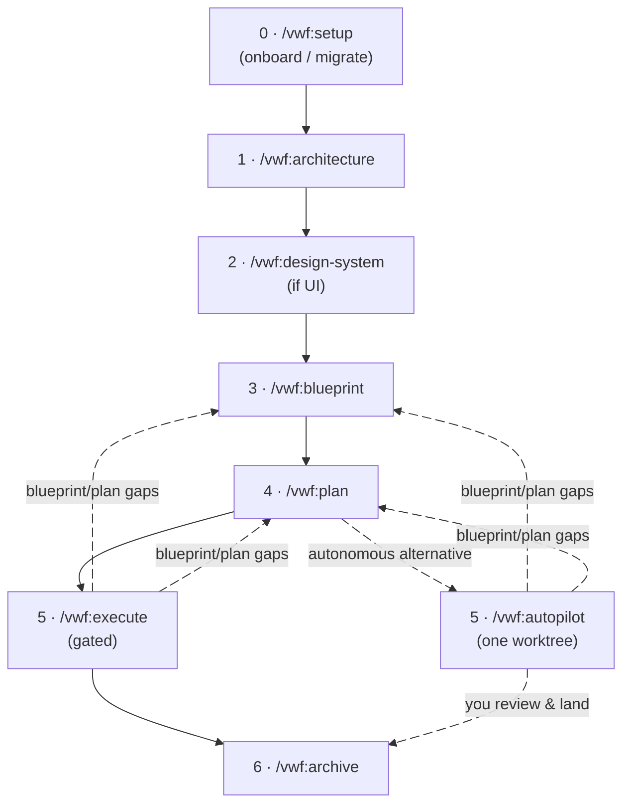
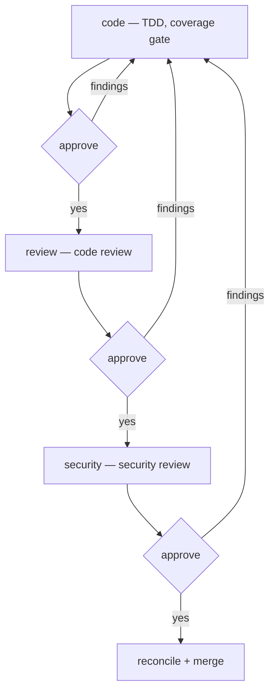

# vwf — Blueprint → Plan → Execute for Claude Code

`vwf` is the flagship plugin of the `virajp-plugins` marketplace — an
opinionated workflow that turns a vague feature request into shipped, reviewed
code through three disciplined phases:

1. **Blueprint** — keep an always-current blueprint of the *whole product*.
2. **Plan** — diff the blueprint against the real code for one slice, and write
   the delta to apply.
3. **Execute** — implement the plan under strict TDD, then run code review and
   security review behind approval gates.

You drive it with slash commands. Claude does the work, asks one question at a
time, and never writes until you approve.

The same marketplace also ships a handful of
**[supporting plugins](#supporting-plugins)** (coding-standard skills + language
servers) and a **[statusline](#statusline)** — all installable through one CLI,
[`@askviraj/ai-plugins`](https://www.npmjs.com/package/@askviraj/ai-plugins).

## Caveats

`vwf` is deliberately heavyweight. Know what you're signing up for before
adopting it.

**Model & cost**

- **Built for a large context window.** The commands run on `sonnet` at high
  reasoning effort, with the code- and security-review subagents on `opus` — and
  the orchestrator holds a lot at once: the blueprint, the plan, the registry,
  and each subagent's output. Run Claude Code with the **1-million-token**
  context; the standard window will degrade or overflow on a real cycle.
- **High token cost.** High-effort reasoning throughout, opus reviewers, and
  each `execute` cycle spawns several subagents (coder, code review, security
  review) with fix loop-backs. Expect a meaningful spend per slice — this is not
  a cheap workflow.

**Dependencies**

- **Hard external prerequisites.** `rtk` and `graphify` must be on your `PATH` —
  the `rtk hook claude` Bash hook fails without `rtk`. Dependency
  auto-install/enable needs Claude Code ≥ 2.1.143. See
  [Prerequisites](#prerequisites).
- **Memory degrades silently.** `vwf` recalls and persists through `mempalace`.
  If it's unavailable, every memory step is skipped by design — no error, but
  cross-cycle recall is lost (surfaced gaps still survive in the plan doc).
- **Leans on review engines.** `execute`'s code- and security-review stages run
  on the `/code-review` and `/security-review` engines, falling back to their
  own manual review dimensions when an engine is unavailable.

**Fit**

- **High-touch by default — autonomy is opt-in.** The default flow asks one
  question at a time and stops at a mandatory approval gate at every stage; plan
  for an interactive session. `/vwf:autopilot` trades those gates for an
  unattended end-to-end run of a single plan — it still runs code, code review,
  and security review per step, but takes the decisions itself and stops only on
  a hard halt, a resource cap, an all-blocking gap, or an irreversible decision.
  Reach for it only when the plan is solid and you're ready to review a finished
  worktree.
- **Requires a testable project.** `execute` enforces non-negotiable TDD and a
  coverage gate. A project without a test runner won't fit the execute stage;
  missing coverage tooling is tolerated (the coder reports `coverage: n/a` and
  the gate decides).
- **Assumes a registry-described workspace.** `plan` and `execute` map each
  slice to a project in the architecture registry and read its code (submodules
  included). You model the codebase with `/vwf:architecture` first; it won't
  operate on an ad-hoc folder.
- **Enforced structure & stacks.** `vwf` prescribes a workspace shape (parent
  repo + backend/frontend submodules) and **one reference stack per project
  type** — see
  [The structure & stacks it enforces](#the-structure--stacks-it-enforces). You
  can opt out of any piece — an explicit objection is recorded as a registry
  deviation and never re-asked — but if you want to pick a different stack per
  repo, this is the wrong plugin.
- **Solo / small-team focus.** It is highly opinionated — one workflow, one set
  of conventions. Great for a solo dev or small team; not a configurable
  framework for a large org.

## Prerequisites

`vwf` shells out to a few external tools. Install them first — the installer
checks for each and prints the exact command for anything missing.

| Tool            | Why                                      | Install                               |
| --------------- | ---------------------------------------- | ------------------------------------- |
| mise            | resolves the toolchain                   | `brew install mise`                   |
| node + pnpm     | `context7` MCP server; the npm→pnpm hook | `mise use -g node@latest pnpm@latest` |
| Claude Code CLI | hosts the commands                       | `mise use -g claude-code@latest`      |
| rtk             | the `rtk hook claude` Bash hook          | `brew install --formulae rtk`         |
| graphify        | knowledge graph the commands rely on     | `mise use -g pipx:graphifyy@latest`   |
| uv              | runs the `mempalace` memory server       | `mise use -g uv@latest`               |

`vwf` also depends on four plugins — `context7`, `markdown`, `mempalace`, and
`mise` — all resolved from the same `virajp-plugins` marketplace. Claude Code
**auto-installs and auto-enables** them when you enable `vwf` (requires Claude
Code ≥ 2.1.143).

## Install

```sh
# Installs vwf + its plugin dependencies, and wires up graphify
pnpx @askviraj/ai-plugins --user vwf
```

Installing outside a git repo works too: `graphify install` still runs, and its
repo-scoped post-commit hook is skipped automatically (with a note).

Restart Claude Code afterward so the commands, hooks, and dependencies load.
(The examples here use `pnpx`; if you don't use `pnpm`, swap in `npx`.)

## The mental model

The three phases map to three questions:

- **Blueprint** answers *what should the whole product be?* — permanent,
  product-wide, organized by entity. It is a **code-independent technical
  contract**: it pins every decision that has more than one reasonable answer
  *and* is true regardless of how the code is written — data, API,
  relationships, concurrency, integration flows, and UI/UX — so `plan` and
  `execute` never have to ask or assume. Reuse-vs-build, file placement,
  ordering, and library choices are `plan`'s job, not the blueprint's.
- **Plan** answers *what changes for this one slice, and in what order?* — a
  diff, not a re-blueprint, scoped to a single entity or section.
- **Execute** answers *is it built, correct, and safe?* — TDD, then review.



`architecture` runs once to bootstrap; then you loop
`blueprint → plan → execute → archive` per slice — or swap `execute` for
`autopilot` to run the approved plan unattended (it commits into a dedicated
worktree for you to review and land, and never archives). Either way, when
execution exposes a hole in the blueprint or plan, `vwf` captures it and loops
back to fix the source — never silently working around it.

## The documents it maintains

`vwf` keeps everything in version-controlled Markdown under `docs/`. The
blueprint is the desired state; the plans are the changes you apply to reach it.

```text
docs/
├── blueprint/                   # the always-current blueprint (desired state)
│   ├── .vwf.yml                 # blueprint format-version stamp (written by setup)
│   ├── architecture.md          # system shape + machine-readable Project Registry
│   ├── design-system.md         # product-wide UX/visual contract (if UI)
│   ├── conventions.md           # cross-cutting decisions (auth, errors, …)
│   ├── environment.md           # per-project env-var/secret catalog (names, never values)
│   ├── integration.md           # cross-entity flows + inter-service contracts
│   └── <entity>.md              # one doc per entity (or an <entity>/ folder)
└── plans/                       # per-cycle plans (the diff to apply)
    ├── <date>-<time>-<slice>.md
    ├── <plan>.gap-report.md     # autopilot's gap record (when it ran)
    └── archived/                # retired, completed plans
```

Each entity doc holds the full-stack picture for that entity — stable product
intent at the top, volatile engineering detail (data model, API, jobs, screens)
below a marker. The **Project Registry** in `architecture.md` is a yaml block
that `blueprint` and `plan` parse to map an entity's sections to the right
project by `type` — the command mechanics are registry-driven, while the stacks
themselves come from the enforced reference stacks below (recorded deviations
aside).

## The structure & stacks it enforces

`vwf` is opinionated about more than process: it enforces a **workspace shape**
and **one reference stack per project type**, both distilled from a production
reference implementation.

```text
workspace/            # parent repo — vwf lives here
├── .gitmodules       # backend + frontend
├── docs/blueprint/   # the vwf bundle (one per workspace)
├── backend/          # submodule — pnpm + Turborepo monorepo
│   ├── projects/     # service · worker · web · console
│   └── packages/
│       └── common/   # the shared kernel
└── frontend/         # submodule — single-package Flutter app
```

| Project    | Type       | Reference stack                                |
| ---------- | ---------- | ---------------------------------------------- |
| `common`   | `packages` | TypeScript · Effect-TS                         |
| `service`  | `service`  | TypeScript · Hono · Effect-TS                  |
| `worker`   | `worker`   | TypeScript · Temporal · Effect-TS              |
| `web`      | `site`     | TypeScript · Astro (SSR) · React               |
| `console`  | `console`  | TypeScript · Hono + Effect-TS · React + Refine |
| `frontend` | `frontend` | Dart · Flutter                                 |

Not every project must exist — a product may have no `console` or `web` yet. How
enforcement works:

- **New/empty repos** get the shape and stacks applied as the default — one
  confirmation, no per-project stack menu.
- **Existing repos** that don't match get a **consent-gated restructure
  proposal** from `/vwf:setup`: in-repo layout moves as reviewable batches;
  anything crossing a repo boundary (like a submodule split) only ever as a
  written recommendation.
- **The escape hatch.** An explicit objection is always honored — recorded as a
  `deviations:` entry in the Project Registry (scope, choice, reason) and never
  re-asked. The stack table grows through vwf updates, not per-repo
  improvisation.

Two placement rules ride along with the shape — seeded into each repo's
`conventions.md` and enforced by the execute reviewers:

1. **All shared schemas live in `packages/common`** — Effect Schemas, one export
   subpath per entity; no other project defines a shared data schema.
2. **All third-party integrations go via `packages/common`** — Firebase and
   every other external service are wrapped once as Effect layers; no other
   project imports a third-party SDK directly (client-side sign-in is the one
   exception).

`console` deserves a note: it is the internal admin panel — a single Hono +
Effect app serving both the operator API and an embedded React + Refine UI, and
the **sole holder of admin capabilities** (the public `service` exposes no admin
routes).

The full per-type stack docs — patterns, testing, deployment — ship inside the
plugin under `assets/stacks/` and drive what `/vwf:setup` and
`/vwf:architecture` record.

## Commands

| Command                   | What it does                                                |
| ------------------------- | ----------------------------------------------------------- |
| `/vwf:setup`              | Onboard/migrate a repo into vwf's format (re-runnable)      |
| `/vwf:architecture`       | Bootstrap or update the system shape + Project Registry     |
| `/vwf:design-system`      | Product-wide UX/visual contract (mandatory once UI exists)  |
| `/vwf:blueprint [entity]` | Maintain the full-product blueprint, one doc per entity     |
| `/vwf:plan [slice]`       | Write a reviewable cycle plan — a diff of blueprint vs code |
| `/vwf:execute [mode]`     | Implement the plan under TDD, then code + security review   |
| `/vwf:autopilot [plan]`   | Autonomously run one plan end to end — no per-stage gates   |
| `/vwf:archive [plan]`     | Retire a completed plan into `docs/plans/archived/`         |
| `/vwf:handoff <name>`     | Capture the session so work resumes in a fresh one          |
| `/vwf:recall <name>`      | Resume from a handoff in a fresh session                    |
| `/vwf:git-workflow`       | Internal — worktree isolation, commits, merges              |

Every command runs on `sonnet` at high reasoning effort; inside `execute` and
`autopilot`, the code- and security-review subagents run on `opus`.

### /vwf:setup

Run this to **onboard a repo** — new or existing — into vwf's format, and re-run
it after upgrading vwf to migrate to the latest format. It detects your topology
(monorepo, polyrepo, or the workspace shape; project types; stacks) and confirms
it with you via MCQ, then produces a **dry-run migration plan** — every doc to
scaffold and every source move to make, including a restructure proposal toward
the [enforced workspace shape](#the-structure--stacks-it-enforces) when the repo
doesn't match (declining records a deviation, not a fight). On a new/empty repo
it applies the workspace structure and reference stacks as the default. Nothing
is written until you approve; it works in a worktree, restructures code only
with per-batch consent, and never deletes. It orchestrates the rest (mise,
`architecture`, and `design-system` if you have a UI), merges a vwf section into
your `CLAUDE.md`, writes the README, and stamps the blueprint format version in
`docs/blueprint/.vwf.yml` so a later run can detect drift and migrate the delta.
Every workflow command also runs a quick format check against that stamp and
nudges you to re-run `/vwf:setup` when a repo falls behind — so a single
user-level vwf upgrade reaches each repo on next use.

### /vwf:architecture

Run this **after `setup`** (or first, on a fresh repo). It elicits your system's
shape — projects, their types, how they interconnect, where they deploy —
records each project's stack from the
[enforced reference stacks](#the-structure--stacks-it-enforces) (stated, not
offered as a menu; an explicit override becomes a registry `deviations:` entry),
and writes `docs/blueprint/architecture.md`, including the machine-readable
Project Registry the other commands depend on. Re-run it any time the topology
changes; it asks only about genuine deltas, never re-eliciting what's confirmed.

This is the one doc that *does* name technologies and infrastructure — the
blueprint deliberately doesn't.

### /vwf:design-system

A second foundation, **mandatory once the registry has a UI project** (type
`site`, `frontend`, or `console`). It elicits the product-wide UX/visual
language — semantic color tokens, typography, spacing, motion, the accessibility
standard, and global component behaviors — and writes
`docs/blueprint/design-system.md`, gated by a fresh **reviewer subagent** (like
the blueprint's) that checks it against the design-system checklist until it
passes. Like the blueprint, it stays code-independent: it records token *values*
and *scales*, never the component library, CSS framework, or design file. Every
entity's Screens reference it instead of re-deciding visual language.
`blueprint` halts on a UI entity until it exists.

### /vwf:blueprint

Maintain the desired end state of the **whole product**, one entity at a time:

```text
/vwf:blueprint order
```

`blueprint` reads the registry, works out which engineering surfaces apply to
the entity (data model, API, relationships, concurrency, jobs, screens), and
elicits the gaps with you under the **`blueprint-authoring`** doctrine. It
writes `docs/blueprint/order.md`, records any cross-entity flow or inter-service
contract in `integration.md`, points each screen at the design system, and
updates `conventions.md` for any cross-cutting decision raised.

A fresh **reviewer subagent** then checks the doc against a completeness
checklist — data, relationships, concurrency, API, and UI/UX, plus a
**code-independence guardrail** that flags any file/class/library/CSS leakage —
and returns `NO GAPS` or a numbered list. Gaps loop back to you for the specific
open decisions, then re-review — until the doc passes. The blueprint is
permanent and product-wide; it is never feature-scoped. Renaming or deleting an
entity triggers an inbound-link reconcile, so no other doc is left pointing at a
doc that moved.

### /vwf:plan

Produce a reviewable plan for one slice of the blueprint:

```text
/vwf:plan order
/vwf:plan order/api      # just one section of the entity
/vwf:plan integration    # the cross-entity integration doc
```

A plan is a **diff**. `plan` reads the desired state (the blueprint slice +
conventions + registry) and the actual state (the real code the registry maps
the slice to), then writes only the delta — what exists, what's missing, what
changes, and the order to do it in — to `docs/plans/<date>-<time>-<slice>.md`.
Steps are ordered for TDD: each names the failing test that defines "done". If
the blueprint implies a surface the code lacks, `plan` flags it as drift rather
than quietly resolving it. You approve the plan before any code is written.

### /vwf:execute

Implement an approved plan. Execution is mechanical from the plan, but strict:

```text
/vwf:execute            # full pipeline from the start
/vwf:execute review     # jump to a stage (the prior stage must be complete)
```

It runs three stages, each in a fresh purpose-built subagent, each behind a
**mandatory approval gate**:

| Stage    | Model  | What happens                                                                |
| -------- | ------ | --------------------------------------------------------------------------- |
| code     | sonnet | Implements the plan under TDD (RED → GREEN → REFACTOR) to the coverage gate |
| review   | opus   | Adversarial code review against the plan, blueprint, conventions, and stack |
| security | opus   | Threat-models the change against the project's declared capabilities        |



`vwf` never chains stages automatically — it pauses for your approval at every
gate. Review and security findings loop back to `code` to fix, then re-review.
When a stage exposes a **gap** (a hole in the blueprint or plan, not a code
bug), it's recorded — to the plan doc and to memory — and reconciled at the end
of the cycle, where `vwf` offers to fix the blueprint (`/vwf:blueprint`) or
re-derive the plan (`/vwf:plan`). It then reconciles the architecture registry
and offers to archive the plan.

### /vwf:autopilot

The **autonomous** counterpart to `/vwf:execute`. It runs one approved plan to
completion without the per-stage approval gates — taking those decisions from a
fixed rule set and stopping only at a few defined pause points.

```text
/vwf:autopilot                       # the single active plan
/vwf:autopilot 2026-06-26-1430-order.md
```

What it does, by rule:

- **One plan, one worktree.** Isolates all work in a dedicated git worktree and
  commits every step itself. It **never merges, pushes, or archives** — you get
  a finished worktree to review and land.
- **Whole plan, dependencies first.** Implements every step, ordered so
  prerequisites land before dependents.
- **Full pipeline each step.** `code → review → security`, looping findings back
  to code. **Security findings are always fixed**; **code-review findings loop
  up to 4 rounds**, after which any residual is recorded as a gap — the
  blueprint/plan wasn't thorough enough.
- **Gaps don't stop it.** Each gap is written to
  `docs/plans/<plan>.gap-report.md` and to memory, and the run continues.

It **pauses** only on: a hard halt (no plan/blueprint, a test harness that can't
run, an unresolvable git conflict); a **resource cap** — context > 65%, 5-hour >
90%, or 7-day > 80% — where it hands off and stops (resume with `/vwf:recall`);
a gap that blocks *all* remaining work; or a decision the rules don't cover that
is irreversible. At the end, if any gaps remain it asks you to resolve them —
and never suggests archiving.

The resource-cap pause is delivered by the
**[statusline caps hook](#statusline)** — a command can't measure its own
context window, so install the statusline (`--statusline`) before an autonomous
run or that pause won't fire.

> Autopilot is the sharp tool: point it at a plan you trust, and review the
> worktree before you merge.

### /vwf:archive

Move a finished plan out of the active set into `docs/plans/archived/`. It never
deletes. Run it manually, or accept the offer at the end of `execute`.

```text
/vwf:archive
```

### /vwf:handoff and /vwf:recall

Long sessions lose fidelity. When the context window grows **beyond ~60%**,
capture the session so a fresh one can continue:

```text
/vwf:handoff auth-refactor      # write a handoff, file it to memory
```

`handoff` first **tidies the tree** — it checkpoints pending work everywhere
(the outer repo and any submodules) as `wip:` commits, updates any submodule
pointers in the outer repo, and removes only fully-merged worktrees (never one
with unmerged work). It does not push. Then it writes a structured handoff
document — goal, current state, key decisions, open next steps, and (when
there's a clear next action) a ready-to-paste **next prompt** — and stores it in
mempalace under your project. In a new session:

```text
/vwf:recall auth-refactor       # rebuild context, then optionally run the next prompt
```

`recall` retrieves the handoff, reads the files it points to, summarizes where
you left off, and offers to run the captured next prompt. If mempalace is
unavailable, `handoff` falls back to `docs/handoffs/<name>.md` and `recall`
reads it from there.

### /vwf:git-workflow

Internal — you rarely invoke it directly. The other commands route **all** git
actions through it: it isolates work in a git worktree (always the outermost
superproject, never a submodule), initializes it with the repo's `worktree:init`
(or `setup:all`) mise task, commits with conventional messages, and ends a
worktree with full coverage — landing the branch (plus any submodule work and
pointer updates), then removing it. It never pushes without your explicit
request.

## How it asks questions

`vwf` is deliberately conversational. `setup`, `architecture`, `design-system`,
`blueprint`, and `plan` share one **elicitation protocol**:

- **Explore first** — read the docs, code, and recent commits before asking
  anything; never ask what the registry or code already answers.
- **One decision per round** — multiple-choice with an "Other" escape hatch;
  each answer shapes the next question.
- **Only real decisions** — if exactly one idiomatic answer exists, it proceeds
  without asking. It never guesses an open decision — it records it instead.
- **Propose 2–3 approaches** — with trade-offs and a recommendation, before
  settling a direction.
- **Hard gate** — it presents the shape and waits for your approval before
  writing anything, however small the change looks.

## Memory

`vwf` uses the `mempalace` plugin as cross-session memory so each cycle builds
on the last instead of re-deriving it. It recalls prior decisions and findings
before working, and persists durable outcomes after. Memory is keyed by your
project (the **wing**) and split into rooms:

| Room        | Holds                                                           |
| ----------- | --------------------------------------------------------------- |
| `decisions` | design/architecture decisions and the *why*                     |
| `problems`  | review and security findings and how they were resolved         |
| `planning`  | plan rationale and deferred options                             |
| `gaps`      | blueprint/plan holes surfaced during execution, and their fixes |
| `runs`      | autopilot's per-plan run journal (what a resumed run reads)     |
| `handoff`   | session handoffs for `/vwf:handoff` and `/vwf:recall`           |

Memory is best-effort: if mempalace is unavailable, `vwf` skips every memory
step and proceeds — except `handoff`/`recall`, which fall back to
`docs/handoffs/<name>.md` (the handoff *is* the deliverable). Gaps are also
mirrored into the plan doc, so they survive a memory outage. See
**[docs/mempalace.md](./docs/mempalace.md)**.

## A worked walkthrough

A first slice, end to end. Assume a backend service with an `order` entity.

```text
# 1. Bootstrap the system shape and registry (once per workspace)
/vwf:architecture

# 2. Specify the order entity — answer the questions, approve the doc
/vwf:blueprint order
#    → writes docs/blueprint/order.md, gated by the completeness reviewer

# 3. Plan the first slice — review the diff, approve it
/vwf:plan order
#    → writes docs/plans/2026-06-26-1430-order.md (TDD-ordered steps)

# 4. Execute — approve at each gate
/vwf:execute
#    → code (TDD) → [approve] → review → [approve] → security → [approve]
#    → reconcile registry + any gaps → merge via git-workflow

# 5. Archive the completed plan
/vwf:archive
```

From here, loop steps 2–5 per slice. Update the blueprint when the product
changes; re-run `architecture` only when the system's *shape* changes.

## vwf skills

Several skills back the workflow's quality. You don't invoke them directly —
they inform how Claude writes and reviews:

- **`blueprint-authoring`** — the contract-vs-realization line (what belongs in
  the blueprint vs `plan`) plus the per-surface completeness bars: data,
  relationships, concurrency, integration flows, and UI/UX — including the
  doc-unit doctrine (entity / page / module). Auto-applies whenever a
  `docs/blueprint/` doc is edited (and on `docs/plans/` for frontmatter/link
  hygiene only).
- **`design-system`** — the UX/visual-contract doctrine (semantic tokens,
  typography, spacing, motion, accessibility, component behaviors,
  anti-patterns) behind `/vwf:design-system`.
- **`project-setup`** — the onboarding/migration doctrine behind `/vwf:setup`:
  topology detection, the enforced workspace structure + reference stacks (and
  the deviation escape hatch), consent-gated dry-run migration, and the
  blueprint format-version + drift map.
- **`rest-api-design`** — technology-agnostic REST API principles (versioning,
  error formats, pagination, auth, OpenAPI), applied whenever the blueprint or
  plan touches an API surface.

The minimal-code behaviors that a "karpathy guidelines" skill would cover are
already enforced structurally across the workflow — elicitation (think before
coding), the plan-as-a-diff and the coder's "nothing not in the plan" (surgical
changes, YAGNI/the minimalism ladder), and TDD with a coverage gate (goal-driven
execution). For ad-hoc, off-pipeline work you can install the external
**[andrej-karpathy-skills](https://github.com/multica-ai/andrej-karpathy-skills)**
plugin (see Supporting plugins).

## Tips

- **Run `architecture` first.** `blueprint` and `plan` halt without a registry.
- **Keep slices small.** One entity or one section per plan/execute cycle keeps
  reviews sharp and the diff reviewable.
- **Trust the gates.** Read what each stage reports before approving — the
  approval is the point, not a formality.
- **Hand off early.** A handoff written at 60% context is worth far more than
  one squeezed out at 95%.

---

## Supporting plugins

The marketplace ships additional plugins — opinionated coding-standard skills
and language servers. Most auto-apply by file path; install only the ones for
your stack. Each has a dedicated guide:

| Plugin                                                                             | What it provides                                                                                                                                                                                   | Install                                     |
| ---------------------------------------------------------------------------------- | -------------------------------------------------------------------------------------------------------------------------------------------------------------------------------------------------- | ------------------------------------------- |
| **[markdown](./docs/markdown.md)**                                                 | Always-on Markdown/documentation standards (auto-applies to `**/*.md`) + a `/markdown:readme` command that documents a repo's README                                                               | `--user markdown`                           |
| **[typescript](./docs/typescript.md)**                                             | Effect-TS coding standards — a `typescript` router skill (+ effect/effect-runtime/vitest/build references) plus package-json/pnpm/tsconfig/lint-format + the TypeScript/JavaScript language server | `--user typescript`                         |
| **[flutter](./docs/flutter.md)**                                                   | Flutter/Dart (GetX) standards — `dart` & `swift` router skills plus kotlin/pubspec/analysis-options/i18n + bundled Dart/Kotlin/Swift language servers; **project-scoped**                          | `--project flutter`                         |
| **[mise](./docs/mise.md)**                                                         | mise standards (the `.config/` three-file split + task library) + a `/mise:scaffold` command                                                                                                       | `--user mise`                               |
| **[github-actions](./docs/github-actions.md)**                                     | A `/github-actions:workflow` command — generates workflows installing every tool via `jdx/mise-action` (mise only); supports polyrepo + monorepo                                                   | `--user github-actions`                     |
| **[context7](./docs/context7.md)**                                                 | The Context7 MCP server — up-to-date library docs on demand                                                                                                                                        | `--user context7`                           |
| **[mempalace](./docs/mempalace.md)**                                               | AI memory system (external; also a `vwf` dependency)                                                                                                                                               | `--user mempalace`                          |
| **[andrej-karpathy-skills](https://github.com/multica-ai/andrej-karpathy-skills)** | Karpathy coding-mistake guidelines (external; opt-in — excluded from `--all`, install at either scope)                                                                                             | `--user`/`--project andrej-karpathy-skills` |

```sh
pnpx @askviraj/ai-plugins --user typescript --user markdown
```

## Statusline

A standalone, powerline-style statusline (main two-line bar + subagent panel),
fully data-driven from JSON and themeable across three config layers (defaults →
`~/.config/statusline.json` → `<repo-root>/.config/statusline.json`). It
installs through the same CLI — not the plugin marketplace — copying the script
to `~/.claude/scripts/` and writing the chosen key(s) into
`~/.claude/settings.json`. Requires a [Nerd Font](https://www.nerdfonts.com/).

```sh
# install the statusline (both the main bar and the subagent panel)
pnpx @askviraj/ai-plugins --statusline
```

Installing the statusline (`--statusline`) also wires a **context & rate-limit
caps hook** — it pauses long `/vwf:autopilot` runs at budget thresholds (context
over 65%, 5-hour over 90%, 7-day over 80%) by triggering a handoff.

See **[docs/statusline.md](./docs/statusline.md)** for setup and the full
configuration reference.

## The installer CLI

[`@askviraj/ai-plugins`](https://www.npmjs.com/package/@askviraj/ai-plugins)
drives the Claude Code CLI: it adds the `virajp-plugins` marketplace
(user-scoped) and installs each plugin at its scope. It only ever registers and
refreshes `virajp-plugins` — every plugin resolves from it alone.

```sh
# Everything: all user-scoped plugins + the statusline
pnpx @askviraj/ai-plugins --all --statusline

# Just the user-scoped plugins (no statusline)
pnpx @askviraj/ai-plugins --all

# Named plugins, at user or project scope (flutter is project-scoped)
pnpx @askviraj/ai-plugins --user vwf --project flutter

# Versions: CLI, statusline, and each plugin's installed-vs-latest (with scope)
pnpx @askviraj/ai-plugins --version

# Upgrade installed plugins + refresh the statusline
pnpx @askviraj/ai-plugins --upgrade

# Idempotent install + upgrade — safe to drop in a setup script
pnpx @askviraj/ai-plugins --all --statusline --upgrade

# Uninstall (mirrors the install flags)
pnpx @askviraj/ai-plugins --uninstall --user vwf
pnpx @askviraj/ai-plugins --uninstall --all --statusline
```

Notes:

- `--all` acts on **user-scoped** plugins only. `flutter` is **project-scoped**
  — install it explicitly with `--project flutter` from within the project that
  needs it. `andrej-karpathy-skills` is **opt-in** (external) — also excluded
  from `--all`; install it with `--user`/`--project andrej-karpathy-skills`.
- Scope is chosen by the flag: `--user <name>` installs at user scope,
  `--project <name>` at project scope (you can mix both in one run). The
  marketplace add is always user-scoped.
- The installer **checks every required external tool** for what you're
  installing and prints the install command for anything missing — it never
  installs a dependency for you.

## Credits & acknowledgements

This project is a thin layer over a lot of excellent work. It would not exist —
or would be far poorer — without these. Thank you to their authors and
maintainers. 🙏

- **[Claude Code](https://claude.ai/code)** by
  [Anthropic](https://anthropic.com) — the host these plugins, hooks, and
  statusline plug into.
- **[MemPalace](https://github.com/MemPalace/mempalace)** — the AI memory system
  that powers `vwf`'s cross-session recall (re-listed here as a dependency).
- **[andrej-karpathy-skills](https://github.com/multica-ai/andrej-karpathy-skills)**
  — behavioral coding guidelines derived from Andrej Karpathy's observations,
  re-listed here as an opt-in plugin.
- **[Context7](https://github.com/upstash/context7)** by
  [Upstash](https://upstash.com) — the MCP docs server behind the `context7`
  plugin.
- **[mise](https://mise.jdx.dev/)** by Jeff Dickey — resolves the toolchain the
  plugins and hooks depend on.
- **[pnpm](https://pnpm.io/)** — the package manager the `npm→pnpm` hook and
  `context7` rely on.
- **[typescript-language-server](https://github.com/typescript-language-server/typescript-language-server)**,
  the **[Dart SDK](https://dart.dev/)**,
  **[kotlin-lsp](https://github.com/Kotlin/kotlin-lsp)**, and
  **[SourceKit-LSP](https://github.com/swiftlang/sourcekit-lsp)** — the engines
  behind the language-server plugins.
- **[rtk](https://github.com/rtk-ai/rtk) (Rust Token Killer)** — the
  token-saving proxy `vwf`'s Bash hook shells out to (installed via
  `brew install --formulae rtk`).
- **[graphify](https://github.com/safishamsi/graphify)** — the knowledge-graph
  tool `vwf` integrates with.
- **[oclif](https://oclif.io/)** — the framework this installer CLI is built on.
- **[Nerd Fonts](https://www.nerdfonts.com/)** — the glyphs that make the
  statusline render, and the **[Gruvbox](https://github.com/morhetz/gruvbox)**
  palette it ships by default.
