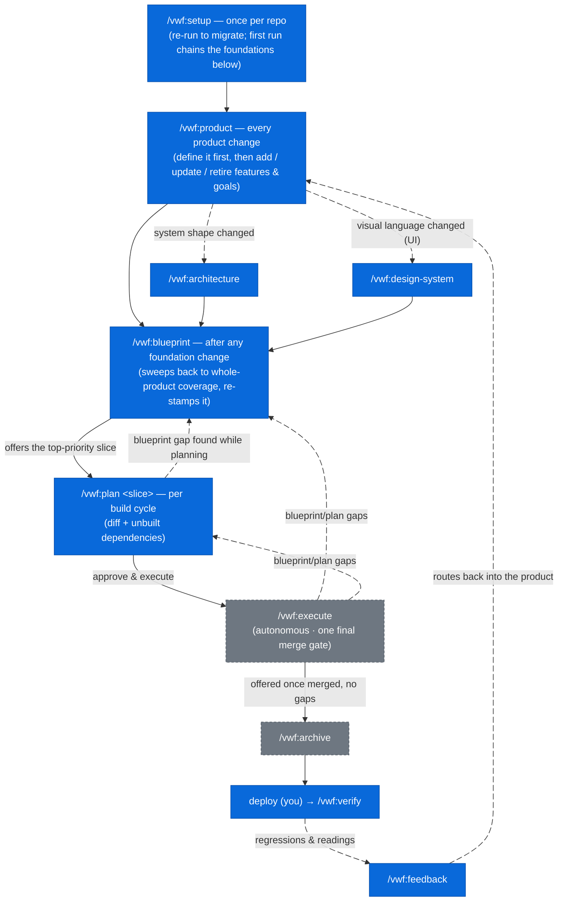

# vwf — Product → Blueprint → Plan → Execute for Claude Code

`vwf` is the flagship plugin of the `virajp-plugins` marketplace — an
opinionated workflow that turns a vague idea into a shipped, reviewed product
through four disciplined phases:

1. **Product** — pin the outcome contract: the problem, the users, measurable
   goals, and the order to build in. Everything downstream must trace to it.
2. **Blueprint** — keep an always-current blueprint of the *whole product*,
   every entity serving a product goal.
3. **Plan** — diff the blueprint against the real code for one slice, and write
   the delta to apply.
4. **Execute** — implement the plan autonomously under strict TDD, with code
   review, security review, E2E acceptance, and UX conformance per the rules,
   behind one final merge gate — with post-deploy verification and a
   production-feedback intake closing the loop.

You drive it with slash commands. Claude does the work — asking one question at
a time while authoring, running unattended while executing — and never merges
until you approve.

The same marketplace also ships a handful of
**[supporting plugins](#supporting-plugins)** (coding-standard skills + language
servers) and a **[statusline](#statusline)** — all installable through one CLI,
[`@askviraj/ai-plugins`](https://www.npmjs.com/package/@askviraj/ai-plugins).

## Caveats

`vwf` is deliberately heavyweight. Know what you're signing up for before
adopting it.

**Model & cost**

- **Built for a large context window.** The commands run on `sonnet` at high
  reasoning effort, with the code-review, security-review, and ux subagents on
  `opus` — and the orchestrator holds a lot at once: the blueprint, the plan,
  the registry, and each subagent's output. Run Claude Code with the
  **1-million-token** context; the standard window will degrade or overflow on a
  real cycle.
- **High token cost.** High-effort reasoning throughout, opus reviewers, and
  each `execute` cycle spawns several subagents (coder, code review, security
  review, plus E2E acceptance and UX conformance when the slice warrants them)
  with fix loop-backs. Expect a meaningful spend per slice — this is not a cheap
  workflow.

**Dependencies**

- **Hard external prerequisites.** `rtk` and `graphify` must be on your `PATH` —
  the `rtk hook claude` Bash hook fails without `rtk`. Dependency
  auto-install/enable needs Claude Code ≥ 2.1.143. See
  [Prerequisites](#prerequisites).
- **Memory degrades silently.** `vwf` recalls and persists through `mempalace`.
  If it's unavailable, every memory step is skipped by design — no error, but
  cross-cycle recall is lost (surfaced gaps still survive in the plan doc).
- **Leans on review engines.** `execute`'s code- and security-review stages run
  on the `/code-review` and `/security-review` engines, falling back to their
  own manual review dimensions when an engine is unavailable.

**Fit**

- **High-touch where it matters, autonomous where it doesn't.** The authoring
  phases (product, architecture, design-system, blueprint, plan) ask one
  question at a time and gate on your approval — plan for interactive sessions.
  `/vwf:execute` then runs the approved plan **unattended**: code, code review,
  and security review per step (plus one acceptance + ux pass after all steps),
  deciding from a fixed rule set and stopping only on a hard halt, a resource
  cap, an all-blocking gap, an irreversible decision — or the **final gate**,
  where you review the whole run and approve the merge.
- **Requires a testable project.** `execute` enforces non-negotiable TDD and a
  coverage gate. A project without a test runner won't fit the execute stage;
  missing coverage tooling is tolerated (the coder reports `coverage: n/a` and
  the gate decides). The verification harness (dev server, E2E suites, staging
  mode) is self-healing: `setup` detects and stamps what exists, and `plan`
  injects bootstrap steps for whatever a slice's gates need — so harness gaps
  surface at plan time with their fix attached, not as surprises at a gate.
- **Assumes a registry-described workspace.** `plan` and `execute` map each
  slice to a project in the architecture registry and read its code (submodules
  included). You model the codebase with `/vwf:architecture` first; it won't
  operate on an ad-hoc folder.
- **Enforced structure & stacks.** `vwf` prescribes a workspace shape (parent
  repo + backend/frontend submodules) and **one reference stack per project
  type** — see
  [The structure & stacks it enforces](#the-structure--stacks-it-enforces). You
  can opt out of any piece — an explicit objection is recorded as a registry
  deviation and never re-asked — but if you want to pick a different stack per
  repo, this is the wrong plugin.
- **Solo / small-team focus.** It is highly opinionated — one workflow, one set
  of conventions. Great for a solo dev or small team; not a configurable
  framework for a large org.

## Prerequisites

`vwf` shells out to a few external tools. Install them first — the installer
checks for each and prints the exact command for anything missing.

| Tool            | Why                                      | Install                               |
| --------------- | ---------------------------------------- | ------------------------------------- |
| mise            | resolves the toolchain                   | `brew install mise`                   |
| node + pnpm     | `context7` MCP server; the npm→pnpm hook | `mise use -g node@latest pnpm@latest` |
| Claude Code CLI | hosts the commands                       | `mise use -g claude-code@latest`      |
| rtk             | the `rtk hook claude` Bash hook          | `brew install --formulae rtk`         |
| graphify        | knowledge graph the commands rely on     | `mise use -g pipx:graphifyy@latest`   |
| uv              | runs the `mempalace` memory server       | `mise use -g uv@latest`               |

`vwf` also depends on four plugins — `context7`, `markdown`, `mempalace`, and
`mise` — all resolved from the same `virajp-plugins` marketplace. Claude Code
**auto-installs and auto-enables** them when you enable `vwf` (requires Claude
Code ≥ 2.1.143).

## Install

```sh
# Installs vwf + its plugin dependencies, and wires up graphify
pnpx @askviraj/ai-plugins --user vwf
```

Installing outside a git repo works too: `graphify install` still runs, and its
repo-scoped post-commit hook is skipped automatically (with a note).

Restart Claude Code afterward so the commands, hooks, and dependencies load.
(The examples here use `pnpx`; if you don't use `pnpm`, swap in `npx`.)

## The mental model

Each phase answers one question:

- **Product** answers *is this worth building, and what does "good" mean?* — the
  problem, the users, measurable goals, and the order to build in. Every entity
  in the blueprint must trace to a goal here.
- **Blueprint** answers *what should the whole product be?* — permanent,
  product-wide, organized by entity. It is a **code-independent technical
  contract**: it pins every decision that has more than one reasonable answer
  *and* is true regardless of how the code is written — data, API,
  relationships, concurrency, integration flows (each with acceptance criteria
  and a sequence diagram), and UI/UX — so `plan` and `execute` never have to ask
  or assume. Reuse-vs-build, file placement, ordering, and library choices are
  `plan`'s job, not the blueprint's.
- **Plan** answers *what changes for this one slice, and in what order?* — a
  diff, not a re-blueprint, scoped to a single entity or section plus any
  unbuilt entities it depends on.
- **Execute** answers *is it built, correct, safe, and does it do what the
  blueprint promises?* — TDD, then code/security review, then E2E acceptance and
  rendered-UI conformance.
- **Verify & feedback** answer *does it hold in production, and what next?* —
  post-deploy checks against the same acceptance criteria, and a routed intake
  for what production teaches you.

Each command has its own cadence — `setup` once, `product` on every product
change, `plan` per build cycle — and the transitions chain from gate offers.
**Blue** nodes are commands you prompt; **gray dashed** nodes run without you
typing them (you only approve at their gates):



(`setup`'s first run chains `product` → `architecture` → `design-system` for you
and ends by offering `blueprint` — blue marks who prompts them from then on.
Fully internal machinery never appears in the flow: `/vwf:git-workflow` is
invoked by the other commands for every git action, the five execute subagents
and the reviewer subagents run inside their commands, and `handoff`/`recall` are
session utilities you reach for only when a session runs long.)

`/vwf:setup` runs once per repo (re-run only to migrate formats); its first run
chains `product`, `architecture`, and `design-system` for you. From then on,
**`/vwf:product` is the front door for every product change** — adding,
updating, or retiring features and goals — with `architecture` following when
the system's shape changes and `design-system` when the visual language does.
Any foundation change ends in a `/vwf:blueprint` sweep, which loops entity by
entity until the **whole product** is covered again and re-stamps that coverage
(`plan` refuses to run without it), then offers to plan the top slice. Building
is **one command per cycle**: `/vwf:plan <slice>` cuts a diff for the slice
**plus any unbuilt entities it depends on**, its approval gate offers *Approve &
execute*, `execute` runs the plan unattended in a dedicated worktree up to one
final gate where you review the run and approve the merge, and `archive` is
offered once no gaps remain. After you deploy, `verify` checks the environment
and `feedback` routes what production says back into the product. When execution
exposes a hole in the blueprint or plan, `vwf` captures it and loops back to fix
the source — never silently working around it.

## The documents it maintains

`vwf` keeps everything in version-controlled Markdown under `docs/`. The
blueprint is the desired state; the plans are the changes you apply to reach it.

```text
.config/
└── vwf.yaml                     # the vwf config — how vwf operates here (stamp,
                                 # harness, enforcement opt-outs, knobs, environments)
docs/
├── blueprint/                   # the always-current blueprint (desired state)
│   ├── product.md               # problem, users, measurable goals, slice priority
│   ├── architecture.md          # system shape + machine-readable Project Registry
│   ├── design-system.md         # product-wide UX/visual contract (if UI)
│   ├── conventions.md           # cross-cutting decisions (auth, errors, …)
│   ├── environment.md           # per-project env-var/secret catalog (names, never values)
│   ├── integration.md           # cross-entity flows + acceptance criteria per flow
│   └── <entity>/                # one folder per entity — index.md alone when
│       └── index.md             # small; + data/api/jobs/screens.md when large
└── plans/                       # per-cycle plans (the diff to apply)
    ├── <date>-<time>-<slice>.md # incl. a "Gaps surfaced during execution" section
    └── archived/                # retired, completed plans
```

Each entity doc holds the full-stack picture for that entity — stable product
intent at the top, volatile engineering detail (data model, API, jobs, screens)
below a marker. The **Project Registry** in `architecture.md` is a yaml block
that `blueprint` and `plan` parse to map an entity's sections to the right
project by `type` — the command mechanics are registry-driven, while the stacks
themselves come from the enforced reference stacks below (recorded deviations
aside).

## The structure & stacks it enforces

`vwf` is opinionated about more than process: it enforces a **workspace shape**
and **one reference stack per project type**, both distilled from a production
reference implementation.

```text
workspace/            # parent repo — vwf lives here
├── .gitmodules       # backend + frontend
├── docs/blueprint/   # the vwf bundle (one per workspace)
├── backend/          # submodule — pnpm + Turborepo monorepo
│   ├── projects/     # service · worker · web · console
│   └── packages/
│       └── common/   # the shared kernel
└── frontend/         # submodule — single-package Flutter app
```

| Project    | Type       | Reference stack                                |
| ---------- | ---------- | ---------------------------------------------- |
| `common`   | `packages` | TypeScript · Effect-TS                         |
| `service`  | `service`  | TypeScript · Hono · Effect-TS                  |
| `worker`   | `worker`   | TypeScript · Temporal · Effect-TS              |
| `web`      | `site`     | TypeScript · Astro (SSR) · React               |
| `console`  | `console`  | TypeScript · Hono + Effect-TS · React + Refine |
| `frontend` | `frontend` | Dart · Flutter                                 |

Not every project must exist — a product may have no `console` or `web` yet. How
enforcement works:

- **New/empty repos** get the shape and stacks applied as the default — one
  confirmation, no per-project stack menu.
- **Existing repos** that don't match get a **consent-gated restructure
  proposal** from `/vwf:setup`: in-repo layout moves as reviewable batches;
  anything crossing a repo boundary (like a submodule split) only ever as a
  written recommendation.
- **The escape hatch.** An explicit objection is always honored — recorded under
  `enforcement:` in `.config/vwf.yaml` (the vwf config: choice + reason) and
  never re-asked. The registry keeps describing the system as it *is*; the
  config records how vwf treats it. The stack table grows through vwf updates,
  not per-repo improvisation.

Two placement rules ride along with the shape — seeded into each repo's
`conventions.md` and enforced by the execute reviewers:

1. **All shared schemas live in `packages/common`** — Effect Schemas, one export
   subpath per entity; no other project defines a shared data schema.
2. **All third-party integrations go via `packages/common`** — Firebase and
   every other external service are wrapped once as Effect layers; no other
   project imports a third-party SDK directly (client-side sign-in is the one
   exception).

`console` deserves a note: it is the internal admin panel — a single Hono +
Effect app serving both the operator API and an embedded React + Refine UI, and
the **sole holder of admin capabilities** (the public `service` exposes no admin
routes).

The full per-type stack docs — patterns, testing, deployment — ship inside the
plugin under `assets/stacks/` and drive what `/vwf:setup` and
`/vwf:architecture` record.

## Commands

| Command                   | What it does                                                                    |
| ------------------------- | ------------------------------------------------------------------------------- |
| `/vwf:setup`              | Onboard/migrate a repo into vwf's format (re-runnable)                          |
| `/vwf:product`            | The Phase −1 outcome contract — problem, users, goals, slice priority           |
| `/vwf:architecture`       | Bootstrap or update the system shape + Project Registry                         |
| `/vwf:design-system`      | Product-wide UX/visual contract (mandatory once UI exists)                      |
| `/vwf:blueprint [entity]` | Sweep the full-product blueprint to complete coverage, one doc per entity       |
| `/vwf:plan [slice]`       | Write a reviewable cycle plan — a diff of blueprint vs code, incl. unbuilt deps |
| `/vwf:execute [plan]`     | Run an approved plan autonomously — TDD, reviews, E2E + UX, one final gate      |
| `/vwf:archive [plan]`     | Retire a completed plan into `docs/plans/archived/`                             |
| `/vwf:verify [env]`       | Post-deploy: health-check + re-run acceptance criteria against the environment  |
| `/vwf:feedback [input]`   | Route production feedback to the doc/command that fixes it                      |
| `/vwf:handoff <name>`     | Capture the session so work resumes in a fresh one                              |
| `/vwf:recall <name>`      | Resume from a handoff in a fresh session                                        |
| `/vwf:git-workflow`       | Internal — worktree isolation, commits, merges                                  |

Every command runs on `sonnet` at high reasoning effort; inside `execute`, the
code-review, security-review, and ux subagents run on `opus`.

### /vwf:setup

Run this to **onboard a repo** — new or existing — into vwf's format, and re-run
it after upgrading vwf to migrate to the latest format. It detects your topology
(monorepo, polyrepo, or the workspace shape; project types; stacks) and confirms
it with you via MCQ, then produces a **dry-run migration plan** — every doc to
scaffold and every source move to make, including a restructure proposal toward
the [enforced workspace shape](#the-structure--stacks-it-enforces) when the repo
doesn't match (declining records a deviation, not a fight). On a new/empty repo
it applies the workspace structure and reference stacks as the default. Nothing
is written until you approve; it works in a worktree, restructures code only
with per-batch consent, and never deletes. It orchestrates the rest (mise,
`product`, `architecture`, and `design-system` if you have a UI), merges a vwf
section into your `CLAUDE.md`, writes the README, detects the repo's
verification-harness capabilities (dev server, E2E, staging mode), and stamps
the **vwf config** at `.config/vwf.yaml` — the blueprint format version, harness
inventory, enforcement opt-outs, and per-project nuances (e.g. a Flutter app's
extra `platforms:` like macos/windows) — so a later run can detect drift and
migrate the delta, and every command knows how vwf operates in this repo
(pipeline knobs, verify environments, the mempalace wing). Every workflow
command also runs a quick format check against that stamp and nudges you to
re-run `/vwf:setup` when a repo falls behind — so a single user-level vwf
upgrade reaches each repo on next use.

### /vwf:product

The **Phase −1** foundation — run it before `architecture`. It elicits, PM
style, what no other doc pins down: the **problem** (and why now), the **target
users**, **goals with measurable metrics** (each under a stable anchor), the
**slice priority** (what to build next and why), non-goals, and the riskiest
assumptions. A stateless `product-reviewer` subagent gates the doc — an
unmeasurable metric or a solution-shaped problem statement is a gap, not a pass.

This is what gives the rest of the workflow product teeth: `blueprint` halts
without `product.md`, every entity must declare which goal it **serves** (the
reviewer rejects an entity no goal justifies), and `/vwf:feedback` logs metric
readings against it. It's not a one-time doc — re-run it on **every product
change**: adding, updating, or retiring a feature/goal, a pivot, or a re-rank
(update mode asks only about the delta). Retired goals reconcile their inbound
links, never dangle.

### /vwf:architecture

Run this **after `product`**. It elicits your system's shape — projects, their
types, how they interconnect, where they deploy — records each project's stack
from the [enforced reference stacks](#the-structure--stacks-it-enforces)
(stated, not offered as a menu; an explicit override becomes an `enforcement:`
entry in `.config/vwf.yaml`), and writes `docs/blueprint/architecture.md`,
including the machine-readable Project Registry the other commands depend on and
a system-shape mermaid diagram kept in sync with it. Re-run it any time the
topology changes; it asks only about genuine deltas, never re-eliciting what's
confirmed.

This is the one doc that *does* name technologies and infrastructure — the
blueprint deliberately doesn't.

### /vwf:design-system

A second foundation, **mandatory once the registry has a UI project** (type
`site`, `frontend`, or `console`). It elicits the product-wide UX/visual
language — semantic color tokens, typography, spacing, motion, the accessibility
standard, and global component behaviors — and writes
`docs/blueprint/design-system.md`, gated by a fresh **reviewer subagent** (like
the blueprint's) that checks it against the design-system checklist until it
passes. Like the blueprint, it stays code-independent: it records token *values*
and *scales*, never the component library, CSS framework, or design file. Every
entity's Screens reference it instead of re-deciding visual language.
`blueprint` halts on a UI entity until it exists.

### /vwf:blueprint

Maintain the desired end state of the **whole product**. A run is a **sweep**:
it derives a coverage worklist (every product goal served, every referenced
entity authored and reviewed, every registry surface represented) and works
through it entity by entity until whole-product coverage holds — then stamps
`blueprint.coverage: complete` in `.config/vwf.yaml`. `plan` refuses to run
until that stamp is complete, so a half-blueprinted product can't leak gaps into
code. Stopping early is fine — the stamp records what remains, and the next run
picks it up.

```text
/vwf:blueprint          # sweep from the top of the worklist
/vwf:blueprint order    # start the sweep at one entity
```

Per entity, `blueprint` reads the registry, works out which engineering surfaces
apply (data model, API, relationships, concurrency, jobs, screens), and elicits
the gaps with you under the **`blueprint-authoring`** doctrine. It writes
`docs/blueprint/order/index.md` (every entity is a folder — small entities are
just `index.md`; large ones split surfaces into sibling files, so the blueprint
root stays a clean list of system docs + entity folders), records any
cross-entity flow or inter-service contract in `integration.md`, points each
screen at the design system, and updates `conventions.md` for any cross-cutting
decision raised.

Complicated flows are **drawn, not just tabled**: every `integration.md` flow
carries a mermaid sequence diagram (failure branch included), an entity
lifecycle with three or more states carries a state diagram beside its
transition table, and `architecture.md` carries a system-shape flowchart kept in
sync with the registry. Diagrams are views of the authoritative tables — the
reviewer flags one that adds, contradicts, or goes missing.

A fresh **reviewer subagent** then checks the doc against a completeness
checklist — data, relationships, concurrency, API, and UI/UX, plus a
**code-independence guardrail** that flags any file/class/library/CSS leakage —
and returns `NO GAPS` or a numbered list. Gaps loop back to you for the specific
open decisions, then re-review — until the doc passes. The blueprint is
permanent and product-wide; it is never feature-scoped. Renaming or deleting an
entity triggers an inbound-link reconcile, so no other doc is left pointing at a
doc that moved.

### /vwf:plan

Produce a reviewable plan for one slice of the blueprint:

```text
/vwf:plan order
/vwf:plan order/api      # just one section of the entity
/vwf:plan integration    # the cross-entity integration doc
```

A plan is a **diff**. `plan` reads the desired state (the blueprint slice +
conventions + registry) and the actual state (the real code the registry maps
the slice to), then writes only the delta — what exists, what's missing, what
changes, and the order to do it in — to `docs/plans/<date>-<time>-<slice>.md`.
Steps are ordered for TDD: each names the failing test that defines "done".

Three guardrails keep a plan from building on a gap — which is what lets
`execute` run autonomously: it **halts unless the blueprint coverage stamp reads
complete**; it computes the slice's **dependency closure** — if the slice's
blueprint depends on an entity that isn't built yet (planning `operator` while
`settings` has unimplemented delta), that delta is pulled into the plan as
leading steps, transitively; and it **routes blueprint gaps back to the
blueprint** — a *what* question the diff exposes (a behaviour, contract, or
acceptance criterion the blueprint never pinned down) is never settled inside
the plan or parked as a risk, but fixed via `/vwf:blueprint` first, then the
diff re-derived. Only *how* questions are decided at plan time, so an approved
plan carries no open decisions for execute to trip on. If the blueprint implies
a surface the code lacks, `plan` flags it as drift rather than quietly resolving
it. You approve the plan before any code is written — and can approve straight
into `/vwf:execute` in the same breath.

### /vwf:execute

Run an approved plan to completion, **autonomously**, in a dedicated git
worktree. Execution is mechanical from the plan: it decides from a fixed rule
set, stops only at a few defined pause points, and ends at **one final gate**
where you review the whole run and approve the merge.

```text
/vwf:execute                       # the single active plan
/vwf:execute 2026-06-26-1430-order.md
```

It runs five stages, each in a fresh purpose-built subagent:

| Stage      | Model  | What happens                                                                  |
| ---------- | ------ | ----------------------------------------------------------------------------- |
| code       | sonnet | Implements the plan under TDD (RED → GREEN → REFACTOR) to the coverage gate   |
| review     | opus   | Adversarial code review against the plan, blueprint, conventions, and stack   |
| security   | opus   | Threat-models the change against the project's declared capabilities          |
| acceptance | sonnet | Independently maps the blueprint's flow criteria to E2E tests and runs them   |
| ux         | opus   | Renders changed screens, judges them against the design system, axe a11y scan |

What it does, by rule:

- **One plan, one worktree.** Isolates all work in a dedicated git worktree and
  commits every step itself. It merges only after **you** approve the run at the
  final gate.
- **Whole plan, dependencies first.** Implements every step, ordered so
  prerequisites land before dependents.
- **Full pipeline each step.** `code → review → security`, looping findings back
  to code. **Security findings are always fixed**; **code-review findings loop
  up to 4 rounds**, after which any residual is recorded as a gap — the
  blueprint/plan wasn't thorough enough. After **all** steps, one
  `acceptance + ux` pass runs (E2E criteria + rendered-UI review), with the same
  4-round cap. `acceptance` runs when the slice touches a flow with acceptance
  criteria; `ux` when it changes screens in a UI project (web gets the full
  screenshot review; Flutter a code-level pass) — each skip explicit, never
  silent.
- **Gaps don't stop it.** Each gap (a hole in the blueprint or plan, not a code
  bug) is written to the plan doc's "Gaps surfaced during execution" section and
  to memory, and the run continues.

It **pauses** mid-run only on: a hard halt (no plan/blueprint, a test harness
that can't run, an unresolvable git conflict); a **resource cap** — context >
65%, 5-hour > 90%, or 7-day > 80% — where it hands off and stops (resume with
`/vwf:recall`); a gap that blocks *all* remaining work; or a decision the rules
don't cover that is irreversible.


At the final gate it presents everything: per-step commits, coverage, the
acceptance and ux results, and the consolidated gap list. Whatever you decide
about the merge, it then offers to close each gap at the source — fix the
blueprint (`/vwf:blueprint`, which re-stamps coverage) or re-derive the plan
(`/vwf:plan`) — and reconciles **the repo's human docs**: any README/CLAUDE.md
claim the landed change falsified is fixed in the same cycle (stale docs are
more harmful than no docs). Archiving is offered once a merged run has no open
gaps.

The resource-cap pause is delivered by the
**[statusline caps hook](#statusline)** — a command can't measure its own
context window, so install the statusline (`--statusline`) before a run or that
pause won't fire.

### /vwf:archive

Move a finished plan out of the active set into `docs/plans/archived/`. It never
deletes. Run it manually, or accept the offer at the end of `execute`.

```text
/vwf:archive
```

### /vwf:verify

Run **after you (or CI) deploy** — vwf never deploys. It health-checks every
deployed project in the named environment, then re-runs the blueprint's flow
**acceptance criteria against the real environment** (staging-mode E2E — all
flows, not just the last plan's, so regressions in untouched flows surface).
Failures route like feedback: a behavior regression becomes a gap with a
`/vwf:blueprint` / `/vwf:plan` offer; an infra failure is reported as
operational, not filed as a blueprint gap.

```text
/vwf:verify staging
```

### /vwf:feedback

The front door for what production teaches you. Paste a bug report, a metric
reading, or a user complaint; it classifies and routes it to where it gets
**fixed** — never to a backlog:

- **Behavior bug / blueprint hole** → gap + a `/vwf:plan` / `/vwf:blueprint`
  offer (deferred items land in the entity doc's Open Questions, so nothing
  depends on memory being up).
- **Metric reading** → a dated row in `product.md`'s Metric readings appendix; a
  miss triggers a `/vwf:product` re-rank offer.
- **UX issue** → recorded at the exact screen/state, with a `/vwf:design-system`
  or `/vwf:blueprint` offer.
- **Feature idea** → `/vwf:product` first (which goal does it serve?), then the
  normal pipeline — never straight to code.

```text
/vwf:feedback "cancelled order #1043 was refunded twice"
```

### /vwf:handoff and /vwf:recall

Long sessions lose fidelity. When the context window grows **beyond ~60%**,
capture the session so a fresh one can continue:

```text
/vwf:handoff auth-refactor      # write a handoff, file it to memory
```

`handoff` first **tidies the tree** — it checkpoints pending work everywhere
(the outer repo and any submodules) as `wip:` commits, updates any submodule
pointers in the outer repo, and removes only fully-merged worktrees (never one
with unmerged work). It does not push. Then it writes a structured handoff
document — goal, current state, key decisions, open next steps, and (when
there's a clear next action) a ready-to-paste **next prompt** — and stores it in
mempalace under your project. In a new session:

```text
/vwf:recall auth-refactor       # rebuild context, then optionally run the next prompt
```

`recall` retrieves the handoff, reads the files it points to, summarizes where
you left off, and offers to run the captured next prompt. If mempalace is
unavailable, `handoff` falls back to `docs/handoffs/<name>.md` and `recall`
reads it from there.

### /vwf:git-workflow

Internal — you rarely invoke it directly. The other commands route **all** git
actions through it: it isolates work in a git worktree (always the outermost
superproject, never a submodule), initializes it with the repo's `worktree:init`
(or `setup:all`) mise task, commits with conventional messages, and ends a
worktree with full coverage — landing the branch (plus any submodule work and
pointer updates), then removing it. It never pushes without your explicit
request.

## How it asks questions

`vwf` is deliberately conversational. `setup`, `product`, `architecture`,
`design-system`, `blueprint`, `plan`, and `feedback` share one **elicitation
protocol**:

- **Explore first** — read the docs, code, and recent commits before asking
  anything; never ask what the registry or code already answers.
- **One decision per round** — multiple-choice with an "Other" escape hatch;
  each answer shapes the next question.
- **Only real decisions** — if exactly one idiomatic answer exists, it proceeds
  without asking. It never guesses an open decision — it records it instead.
- **Out-of-scope answers are parked, not lost** — when your answer raises
  something beyond the current pass (a new feature, another entity, a future
  concern), it stays out of this pass but is captured durably: filed to memory
  (room `gaps`) and mirrored into the doc's Open Questions / Out of scope
  section, so the next relevant session recalls it instead of depending on
  anyone remembering the conversation.
- **Propose 2–3 approaches** — with trade-offs and a recommendation, before
  settling a direction.
- **Hard gate** — it presents the shape and waits for your approval before
  writing anything, however small the change looks.

## Memory

`vwf` uses the `mempalace` plugin as cross-session memory so each cycle builds
on the last instead of re-deriving it. It recalls prior decisions and findings
before working, and persists durable outcomes after. Memory is keyed by your
project (the **wing**) and split into rooms:

| Room        | Holds                                                                          |
| ----------- | ------------------------------------------------------------------------------ |
| `decisions` | design/architecture decisions and the *why*                                    |
| `problems`  | review and security findings and how they were resolved                        |
| `planning`  | plan rationale and deferred options                                            |
| `gaps`      | blueprint/plan holes from execution + points parked as out-of-scope during Q&A |
| `runs`      | execute's per-plan run journal (what a resumed run reads)                      |
| `handoff`   | session handoffs for `/vwf:handoff` and `/vwf:recall`                          |

Memory is best-effort: if mempalace is unavailable, `vwf` skips every memory
step and proceeds — except `handoff`/`recall`, which fall back to
`docs/handoffs/<name>.md` (the handoff *is* the deliverable). Gaps are also
mirrored into the plan doc, so they survive a memory outage. See
**[docs/mempalace.md](./docs/mempalace.md)**.

## A worked walkthrough

A first slice, end to end. Assume a backend service with an `order` entity. (On
a fresh repo, `/vwf:setup` runs steps 1–2 for you and offers step 3 — they're
shown standalone here, as you'd run them for later updates.)

```text
# 1. Pin the outcome contract (once per workspace, re-run to pivot)
/vwf:product
#    → writes docs/blueprint/product.md — problem, goals, slice priority

# 2. Bootstrap the system shape and registry (once per workspace)
/vwf:architecture

# 3. Blueprint — the sweep runs until the whole product is covered
/vwf:blueprint order
#    → writes docs/blueprint/order/index.md (and continues down the coverage
#      worklist), each doc gated by the completeness reviewer; stamps
#      blueprint.coverage: complete when the sweep finishes

# 4. Plan the first slice — review the diff, approve it
/vwf:plan order
#    → writes docs/plans/2026-06-26-1430-order.md (TDD-ordered steps,
#      any unbuilt dependencies folded in, + the acceptance criteria
#      this cycle must land) — approve, or approve & execute

# 5. Execute — runs unattended, one final gate
/vwf:execute
#    → per step: code (TDD) → review → security (findings loop back)
#    → acceptance (E2E) + ux (rendered) once, after all steps
#    → reconcile registry + docs → [final gate: review run + gaps]
#    → merge via git-workflow

# 6. Archive the completed plan, deploy it yourself, then verify
/vwf:archive
/vwf:verify staging
#    → health per project + all flows' acceptance criteria against staging

# 7. When production talks, route what it says
/vwf:feedback "median refund time is 3h — target is 1h"
#    → logs the reading, offers /vwf:product to re-rank
```

From here, loop steps 4–7 per slice. When the product changes — a feature added,
updated, or retired, a pivot, a metric miss — start at `product` again: its
delta flows through `architecture`/`design-system` (only if the shape or visual
language moved) into a `blueprint` sweep that re-stamps coverage, and then the
plan/execute loop picks the change up.

## vwf skills

Several skills back the workflow's quality. You don't invoke them directly —
they inform how Claude writes and reviews:

- **`blueprint-authoring`** — the contract-vs-realization line (what belongs in
  the blueprint vs `plan`) plus the per-surface completeness bars: data,
  relationships, concurrency, integration flows (each with observable acceptance
  criteria), and UI/UX — including the doc-unit doctrine (entity / page /
  module) and the goal-traceability edge (every entity `Serves:` a product
  goal). Auto-applies whenever a `docs/blueprint/` doc is edited (and on
  `docs/plans/` for frontmatter/link hygiene only).
- **`design-system`** — the UX/visual-contract doctrine (semantic tokens,
  typography, spacing, motion, accessibility, component behaviors,
  anti-patterns) behind `/vwf:design-system`.
- **`project-setup`** — the onboarding/migration doctrine behind `/vwf:setup`:
  topology detection, the enforced workspace structure + reference stacks (and
  the deviation escape hatch), harness-capability detection, consent-gated
  dry-run migration, and the blueprint format-version + drift map.
- **`rest-api-design`** — technology-agnostic REST API principles (versioning,
  error formats, pagination, auth, OpenAPI), applied whenever the blueprint or
  plan touches an API surface.

The minimal-code behaviors that a "karpathy guidelines" skill would cover are
already enforced structurally across the workflow — elicitation (think before
coding), the plan-as-a-diff and the coder's "nothing not in the plan" (surgical
changes, YAGNI/the minimalism ladder), and TDD with a coverage gate (goal-driven
execution). For ad-hoc, off-pipeline work you can install the external
**[andrej-karpathy-skills](https://github.com/multica-ai/andrej-karpathy-skills)**
plugin (see Supporting plugins).

## Tips

- **Run `product` and `architecture` first.** `blueprint` halts without either —
  the goals and the registry anchor everything downstream.
- **Keep slices small.** One entity or one section per plan/execute cycle keeps
  reviews sharp and the diff reviewable.
- **Trust the gates.** Read the plan diff before approving it, and the run
  report + gap list at execute's final gate before merging — the approval is the
  point, not a formality.
- **Hand off early.** A handoff written at 60% context is worth far more than
  one squeezed out at 95%.

---

## Supporting plugins

The marketplace ships additional plugins — opinionated coding-standard skills
and language servers. Most auto-apply by file path; install only the ones for
your stack. Each has a dedicated guide:

| Plugin                                                                             | What it provides                                                                                                                                                                                   | Install                                     |
| ---------------------------------------------------------------------------------- | -------------------------------------------------------------------------------------------------------------------------------------------------------------------------------------------------- | ------------------------------------------- |
| **[markdown](./docs/markdown.md)**                                                 | Always-on Markdown/documentation standards (auto-applies to `**/*.md`) + a `/markdown:readme` command that documents a repo's README                                                               | `--user markdown`                           |
| **[typescript](./docs/typescript.md)**                                             | Effect-TS coding standards — a `typescript` router skill (+ effect/effect-runtime/vitest/build references) plus package-json/pnpm/tsconfig/lint-format + the TypeScript/JavaScript language server | `--user typescript`                         |
| **[flutter](./docs/flutter.md)**                                                   | Flutter/Dart (GetX) standards — `dart` & `swift` router skills plus kotlin/pubspec/analysis-options/i18n + bundled Dart/Kotlin/Swift language servers; **project-scoped**                          | `--project flutter`                         |
| **[mise](./docs/mise.md)**                                                         | mise standards (the `.config/` three-file split + task library) + a `/mise:scaffold` command                                                                                                       | `--user mise`                               |
| **[github-actions](./docs/github-actions.md)**                                     | A `/github-actions:workflow` command — generates workflows installing every tool via `jdx/mise-action` (mise only); supports polyrepo + monorepo                                                   | `--user github-actions`                     |
| **[context7](./docs/context7.md)**                                                 | The Context7 MCP server — up-to-date library docs on demand                                                                                                                                        | `--user context7`                           |
| **[mempalace](./docs/mempalace.md)**                                               | AI memory system (external; also a `vwf` dependency)                                                                                                                                               | `--user mempalace`                          |
| **[andrej-karpathy-skills](https://github.com/multica-ai/andrej-karpathy-skills)** | Karpathy coding-mistake guidelines (external; opt-in — excluded from `--all`, install at either scope)                                                                                             | `--user`/`--project andrej-karpathy-skills` |

```sh
pnpx @askviraj/ai-plugins --user typescript --user markdown
```

## Statusline

A standalone, powerline-style statusline (main two-line bar + subagent panel),
fully data-driven from JSON and themeable across three config layers (defaults →
`~/.config/statusline.json` → `<repo-root>/.config/statusline.json`). It
installs through the same CLI — not the plugin marketplace — copying the script
to `~/.claude/scripts/` and writing the chosen key(s) into
`~/.claude/settings.json`. Requires a [Nerd Font](https://www.nerdfonts.com/).

```sh
# install the statusline (both the main bar and the subagent panel)
pnpx @askviraj/ai-plugins --statusline
```

Installing the statusline (`--statusline`) also wires a **context & rate-limit
caps hook** — it pauses long `/vwf:execute` runs at budget thresholds (context
over 65%, 5-hour over 90%, 7-day over 80%) by triggering a handoff.

See **[docs/statusline.md](./docs/statusline.md)** for setup and the full
configuration reference.

## The installer CLI

[`@askviraj/ai-plugins`](https://www.npmjs.com/package/@askviraj/ai-plugins)
drives the Claude Code CLI: it adds the `virajp-plugins` marketplace
(user-scoped) and installs each plugin at its scope. It only ever registers and
refreshes `virajp-plugins` — every plugin resolves from it alone.

```sh
# Everything: all user-scoped plugins + the statusline
pnpx @askviraj/ai-plugins --all --statusline

# Just the user-scoped plugins (no statusline)
pnpx @askviraj/ai-plugins --all

# Named plugins, at user or project scope (flutter is project-scoped)
pnpx @askviraj/ai-plugins --user vwf --project flutter

# Versions: CLI, statusline, and each plugin's installed-vs-latest (with scope)
pnpx @askviraj/ai-plugins --version

# Upgrade installed plugins + refresh the statusline
pnpx @askviraj/ai-plugins --upgrade

# Idempotent install + upgrade — safe to drop in a setup script
pnpx @askviraj/ai-plugins --all --statusline --upgrade

# Uninstall (mirrors the install flags)
pnpx @askviraj/ai-plugins --uninstall --user vwf
pnpx @askviraj/ai-plugins --uninstall --all --statusline
```

Notes:

- `--all` acts on **user-scoped** plugins only. `flutter` is **project-scoped**
  — install it explicitly with `--project flutter` from within the project that
  needs it. `andrej-karpathy-skills` is **opt-in** (external) — also excluded
  from `--all`; install it with `--user`/`--project andrej-karpathy-skills`.
- Scope is chosen by the flag: `--user <name>` installs at user scope,
  `--project <name>` at project scope (you can mix both in one run). The
  marketplace add is always user-scoped.
- The installer **checks every required external tool** for what you're
  installing and prints the install command for anything missing — it never
  installs a dependency for you.

## Credits & acknowledgements

This project is a thin layer over a lot of excellent work. It would not exist —
or would be far poorer — without these. Thank you to their authors and
maintainers. 🙏

- **[Claude Code](https://claude.ai/code)** by
  [Anthropic](https://anthropic.com) — the host these plugins, hooks, and
  statusline plug into.
- **[MemPalace](https://github.com/MemPalace/mempalace)** — the AI memory system
  that powers `vwf`'s cross-session recall (re-listed here as a dependency).
- **[andrej-karpathy-skills](https://github.com/multica-ai/andrej-karpathy-skills)**
  — behavioral coding guidelines derived from Andrej Karpathy's observations,
  re-listed here as an opt-in plugin.
- **[Context7](https://github.com/upstash/context7)** by
  [Upstash](https://upstash.com) — the MCP docs server behind the `context7`
  plugin.
- **[mise](https://mise.jdx.dev/)** by Jeff Dickey — resolves the toolchain the
  plugins and hooks depend on.
- **[pnpm](https://pnpm.io/)** — the package manager the `npm→pnpm` hook and
  `context7` rely on.
- **[typescript-language-server](https://github.com/typescript-language-server/typescript-language-server)**,
  the **[Dart SDK](https://dart.dev/)**,
  **[kotlin-lsp](https://github.com/Kotlin/kotlin-lsp)**, and
  **[SourceKit-LSP](https://github.com/swiftlang/sourcekit-lsp)** — the engines
  behind the language-server plugins.
- **[rtk](https://github.com/rtk-ai/rtk) (Rust Token Killer)** — the
  token-saving proxy `vwf`'s Bash hook shells out to (installed via
  `brew install --formulae rtk`).
- **[graphify](https://github.com/safishamsi/graphify)** — the knowledge-graph
  tool `vwf` integrates with.
- **[oclif](https://oclif.io/)** — the framework this installer CLI is built on.
- **[Nerd Fonts](https://www.nerdfonts.com/)** — the glyphs that make the
  statusline render, and the **[Gruvbox](https://github.com/morhetz/gruvbox)**
  palette it ships by default.
