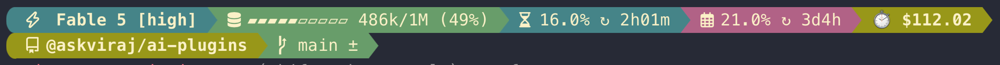

# vwf — Product → Blueprint → Plan → Execute for Claude Code

`virajp-plugins` is a plugin marketplace for AI coding agents, built around
**vwf**: an opinionated workflow that turns a vague idea into a shipped,
reviewed product through four disciplined phases.

1. **Product** — pin the outcome contract: the problem, the users, measurable
   goals, and the order to build in. Everything downstream must trace to it.
2. **Blueprint** — keep an always-current blueprint of the *whole product*,
   organized by **flow** (every flow serving a product goal, entities as the
   data contracts under them), closed by a whole-product coherence review.
3. **Plan** — diff the blueprint against the real code for one slice, planning
   its unbuilt dependencies as their own chained plans first, and write the
   delta to apply.
4. **Execute** — implement the plan autonomously under strict TDD, with code
   review, security review, E2E acceptance, and UX conformance per the rules,
   behind one final merge gate — with post-deploy verification and a
   production-feedback intake closing the loop.

You drive it with slash commands. Claude does the work — asking one question at
a time while authoring, running unattended while executing — and never merges
until you approve. The whole manual, command by command, is
**[docs/plugins/vwf.md](./docs/plugins/vwf.md)**. Journey-shaped guides —
starting fresh, adopting vwf in a codebase that already works, and running a
live product — are in **[docs/how-to](./docs/how-to/index.md)**.

Around it the marketplace ships **twelve more plugins** — languages, clouds,
capabilities, tooling and design. That is the point of the split: vwf owns the
workflow and names no technology at all, so every concrete choice lives in a
plugin you install only if your product uses it. They install through Claude
Code's own plugin commands, straight from this repo; the
[statusline](#statusline) is separate, and ships through one small CLI,
[`@askviraj/ai-plugins`](https://www.npmjs.com/package/@askviraj/ai-plugins).

These are **Claude Code plugins**, authored natively. Other agents are served by
[a prompt, not a bespoke build](#other-tools) — see that section for what you do
and do not get.

## Caveats

`vwf` is deliberately heavyweight, and some of what it needs is a real adoption
blocker rather than a preference. Know this before you install.

- **It is built for the 1-million-token context window.** The orchestrator holds
  the blueprint, the plan, the registry and each subagent's output at once. On
  the standard window a real cycle will degrade or overflow.
- **It runs `opus` where judgment decides the outcome**, and where nobody is
  watching — `product`, `blueprint`, `plan`, the blueprint review gates, and
  every subagent inside the unattended `execute` run. `sonnet` and `haiku` carry
  the rest. An `execute` cycle runs several `opus` subagents per step with fix
  loop-backs, so **expect a meaningful token cost per slice.** This is not a
  cheap workflow.
- **It expects a testable, registry-described project.** `execute` enforces
  non-negotiable TDD and a coverage gate; `plan` and `execute` map each slice to
  a project in an architecture registry you author first. It will not operate on
  an ad-hoc folder.
- **Five binaries must be on your `PATH`** — `mise`, `graphify`, `uv`, `pnpm`
  and `rtk`. Nothing checks this at install time; `/vwf:doctor` reports a
  missing one as a **blocking** finding, and both `/vwf:setup` and
  `/vwf:execute` halt on it. So the first thing to run after installing is
  `/vwf:doctor`.
- **It is opinionated on purpose.** One workflow, one set of conventions, sized
  for a solo developer or a small team — not a configurable framework for a
  large org.

The full discussion — how model and effort are tiered per surface, what
delegating read-heavy work buys, and the rest of the fit questions — is in
[docs/plugins/vwf.md](./docs/plugins/vwf.md#caveats).

## Install

Two commands, both Claude Code's own. There is no installer to download and
nothing to keep up to date but the marketplace itself.

```sh
# Register this repo as a plugin marketplace, once
claude plugin marketplace add virajp/ai-plugins

# Install the workflow. `devtools`, its one dependency, comes with it
claude plugin install vwf@virajp-plugins
```

Restart your agent afterward so the skills, hooks and MCP servers load, then run
`/vwf:doctor` — it is what tells you whether the five required binaries are
actually on your `PATH`.

Scope is yours to choose: add `--scope project` to either command to keep the
marketplace or the plugin to one repo instead of your user profile. Everything
beyond `vwf` is installed by name, because which language, cloud and capability
plugins you want is a question about your product rather than about the toolkit:

```sh
claude plugin install typescript@virajp-plugins gcp@virajp-plugins
```

Upgrading is `claude plugin marketplace update` followed by
`claude plugin update <name>` — the marketplace is served from this repo's
`main`, which every push validates in CI.

The [statusline](#statusline) is the one piece that is *not* a plugin, because
no plugin mechanism can install a status bar. It comes from npm; see that
section.

## Other tools

These are Claude Code plugins. Other agents — Cursor, OpenCode, Codex — have no
common plugin format to render into, so instead of a bespoke build per tool, the
route is to **ask your agent to do the adaptation**, pointing it at this repo.
That works today, and it is how most non-Claude use of this toolkit already
happens.

Paste one of these, adjusting the plugin name:

**One plugin, adapted for whatever you are running:**

> Install the `vwf` plugin from
> `https://github.com/virajp/ai-plugins/tree/main/plugins/vwf` into this
> project, adapted to the conventions of the agent you are running in. Read its
> `.claude-plugin/plugin.json` first — it declares the MCP servers, LSP servers
> and dependencies the plugin expects. Skills live in `skills/<name>/SKILL.md`
> with YAML frontmatter; hooks are declared in `hooks/hooks.json` with their
> scripts beside them. Port each of those to this tool's equivalent mechanism,
> and tell me plainly what has no equivalent rather than dropping it silently.

**The whole marketplace, to pick from:**

> Read
> `https://github.com/virajp/ai-plugins/blob/main/.claude-plugin/marketplace.json`
> and list the plugins with their descriptions, so I can choose which to install
> here. Then install the ones I name, following the per-plugin instructions
> above.

### What this does not promise

- **Nothing verifies the result.** There is no test for what Cursor or Codex
  produces from that prompt. It is your agent's best effort, and the honest
  expectation is that skills port well, hooks and MCP wiring port unevenly, and
  subagents port worst.
- **Hook and MCP wiring vary most.** vwf's hooks include a command *rewrite*
  (`rtk`) — a tool that can only allow or deny a command cannot express it, and
  the usual adaptation is a refuse-with-correction. MCP transport support
  differs per tool; vwf's memory server is HTTP, which is the more portable of
  the two it declares.
- **Model-invocation restrictions may be approximated.** Some skills are marked
  so the model cannot invoke them itself and you own the timing
  (`disable-model-invocation: true`). If your tool has no equivalent, that
  restriction is lost — the skill still works, but it may fire when you did not
  ask.
- **Per-plugin dependencies are yours to follow.** `vwf` depends on `devtools`;
  nothing outside Claude Code will resolve that for you.
- **The statusline is Claude-only.** The OpenCode and Oh-My-Pi status surfaces
  were discontinued; see [Statusline](#statusline).

## The plugins

Thirteen plugins, each with its own guide. Install the workflow, then whichever
ones match the product you are building. The name in code at the end of each
entry is what you pass to `claude plugin install`.

### The workflow

**[vwf](./docs/plugins/vwf.md)** — the flagship. Sixteen `/vwf:` commands
covering the whole arc: onboard a repo, pin the outcome contract, model the
system, sweep a whole-product blueprint to complete coverage, plan one slice as
a reviewable diff, execute it unattended behind one merge gate, verify the
deploy, and route what production teaches you back to the document that fixes
it. It carries [cross-session memory](./docs/plugins/mempalace.md), a
knowledge-graph layer, session handoff and recall, the
[Karpathy coding guidelines](./docs/plugins/karpathy-guidelines.md), and the
Markdown and Context7 docs surfaces it absorbed. It names **no** technology — no
language, no framework, no cloud — which is what lets the rest of this list
exist. `vwf@virajp-plugins`

### Languages

**[typescript](./docs/plugins/typescript.md)** — the TypeScript language plugin,
covering TypeScript and JavaScript. A `typescript` router skill plus an `effect`
one for Effect-TS, and opinionated standards for `package.json`, pnpm, tsconfig
and the lint/format gate. It bundles the TypeScript language server, the
npm→pnpm/bun normalizing hook, and every TypeScript stack template vwf can offer
— service, service+webapp, site, worker, CLI, IaC and shared packages, plus the
npm-package and repo-level choices. `typescript@virajp-plugins`

**[flutter](./docs/plugins/flutter.md)** — Flutter and Dart done to one
standard: `dart` and `swift` router skills plus `kotlin`, `pubspec`,
`analysis-options` and internationalization, with Dart, Kotlin and SourceKit
(Swift) language servers bundled. It owns the `dart-flutter` stack template for
a `frontend` project. `--project flutter` from the app's own repo, or
`flutter@virajp-plugins` if you build them often enough for it to be a habit.

### Clouds

**[gcp](./docs/plugins/gcp.md)** — Google Cloud, as the judgment an SDK
reference cannot give you: which service to pick, when it stops being the
answer, how each one bills, which have local emulators, and what least-privilege
IAM looks like. It supplies Firebase and Cloud SQL as backing choices and Cloud
Run and GKE as deploy targets. Opt-in. `gcp@virajp-plugins`

**[cloudflare](./docs/plugins/cloudflare.md)** — **deliberately parked at Zero
Trust Access**: a private plane in front of a project that must not be publicly
reachable, whichever cloud hosts it. Workers, Pages, R2, D1, KV and the rest are
not offered here and arrive under their own plan; the menu says so out loud
rather than coming back quietly short. Opt-in. `cloudflare@virajp-plugins`

### Capabilities

A capability plugin holds the **neutral contract** — what your product must
guarantee, regardless of who provides it — and, where one exists, the provider
that belongs to no cloud. Managed flavours come from your cloud plugin. The
capability states the requirement; the provider states the mechanism.

**[datastore](./docs/plugins/datastore.md)** — the datastore contract: write
versioning, atomic multi-record writes, server-authoritative time, the
services-layer access rule, and a deterministic local stack. Ships **Postgres**.
Opt-in. `datastore@virajp-plugins`

**[identity](./docs/plugins/identity.md)** — the identity contract: verification
per route, the *claims carry status, never roles* rule, revocation, and the
operator plane. Ships any **OIDC** issuer. Opt-in. `identity@virajp-plugins`

**[observability](./docs/plugins/observability.md)** — the telemetry contract:
**your product emits OTLP and never a vendor SDK**, signals correlate,
cardinality is a design decision, retention is chosen. Ships the self-hosted
**OpenTelemetry → Grafana OTel-LGTM** sink; a managed backend is a destination,
not an import. Opt-in. `observability@virajp-plugins`

**[orchestration](./docs/plugins/orchestration.md)** — the contract for work
that happens later: at-least-once delivery and the idempotency it forces,
bounded retry, the poison path, work-in-flight visibility, and when a queue
beats a bus beats a scheduler beats a workflow engine. Ships **Temporal**.
Opt-in. `orchestration@virajp-plugins`

**[object-storage](./docs/plugins/object-storage.md)** — **contract-only by
design**: buckets, lifecycle as a bucket policy, signed access, prefix-scoped
credentials, the never-proxy-bytes rule, egress cost. Every object store is some
cloud's, so the flavour comes from `gcp` or `cloudflare` — and this plugin says
that explicitly rather than returning an empty menu, which would be
indistinguishable from a broken adapter. Opt-in. `object-storage@virajp-plugins`

### Tooling, design and delivery

**[devtools](./docs/plugins/devtools.md)** — the developer-machine toolchain in
one plugin: mise (the three-file `MISE_ENV` split, tool placement, the
file-based task library) with a `/devtools:scaffold` skill, Doppler for
**development** secrets, Docker/OCI and the provider-neutral `container-generic`
deploy target, and the repo gates the stack templates name — dprint, ESLint,
gitleaks, grype, pre-commit. A `vwf` dependency, because `/vwf:setup`
orchestrates its scaffold skill. `devtools@virajp-plugins`

**[design-tools](./docs/plugins/design-tools.md)** — the design adapter vwf
imports screens, design systems and design review conversations through. Three
skills resolve the design tool **per project** — `claude-design`, `lovable` or
`stitch` — so a product can design its website in one and its app in another.
Only some tools have a review conversation at all; the ones that do not say so
plainly rather than returning empty. Ships the Claude Design MCP server.
Deliberately not a vwf dependency: an adapter is chosen, not inherited.
`design-tools@virajp-plugins`

**[cicd](./docs/plugins/cicd.md)** — one `/cicd:workflow` skill that resolves
the repo's CI system from config and generates its delivery pipeline: every tool
installed through mise, both multi-repo and monorepo layouts, conforming to
vwf's tag-triggered, branch-validated, tested-before-release contract. GitHub
Actions is the one implementation today; adding a CI system is a single
reference file. Independent — vwf states the contract, this implements it.
`cicd@virajp-plugins`

Every plugin above is authored here. Nothing in this marketplace is re-listed
from another repo any more: the last one that was — the Karpathy coding
guidelines — is now a
[skill vendored inside `vwf`](./docs/plugins/karpathy-guidelines.md) and
installs with it.

```sh
claude plugin install vwf@virajp-plugins typescript@virajp-plugins
claude plugin install --scope project flutter@virajp-plugins
```

## Statusline

A standalone, powerline-style statusline (main two-line bar + subagent panel),
fully data-driven from JSON and themeable across three config layers (defaults →
`~/.config/statusline.json` → `<repo-root>/.config/statusline.json`). It
installs through the same CLI — not the plugin marketplace — copying the script
to `~/.claude/scripts/` and writing the chosen key(s) into
`~/.claude/settings.json`. Requires a [Nerd Font](https://www.nerdfonts.com/).

**Claude Code is the only surface.** An OpenCode TUI bar and an Oh-My-Pi
configuration existed and were discontinued in the Claude-first release; if you
have either, `pnpx @askviraj/ai-plugins --uninstall` reads the old receipt and
removes it cleanly. Cursor exposes no status surface at all, and never did.



```sh
# install the statusline (both the main bar and the subagent panel)
pnpx @askviraj/ai-plugins --statusline
```

Installing it also wires a **context & rate-limit caps hook** — it pauses long
`/vwf:execute` runs at budget thresholds (context over 65%, 5-hour over 90%,
7-day over 80%) by triggering a handoff. Its sensor *is* that bar, which is why
the two travel together.

The script reports its own version, so `--version` tells you what is actually
installed rather than what the package you just ran happens to contain:

```sh
pnpx @askviraj/ai-plugins --version
```

The Claude bar also carries a **monthly spend** segment — the budget from
claude.ai → Settings → Usage, e.g. `$75.93/$150 (51%)`. It sits in the default
layout but draws only for team and enterprise seats, whose limit is a monthly
spend cap rather than the 5-hour and 7-day windows; the figure is refreshed in
the background into a machine-wide cache, so a render never waits on a request.

See **[docs/plugins/statusline.md](./docs/plugins/statusline.md)** for setup and
the full configuration reference.

## The installer CLI

[`@askviraj/ai-plugins`](https://www.npmjs.com/package/@askviraj/ai-plugins) is
a small CLI with three jobs: install the **statusline**, wire up **graphify**,
and **remove** what this toolkit put on your machine. It installs **no plugins**
— those come from Claude's own commands, shown under [Install](#install) above.

**[docs/cli/](./docs/cli/)** is the full reference —
[usage](./docs/cli/usage.md) for the flag surface,
[targets](./docs/cli/targets.md) for what lands where,
[statusline](./docs/cli/statusline.md) for why the bar ships here rather than as
a plugin, and [internals](./docs/cli/internals.md) for the maintainer's map.

### Using it

**npm is the only distribution channel**, so it needs Node — on every platform,
Windows included. There is no standalone binary and no Homebrew tap.

```sh
# Install the statusline, and wire graphify
pnpx @askviraj/ai-plugins --statusline

# See exactly what a run would write, without writing it
pnpx @askviraj/ai-plugins --statusline --dry-run

# Versions: this CLI, the statusline on disk, and each plugin against main
pnpx @askviraj/ai-plugins --version

# List everything the toolkit installed, and remove what you do not deselect
pnpx @askviraj/ai-plugins --uninstall
```

Notes:

- **A statusline you already have is never replaced without your say-so.** If
  Claude is pointed at a bar this installer did not write, the run asks before
  overwriting it, and `--statusline` is the flag that counts as consent. With no
  terminal to ask in (a setup script, CI) the run **fails** rather than guessing
  in either direction. Decline once and the refusal is remembered in
  `~/.config/statusline.json` as `"autoConfigure": false`, so later runs stop
  asking; `--statusline` clears it. The bar's own files are installed either
  way, so a declined machine is one `--statusline` away from a working
  statusline rather than back at the start.
- **`--uninstall` is interactive.** It lists every piece of the toolkit it can
  see — the marketplace registration, your plugin installs at either scope, the
  statusline, graphify's hook and graph — with everything **selected**, so you
  deselect what should stay. Each piece is removed through whatever owns it:
  `claude plugin uninstall` for plugins, and for the statusline a **restore from
  the receipt**, so the bar you had before comes back rather than nothing. With
  no terminal it fails rather than guessing, unless there is nothing to remove.
  `--dry-run` is the scriptable way to just look.
- **It also cleans up the discontinued surfaces.** If an older, multi-target
  version of this CLI installed the OpenCode plugin tree or the OpenCode and
  Oh-My-Pi statuslines, `--uninstall` reads those old receipts and offers them
  for removal too. That is kept for a release or two so nothing is orphaned.
- **`--version` reports what is actually installed.** The statusline script
  carries its own version and is asked for it directly, because under `pnpx` the
  running package is whatever was just downloaded and says nothing about your
  machine. An install predating that flag reports
  `unknown (predates self-reporting)` rather than being guessed at.
- **There is no `--upgrade`.** Re-running is the upgrade for the statusline;
  plugins upgrade through `claude plugin marketplace update virajp-plugins` and
  `claude plugin update <name>`.
- **An invocation that installs nothing prints the help and exits 1.** `--help`
  prints the same text on stdout and exits 0, and an unknown flag is an error
  naming itself — which is how the retired `--all`, `--user`, `--project`,
  `--platform` and `--upgrade` now answer.
- **Behind shared egress**, set `$GITHUB_API_TOKEN` to a read-only (public-repo)
  token. GitHub's anonymous rate limit is per source IP, so a corporate NAT or a
  CI runner pool exhausts it between users. Nothing suggests it until you
  actually hit a limit, and the npm registry call never sends it.

## Credits & acknowledgements

This project is a thin layer over a lot of excellent work. It would not exist —
or would be far poorer — without these. Thank you to their authors and
maintainers. 🙏

- **[Claude Code](https://claude.ai/code)** by
  [Anthropic](https://anthropic.com) — the host these plugins, hooks, and
  statusline plug into.
- **[MemPalace](https://github.com/MemPalace/mempalace)** — the AI memory system
  that powers `vwf`'s cross-session recall. Its two skills are vendored into
  `vwf` under MIT; see `templates/vwf/vendor/mempalace/`.
- **[andrej-karpathy-skills](https://github.com/multica-ai/andrej-karpathy-skills)**
  by `forrestchang` — behavioral coding guidelines derived from Andrej
  Karpathy's observations. Its `karpathy-guidelines` skill is vendored into
  `vwf`; see `templates/vwf/vendor/andrej-karpathy-skills/`.
- **[Context7](https://github.com/upstash/context7)** by
  [Upstash](https://upstash.com) — the MCP docs server `vwf` declares.
- **[mise](https://mise.jdx.dev/)** by Jeff Dickey — resolves the toolchain the
  plugins and hooks depend on.
- **[pnpm](https://pnpm.io/)** — the default package manager the normalizing
  hook and the Context7 server rely on.
- **[typescript-language-server](https://github.com/typescript-language-server/typescript-language-server)**,
  the **[Dart SDK](https://dart.dev/)**,
  **[kotlin-lsp](https://github.com/Kotlin/kotlin-lsp)**, and
  **[SourceKit-LSP](https://github.com/swiftlang/sourcekit-lsp)** — the engines
  behind the language-server plugins.
- **[rtk](https://github.com/rtk-ai/rtk) (Rust Token Killer)** — the
  token-saving proxy `vwf`'s Bash hook shells out to (installed via
  `brew install --formulae rtk`).
- **[graphify](https://github.com/safishamsi/graphify)** — the knowledge-graph
  tool `vwf` integrates with.
- **[tsup](https://tsup.egoist.dev/)** — bundles the installer CLI for
  publication. Argument parsing is Node's own `util.parseArgs`; the CLI carries
  no parser dependency.
- **[Nerd Fonts](https://www.nerdfonts.com/)** — the glyphs that make the
  statusline render, and the **[Gruvbox](https://github.com/morhetz/gruvbox)**
  palette it ships by default.
