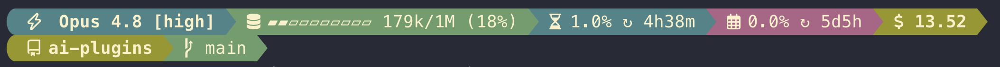

# vwf — Product → Blueprint → Plan → Execute for Claude Code

`virajp-plugins` is a plugin marketplace for AI coding agents, built around
**vwf**: an opinionated workflow that turns a vague idea into a shipped,
reviewed product through four disciplined phases.

1. **Product** — pin the outcome contract: the problem, the users, measurable
   goals, and the order to build in. Everything downstream must trace to it.
2. **Blueprint** — keep an always-current blueprint of the *whole product*,
   organized by **flow** (every flow serving a product goal, entities as the
   data contracts under them), closed by a whole-product coherence review.
3. **Plan** — diff the blueprint against the real code for one slice, planning
   its unbuilt dependencies as their own chained plans first, and write the
   delta to apply.
4. **Execute** — implement the plan autonomously under strict TDD, with code
   review, security review, E2E acceptance, and UX conformance per the rules,
   behind one final merge gate — with post-deploy verification and a
   production-feedback intake closing the loop.

You drive it with slash commands. Claude does the work — asking one question at
a time while authoring, running unattended while executing — and never merges
until you approve. The whole manual, command by command, is
**[docs/vwf.md](./docs/vwf.md)**.

Around it the marketplace ships **thirteen more plugins** — languages, clouds,
capabilities, tooling and design. That is the point of the split: vwf owns the
workflow and names no technology at all, so every concrete choice lives in a
plugin you install only if your product uses it. All of them, plus a
[statusline](#statusline), go on through one CLI,
[`@askviraj/ai-plugins`](https://www.npmjs.com/package/@askviraj/ai-plugins),
across four agents — Claude Code, Cursor, Oh-My-Pi and OpenCode.

## Caveats

`vwf` is deliberately heavyweight, and some of what it needs is a real adoption
blocker rather than a preference. Know this before you install.

- **It is built for the 1-million-token context window.** The orchestrator holds
  the blueprint, the plan, the registry and each subagent's output at once. On
  the standard window a real cycle will degrade or overflow.
- **It runs `opus` where judgment decides the outcome**, and where nobody is
  watching — `product`, `blueprint`, `plan`, the blueprint review gates, and
  every subagent inside the unattended `execute` run. `sonnet` and `haiku` carry
  the rest. An `execute` cycle runs several `opus` subagents per step with fix
  loop-backs, so **expect a meaningful token cost per slice.** This is not a
  cheap workflow.
- **It expects a testable, registry-described project.** `execute` enforces
  non-negotiable TDD and a coverage gate; `plan` and `execute` map each slice to
  a project in an architecture registry you author first. It will not operate on
  an ad-hoc folder.
- **Five binaries must be on your `PATH`** — `mise`, `graphify`, `uv`, `pnpm`
  and `rtk`. The installer treats this as a hard gate: it refuses the install
  and prints the exact command for anything missing.
- **It is opinionated on purpose.** One workflow, one set of conventions, sized
  for a solo developer or a small team — not a configurable framework for a
  large org.

The full discussion — how model and effort are tiered per surface, what
delegating read-heavy work buys, and the rest of the fit questions — is in
[docs/vwf.md](./docs/vwf.md#caveats).

## Install

```sh
# The whole toolkit: every user-scoped plugin + the statusline,
# for every agent found on your PATH
pnpx @askviraj/ai-plugins --all

# Or just vwf, which pulls in its dependencies and wires up graphify
pnpx @askviraj/ai-plugins --user vwf
```

npm is the only distribution channel, so this needs Node — on every platform,
Windows included. Restart your agent afterward so the commands, hooks and
dependencies load. (The examples here use `pnpx`; if you don't use `pnpm`, swap
in `npx`.)

`--all` covers the user-scoped plugins. The project-scoped one (`flutter`) and
the opt-in ones (the clouds and the capabilities) are named explicitly instead —
see [the installer CLI](#the-installer-cli) for the full flag reference.

## The plugins

Fourteen plugins, each with its own guide. Install the workflow, then whichever
ones match the product you are building.

### The workflow

**[vwf](./docs/vwf.md)** — the flagship. Fifteen `/vwf:` commands covering the
whole arc: onboard a repo, pin the outcome contract, model the system, sweep a
whole-product blueprint to complete coverage, plan one slice as a reviewable
diff, execute it unattended behind one merge gate, verify the deploy, and route
what production teaches you back to the document that fixes it. It carries
[cross-session memory](./docs/mempalace.md), a knowledge-graph layer, session
handoff and recall, and the Markdown and Context7 docs surfaces it absorbed. It
names **no** technology — no language, no framework, no cloud — which is what
lets the rest of this list exist. `--user vwf`

### Languages

**[typescript](./docs/typescript.md)** — the TypeScript language plugin,
covering TypeScript and JavaScript. A `typescript` router skill plus an `effect`
one for Effect-TS, and opinionated standards for `package.json`, pnpm, tsconfig
and the lint/format gate. It bundles the TypeScript language server, the
npm→pnpm/bun normalizing hook, and every TypeScript stack template vwf can offer
— service, fullstack, site, worker, CLI, IaC and shared packages, plus the
npm-package and repo-level choices. `--user typescript`

**[flutter](./docs/flutter.md)** — Flutter and Dart done to one standard: `dart`
and `swift` router skills plus `kotlin`, `pubspec`, `analysis-options` and
internationalization, with Dart, Kotlin and SourceKit (Swift) language servers
bundled. It owns the `dart-flutter` stack template for a `frontend` project.
Project-scoped, since a Flutter app is a repo, not a habit. `--project flutter`

### Clouds

**[gcp](./docs/gcp.md)** — Google Cloud, as the judgment an SDK reference cannot
give you: which service to pick, when it stops being the answer, how each one
bills, which have local emulators, and what least-privilege IAM looks like. It
supplies Firebase and Cloud SQL as backing choices and Cloud Run and GKE as
deploy targets. Opt-in. `--user gcp`

**[cloudflare](./docs/cloudflare.md)** — **deliberately parked at Zero Trust
Access**: a private plane in front of a project that must not be publicly
reachable, whichever cloud hosts it. Workers, Pages, R2, D1, KV and the rest are
not offered here and arrive under their own plan; the menu says so out loud
rather than coming back quietly short. Opt-in. `--user cloudflare`

### Capabilities

A capability plugin holds the **neutral contract** — what your product must
guarantee, regardless of who provides it — and, where one exists, the provider
that belongs to no cloud. Managed flavours come from your cloud plugin. The
capability states the requirement; the provider states the mechanism.

**[datastore](./docs/datastore.md)** — the datastore contract: write versioning,
atomic multi-record writes, server-authoritative time, the services-layer access
rule, and a deterministic local stack. Ships **Postgres**. Opt-in.
`--user datastore`

**[identity](./docs/identity.md)** — the identity contract: verification per
route, the *claims carry status, never roles* rule, revocation, and the operator
plane. Ships any **OIDC** issuer. Opt-in. `--user identity`

**[observability](./docs/observability.md)** — the telemetry contract: **your
product emits OTLP and never a vendor SDK**, signals correlate, cardinality is a
design decision, retention is chosen. Ships the self-hosted **OpenTelemetry →
Grafana OTel-LGTM** sink; a managed backend is a destination, not an import.
Opt-in. `--user observability`

**[orchestration](./docs/orchestration.md)** — the contract for work that
happens later: at-least-once delivery and the idempotency it forces, bounded
retry, the poison path, work-in-flight visibility, and when a queue beats a bus
beats a scheduler beats a workflow engine. Ships **Temporal**. Opt-in.
`--user orchestration`

**[object-storage](./docs/object-storage.md)** — **contract-only by design**:
buckets, lifecycle as a bucket policy, signed access, prefix-scoped credentials,
the never-proxy-bytes rule, egress cost. Every object store is some cloud's, so
the flavour comes from `gcp` or `cloudflare` — and this plugin says that
explicitly rather than returning an empty menu, which would be indistinguishable
from a broken adapter. Opt-in. `--user object-storage`

### Tooling, design and delivery

**[devtools](./docs/devtools.md)** — the developer-machine toolchain in one
plugin: mise (the three-file `MISE_ENV` split, tool placement, the file-based
task library) with a `/devtools:scaffold` skill, Doppler for **development**
secrets, Docker/OCI and the provider-neutral `container-generic` deploy target,
and the repo gates the stack templates name — dprint, ESLint, gitleaks, grype,
pre-commit. A `vwf` dependency, because `/vwf:setup` orchestrates its scaffold
skill. `--user devtools`

**[design-tools](./docs/design-tools.md)** — the design adapter vwf imports
screens and design systems through. Two skills resolve the design tool **per
project** — `claude-design`, `lovable` or `stitch` — so a product can design its
website in one and its app in another. Ships the Claude Design MCP server.
Deliberately not a vwf dependency: an adapter is chosen, not inherited.
`--user design-tools`

**[cicd](./docs/cicd.md)** — one `/cicd:workflow` skill that resolves the repo's
CI system from config and generates its delivery pipeline: every tool installed
through mise, both polyrepo and monorepo layouts, conforming to vwf's
tag-triggered, branch-validated, tested-before-release contract. GitHub Actions
is the one implementation today; adding a CI system is a single reference file.
Independent — vwf states the contract, this implements it. `--user cicd`

### External, re-listed here

**[andrej-karpathy-skills](./docs/andrej-karpathy-skills.md)** — behavioral
guidelines that cut the coding mistakes LLMs most reliably make. vwf enforces
the same pillars structurally inside the pipeline; this covers the ad-hoc,
off-pipeline case. A `vwf` dependency, and the only external one.
`--user`/`--project andrej-karpathy-skills`

```sh
pnpx @askviraj/ai-plugins --user vwf --user typescript --project flutter
```

## Statusline

A standalone, powerline-style statusline (main two-line bar + subagent panel),
fully data-driven from JSON and themeable across three config layers (defaults →
`~/.config/statusline.json` → `<repo-root>/.config/statusline.json`). It
installs through the same CLI — not the plugin marketplace — copying the script
to `~/.claude/scripts/` and writing the chosen key(s) into
`~/.claude/settings.json`. Requires a [Nerd Font](https://www.nerdfonts.com/).



```sh
# install the statusline (both the main bar and the subagent panel)
pnpx @askviraj/ai-plugins --statusline
```

It also comes along with `--all`, which installs the whole toolkit; pass
`--no-statusline` there to skip it.

Installing the statusline also wires a **context & rate-limit caps hook** — it
pauses long `/vwf:execute` runs at budget thresholds (context over 65%, 5-hour
over 90%, 7-day over 80%) by triggering a handoff.

See **[docs/statusline.md](./docs/statusline.md)** for setup and the full
configuration reference.

## The installer CLI

[`@askviraj/ai-plugins`](https://www.npmjs.com/package/@askviraj/ai-plugins)
installs the toolkit across **four agents** — Claude Code, Cursor, Oh-My-Pi and
OpenCode. Three of them have a native plugin marketplace, so the CLI registers
`virajp-plugins` and lets the agent's own CLI do the installing. OpenCode has no
plugin concept, so its bundle is copied into place.

`--platform` picks the target (repeatable: `claude`, `cursor`, `ohmypi`,
`opencode`); omitted, the CLI **detects** which tools are on `PATH` and installs
for every one it finds.

### Installing it

**npm is the only distribution channel**, so the CLI needs Node — on every
platform, Windows included. There is no standalone binary and no Homebrew tap.

```sh
# Everything: all user-scoped plugins + the statusline, for every detected platform
pnpx @askviraj/ai-plugins --all

# Just the user-scoped plugins (no statusline)
pnpx @askviraj/ai-plugins --all --no-statusline

# Named plugins, at user or project scope (flutter is project-scoped)
pnpx @askviraj/ai-plugins --user vwf --project flutter

# OpenCode only
pnpx @askviraj/ai-plugins --platform opencode --user typescript

# Versions: CLI, statusline, and each plugin's installed-vs-latest (with scope)
pnpx @askviraj/ai-plugins --version

# Upgrade installed plugins + refresh the statusline
pnpx @askviraj/ai-plugins --upgrade

# Idempotent install + upgrade — safe to drop in a setup script
pnpx @askviraj/ai-plugins --all --upgrade

# Uninstall (mirrors the install flags)
pnpx @askviraj/ai-plugins --uninstall --user vwf
pnpx @askviraj/ai-plugins --uninstall --all
```

Notes:

- `--all` acts on **user-scoped** plugins only. `flutter` is **project-scoped**
  — install it explicitly with `--project flutter` from within the project that
  needs it. The two cloud plugins (`cloudflare`, `gcp`) and all five capability
  plugins (`datastore`, `identity`, `observability`, `orchestration`,
  `object-storage`) are **opt-in** — also excluded from `--all`; install them by
  name at whichever scope you want.
- `--all` means the whole toolkit, so it **includes the statusline** (Claude
  Code only) — pass `--no-statusline` for a plugins-only run. The same applies
  in reverse: `--uninstall --all` removes the statusline too.
- Scope is chosen by the flag: `--user <name>` installs at user scope,
  `--project <name>` at project scope (you can mix both in one run). The
  marketplace add is always user-scoped.
- The installer **checks every required external tool** for what you're
  installing and prints the install command for anything missing — it never
  installs a dependency for you.

### What an OpenCode install does

OpenCode has no plugin or marketplace concept — skills, commands, agents and
plugins each live in a well-known directory, and everything else is config. The
**build** already emits exactly that shape into this repo's `opencode/` tree, so
installing is a copy plus a config merge rather than a render on your machine.
Per selected plugin the CLI:

- copies its bundle into `~/.config/opencode/virajp-plugins/<plugin>/`
  (`--project` targets the repo-local `.opencode/` instead) — `skills/` for the
  auto-applying doctrine, `commands/` for the user-invoked workflow skills
  (**outside** OpenCode's skill discovery, so the model never auto-invokes them,
  exactly like Claude's user-only skills), and `assets/`. Every
  `${CLAUDE_PLUGIN_ROOT}` reference was already rewritten at build time;
- copies the plugin's files in the **global** flat directories — `agent/`
  (subagents *are* ported), `command/` (the `/vwf-setup`-style wrappers, since
  OpenCode has no user-invoked skills) and `plugin/` (each hook rendered as a JS
  plugin: `vwf-rtk.js` and `typescript-npm-normalize.js`). A per-target
  ownership map says which plugin owns each file, so uninstall removes exactly
  what was written;
- merges that plugin's `mcp` and `lsp` entries into your OpenCode config and
  appends the bundle directory to `skills.paths`. An existing `opencode.jsonc`
  is preferred (it wins OpenCode's config merge), then an existing
  `opencode.json`; a new file is created as `opencode.jsonc`. Every write
  records the key's **prior state**, so uninstall restores a value you had
  rather than deleting a key it merely wrote over;
- expands plugin **dependencies**, which Claude Code does natively and OpenCode
  cannot — so installing `vwf` also installs `devtools`;
- wires **graphify** when `vwf` is installed
  (`graphify install --platform
  opencode` plus the git post-commit hook, both
  idempotent, both soft-skipping).

**Skipped, with a note**: the url-sourced `andrej-karpathy-skills` has no
rendered bundle — nothing to copy — so an OpenCode install of `vwf` leaves you
to install it yourself. Memory used to be skipped the same way, which is why
mempalace's skills are now [vendored into `vwf`](./docs/mempalace.md) and ship
on every target. The statusline is Claude-only. `--uninstall` and `--upgrade`
replay the receipt (uninstall never removes a dependency you didn't name);
`--version` compares this build's versions against the manifest on `main`.

## Credits & acknowledgements

This project is a thin layer over a lot of excellent work. It would not exist —
or would be far poorer — without these. Thank you to their authors and
maintainers. 🙏

- **[Claude Code](https://claude.ai/code)** by
  [Anthropic](https://anthropic.com) — the host these plugins, hooks, and
  statusline plug into.
- **[MemPalace](https://github.com/MemPalace/mempalace)** — the AI memory system
  that powers `vwf`'s cross-session recall. Its two skills are vendored into
  `vwf` under MIT; see `templates/vwf/vendor/mempalace/`.
- **[andrej-karpathy-skills](https://github.com/multica-ai/andrej-karpathy-skills)**
  — behavioral coding guidelines derived from Andrej Karpathy's observations,
  re-listed here as a `vwf` dependency.
- **[Context7](https://github.com/upstash/context7)** by
  [Upstash](https://upstash.com) — the MCP docs server `vwf` declares.
- **[mise](https://mise.jdx.dev/)** by Jeff Dickey — resolves the toolchain the
  plugins and hooks depend on.
- **[pnpm](https://pnpm.io/)** — the default package manager the normalizing
  hook and the Context7 server rely on.
- **[typescript-language-server](https://github.com/typescript-language-server/typescript-language-server)**,
  the **[Dart SDK](https://dart.dev/)**,
  **[kotlin-lsp](https://github.com/Kotlin/kotlin-lsp)**, and
  **[SourceKit-LSP](https://github.com/swiftlang/sourcekit-lsp)** — the engines
  behind the language-server plugins.
- **[rtk](https://github.com/rtk-ai/rtk) (Rust Token Killer)** — the
  token-saving proxy `vwf`'s Bash hook shells out to (installed via
  `brew install --formulae rtk`).
- **[graphify](https://github.com/safishamsi/graphify)** — the knowledge-graph
  tool `vwf` integrates with.
- **[citty](https://github.com/unjs/citty)** — the argument parser this
  installer CLI is built on, bundled for publication with
  **[tsup](https://tsup.egoist.dev/)**.
- **[Nerd Fonts](https://www.nerdfonts.com/)** — the glyphs that make the
  statusline render, and the **[Gruvbox](https://github.com/morhetz/gruvbox)**
  palette it ships by default.
